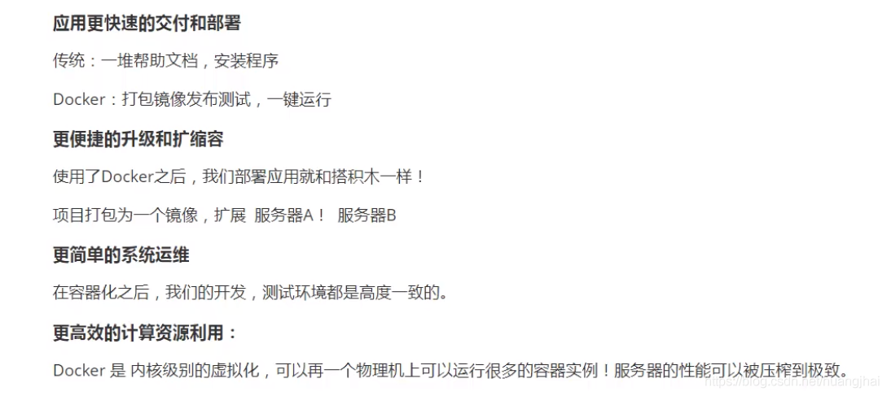

### 2. 虚拟化技术和容器化技术

虚拟化技术特点：1.资源占用多 2.冗余步骤多 3.启动很慢

容器化技术：容器化技术不是模拟的一个完整的操作系统

比较Docker和虚拟机的不同：
1.传统虚拟机，虚拟出硬件，运行一个完整的操作系统，然后在这个系统上安装和运行软件。

2.Docker容器内的应用直接运行在宿主机的内容，容器是没有自己的内核的，也没有虚拟硬件。

3.每个容器都是相互隔离的，每个容器都有属于自己的文件系统，互不影响。

容器化带来的好处：
