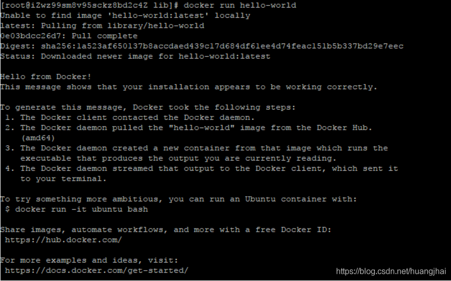

### 4. Docker的安装

查看系统的内核：

uname -r

系统内核版本为3.10.0

```sh
[root@iZwz99sm8v95sckz8bd2c4Z ~]# uname -r
3.10.0-957.21.3.el7.x86_64
12
```

查看系统配置

cat /etc/os-release

cat /etc/redhat-release

```shell
[root@iZwz99sm8v95sckz8bd2c4Z ~]# cat /etc/os-release
NAME="CentOS Linux"
VERSION="7 (Core)"
ID="centos"
ID_LIKE="rhel fedora"
VERSION_ID="7"
PRETTY_NAME="CentOS Linux 7 (Core)"
ANSI_COLOR="0;31"
CPE_NAME="cpe:/o:centos:centos:7"
HOME_URL="https://www.centos.org/"
BUG_REPORT_URL="https://bugs.centos.org/"

CENTOS_MANTISBT_PROJECT="CentOS-7"
CENTOS_MANTISBT_PROJECT_VERSION="7"
REDHAT_SUPPORT_PRODUCT="centos"
REDHAT_SUPPORT_PRODUCT_VERSION="7"
12345678910111213141516
```

Docker的安装步骤：
**（1）卸载旧的版本**

```shell
yum remove docker \
                  docker-client \
                  docker-client-latest \
                  docker-common \
                  docker-latest \
                  docker-latest-logrotate \
                  docker-logrotate \
                  docker-engine
12345678
```

**（2）下载需要的安装包**

```shell
yum -y install gcc
yum -y install gcc-c++
yum install -y yum-utils
1
```

**（3）设置镜像的仓库**

```bash
yum-config-manager \
    --add-repo \
    https://download.docker.com/linux/centos/docker-ce.repo  #国外的地址
    
    # 设置阿里云的Docker镜像仓库
yum-config-manager \
    --add-repo \
    https://mirrors.aliyun.com/docker-ce/linux/centos/docker-ce.repo  #国外的地址
12345678
```

**（4）更新yum软件包索引**

```bash
yum makecache fast
1
```

**（5）安装docker相关的配置**

docker-ce 是社区版，docker-ee 企业版

```shell
 yum install docker-ce docker-ce-cli containerd.io
1
```

出现了completed即安装成功。

**（6）启动Docker**

```bash
systemctl start docker
# 查看当前版本号，是否启动成功
docker version
# 设置开机自启动
systemctl enable docker
12345
```

结果：


下载hello-world镜像进行测试

```sh
docker run hello-world
```


查看下载的hello world镜像

```bash
[root@iZwz99sm8v95sckz8bd2c4Z lib]# docker images
REPOSITORY    TAG       IMAGE ID       CREATED         SIZE
hello-world   latest    bf756fb1ae65   11 months ago   13.3kB
123
```