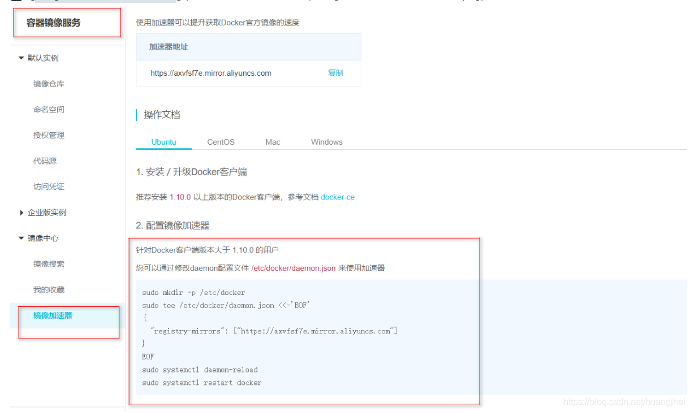

### 6. 配置阿里云镜像加速

**（1）进入阿里云官网，搜索容器镜像服务**

**（2）依次执行官方的这四条命令**

```bash
sudo mkdir -p /etc/docker
sudo tee /etc/docker/daemon.json <<-'EOF'
{
  "registry-mirrors": ["https://axvfsf7e.mirror.aliyuncs.com"]
}
EOF
sudo systemctl daemon-reload
sudo systemctl restart docker
12345678
```