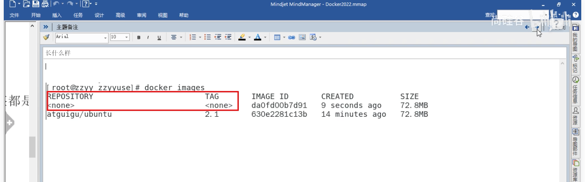

#### 10.2 镜像命令

1.**docker images** 查看本地主机的所有镜像

```bash
[root@iZwz99sm8v95sckz8bd2c4Z ~]# docker images
REPOSITORY    TAG       IMAGE ID       CREATED         SIZE
hello-world   latest    bf756fb1ae65   11 months ago   13.3kB

#解释:
1.REPOSITORY  镜像的仓库源

2.TAG  镜像的标签

3.IMAGE ID 镜像的id

4.CREATED 镜像的创建时间

5.SIZE 镜像的大小


# 可选参数

-a/--all 列出所有镜像

-q/--quiet 只显示镜像的id
```

2.**docker search** 搜索镜像

```bash
[root@iZwz99sm8v95sckz8bd2c4Z ~]# docker search mysql
NAME                              DESCRIPTION                                     STARS     OFFICIAL   AUTOMATED
mysql                             MySQL is a widely used, open-source relation…   10308     [OK]
mariadb                           MariaDB is a community-developed fork of MyS…   3819      [OK]
mysql/mysql-server                Optimized MySQL Server Docker images. Create…   754                  [OK]
percona                           Percona Server is a fork of the MySQL relati…   517       [OK]
centos/mysql-57-centos7           MySQL 5.7 SQL database server                   86
mysql/mysql-cluster               Experimental MySQL Cluster Docker images. Cr…   79
centurylink/mysql                 Image containing mysql. Optimized to be link…   60                   [OK]


#可选参数

Search the Docker Hub for images

Options:
  -f, --filter filter   Filter output based on conditions provided
      --format string   Pretty-print search using a Go template
      --limit int       Max number of search results (default 25)
      --no-trunc        Don't truncate output
      
      
#搜索收藏数大于3000的镜像
[root@iZwz99sm8v95sckz8bd2c4Z ~]# docker search mysql --filter=STARS=3000
NAME      DESCRIPTION                                     STARS     OFFICIAL   AUTOMATED
mysql     MySQL is a widely used, open-source relation…   10308     [OK]
mariadb   MariaDB is a community-developed fordockerk of MyS…   3819      [OK]
```

3.**docker pull 镜像名[:tag]** 下载镜像

```bash
[root@iZwz99sm8v95sckz8bd2c4Z ~]# docker pull mysql
Using default tag: latest            #如果不写tag默认就是latest
latest: Pulling from library/mysql
6ec7b7d162b2: Pull complete          #分层下载,docker image的核心-联合文件系统
fedd960d3481: Pull complete
7ab947313861: Pull complete
64f92f19e638: Pull complete
3e80b17bff96: Pull complete
014e976799f9: Pull complete
59ae84fee1b3: Pull complete
ffe10de703ea: Pull complete
657af6d90c83: Pull complete
98bfb480322c: Pull complete
6aa3859c4789: Pull complete
1ed875d851ef: Pull complete
Digest: sha256:78800e6d3f1b230e35275145e657b82c3fb02a27b2d8e76aac2f5e90c1c30873 #签名
Status: Downloaded newer image for mysql:latest
docker.io/library/mysql:latest  #下载来源的真实地址  #docker pull mysql等价于docker pull docker.io/library/mysql:latest
123456789101112131415161718
```

指定版本下载

```bash
[root@iZwz99sm8v95sckz8bd2c4Z ~]# docker pull mysql:5.7
5.7: Pulling from library/mysql
6ec7b7d162b2: Already exists
fedd960d3481: Already exists
7ab947313861: Already exists
64f92f19e638: Already exists
3e80b17bff96: Already exists
014e976799f9: Already exists
59ae84fee1b3: Already exists
7d1da2a18e2e: Pull complete
301a28b700b9: Pull complete
529dc8dbeaf3: Pull complete
bc9d021dc13f: Pull complete
Digest: sha256:c3a567d3e3ad8b05dfce401ed08f0f6bf3f3b64cc17694979d5f2e5d78e10173
Status: Downloaded newer image for mysql:5.7
docker.io/library/mysql:5.7
```

4.**docker rmi** 删除镜像

``` bash
#1.删除指定的镜像id
[root@iZwz99sm8v95sckz8bd2c4Z ~]# docker rmi -f  镜像id
#2.删除多个镜像id
[root@iZwz99sm8v95sckz8bd2c4Z ~]# docker rmi -f  镜像id 镜像id 镜像id
#3.删除全部的镜像id
[root@iZwz99sm8v95sckz8bd2c4Z ~]# docker rmi -f  $(docker images -aq)
123456
```

5.docker system df

```sh
docker system df
TYPE            TOTAL     ACTIVE    SIZE      RECLAIMABLE
Images          2         1         448.4MB   448.3MB (99%)
Containers      2         0         0B        0B
Local Volumes   0         0         0B        0B
Build Cache     0         0         0B        0B
```

6.仓库名和标签都是<none>叫做虚悬镜像

