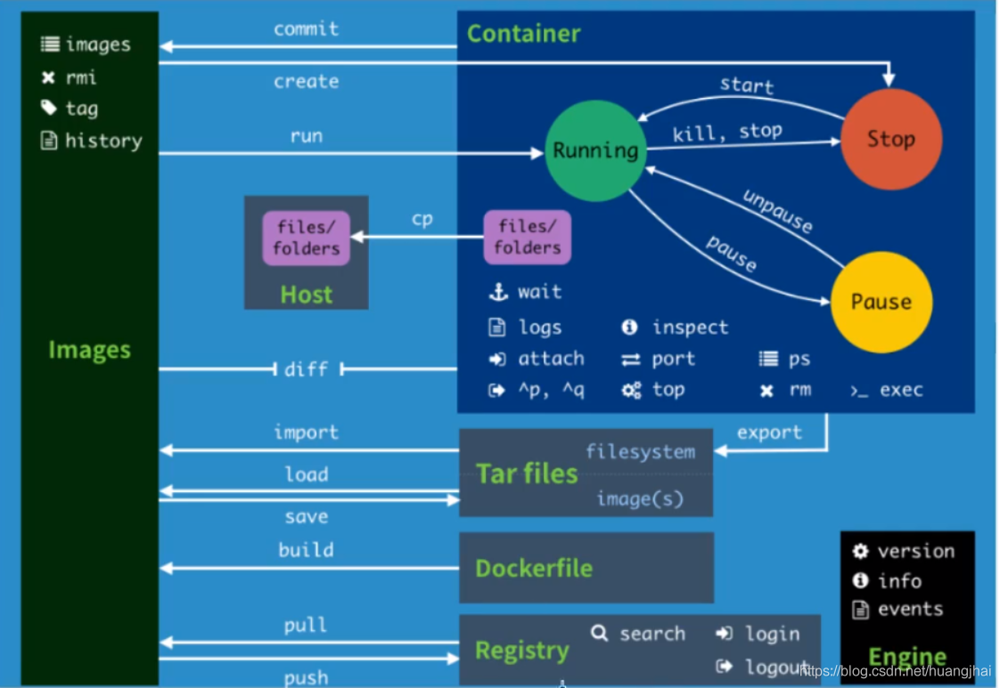

#### 10.4 其他常用命令

##### 10.4 1 日志的查看

```bash
[root@iZwz99sm8v95sckz8bd2c4Z ~]# docker logs --help

Usage:  docker logs [OPTIONS] CONTAINER

Fetch the logs of a container

Options:
      --details        Show extra details provided to logs
  -f, --follow         Follow log output
      --since string   Show logs since timestamp (e.g. 2013-01-02T13:23:37Z) or relative (e.g. 42m for 42 minutes)
  -n, --tail string    Number of lines to show from the end of the logs (default "all")
  -t, --timestamps     Show timestamps
      --until string   Show logs before a timestamp (e.g. 2013-01-02T13:23:37Z) or relative (e.g. 42m for 42 minutes)

常用：
docker logs -tf 容器id
docker logs --tail number 容器id #num为要显示的日志条数


#docker容器后台运行，必须要有一个前台的进程，否则会自动停止
#编写shell脚本循环执行，使得centos容器保持运行状态
[root@iZwz99sm8v95sckz8bd2c4Z ~]# docker run -d centos /bin/sh -c "while true;do echo hi;sleep 5;done"
c703b5b1911ff84d584390263a35707b6024816e1f46542b61918a6327a570dc
[root@iZwz99sm8v95sckz8bd2c4Z ~]# docker ps
CONTAINER ID   IMAGE     COMMAND                  CREATED          STATUS          PORTS     NAMES
c703b5b1911f   centos    "/bin/sh -c 'while t…"   13 seconds ago   Up 10 seconds             pedantic_banach
[root@iZwz99sm8v95sckz8bd2c4Z ~]# docker logs -tf --tail 10 c703b5b1911f
2020-12-27T03:34:07.255599560Z hi
2020-12-27T03:34:12.257641517Z hi
2020-12-27T03:34:17.259706294Z hi
2020-12-27T03:34:22.261693707Z hi
2020-12-27T03:34:27.262609289Z hi
2020-12-27T03:34:32.267862677Z hi
2020-12-27T03:34:37.270382873Z hi
2020-12-27T03:34:42.272414182Z hi
2020-12-27T03:34:47.274823243Z hi
2020-12-27T03:34:52.277419274Z hi
12345678910111213141516171819202122232425262728293031323334353637
```

##### 10.4 2 查看容器中进程信息

```bash
[root@iZwz99sm8v95sckz8bd2c4Z ~]# docker top c703b5b1911f
UID                 PID                 PPID                C                   STIME               TTY                 TIME                CMD
root                11156               11135               0                   11:31               ?                   00:00:00            /bin/sh -c while true;do echo hi;sleep 5;done
root                11886               11156               0                   11:43               ?                   00:00:00            /usr/bin/coreutils --coreutils-prog-shebang=sleep /usr/bin/sleep 5
1234
```

##### 10.4.3 查看容器的元数据

```bash
[root@iZwz99sm8v95sckz8bd2c4Z ~]# docker inspect 容器id
1
```

##### 10.4.4 进入当前正在运行的容器

因为通常我们的容器都是使用后台方式来运行的，有时需要进入容器修改配置

方式一：

```bash
[root@iZwz99sm8v95sckz8bd2c4Z ~]# docker exec -it c703b5b1911f /bin/bash
[root@c703b5b1911f /]# ls
bin  dev  etc  home  lib  lib64  lost+found  media  mnt  opt  proc  root  run  sbin  srv  sys  tmp  usr  var
[root@c703b5b1911f /]# ps -ef      
UID        PID  PPID  C STIME TTY          TIME CMD
root         1     0  0 03:31 ?        00:00:00 /bin/sh -c while true;do echo hi;sleep 5;done
root       279     0  0 03:54 pts/0    00:00:00 /bin/bash
root       315     1  0 03:56 ?        00:00:00 /usr/bin/coreutils --coreutils-prog-shebang=sleep /usr/bin/sleep 5
root       316   279  0 03:56 pts/0    00:00:00 ps -ef
123456789
```

方式二：

```bash
[root@iZwz99sm8v95sckz8bd2c4Z ~]# docker attach c703b5b1911f
1
```

docker exec 进入容器后开启一个新的终端，可以在里面操作

docker attach 进入容器正在执行的终端，不会启动新的进程

##### 10.4.5 拷贝操作

拷贝操作的命令如下：

```bash
#拷贝容器的文件到主机中
docker cp 容器id:容器内路径  目的主机路径

#拷贝宿主机的文件到容器中
docker cp 目的主机路径 容器id:容器内路径
12345
[root@iZwz99sm8v95sckz8bd2c4Z ~]# docker exec -it c703b5b1911f /bin/bash
[root@c703b5b1911f /]# cd home
[root@c703b5b1911f home]# ls
#touch 新建文件
[root@c703b5b1911f home]# touch test.java
[root@c703b5b1911f home]# ls
test.java
[root@c703b5b1911f home]# exit
exit
[root@iZwz99sm8v95sckz8bd2c4Z ~]# docker ps
CONTAINER ID   IMAGE     COMMAND                  CREATED          STATUS          PORTS     NAMES
c703b5b1911f   centos    "/bin/sh -c 'while t…"   35 minutes ago   Up 35 minutes             pedantic_banach
[root@iZwz99sm8v95sckz8bd2c4Z ~]# docker cp c703b5b1911f:/home/test.java /home
[root@iZwz99sm8v95sckz8bd2c4Z ~]# ls /home
hai  pan  test.java
123456789101112131415
```

命令小节的图解如下：


##### 容器的导出与导入

```bash
### 导出容器
docker export b061ba41d6f5 > a.tar
### 删除容器
docker rm -f b061ba41d6f5
### 将导出的tar文件导入为一个镜像
cat a.tar | docker import - yknife/ubuntu:1.0
### 查看镜像
[root@docker01 ysw]# docker images
REPOSITORY      TAG       IMAGE ID       CREATED          SIZE
yknife/ubuntu   1.0       fe48a0d6dcff   13 seconds ago   72.8MB
### 根据刚刚导出的镜像生成一个新的容器
docker run -it fe48a0d6dcff /bin/bash
```

