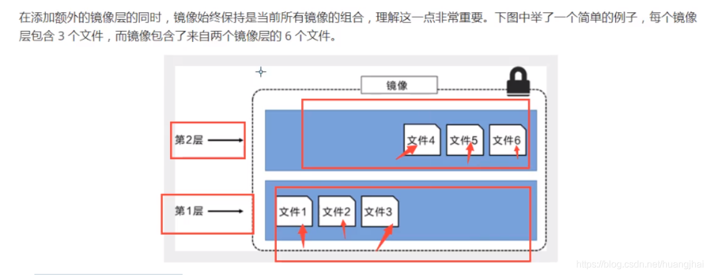

#### 12.1 什么是镜像

镜像是一种轻量级、可执行的独立软件包，用来打包软件运行环境和基于运行环境开发的软件，它包含运行某个软件所需要的所有内容，包括代码，运行时（一个程序在运行或者在被执行的依赖）、库，环境变量和配置文件。

#### 12.2 Docker镜像加载原理

Docker的镜像实际上由一层一层的文件系统组成，这种层级的文件系统是UnionFS联合文件系统。


#### 12.3 分层理解


```bash
[root@iZwz99sm8v95sckz8bd2c4Z ~]# docker image inspect nginx:latest
[
    {
        "Id": "sha256:ae2feff98a0cc5095d97c6c283dcd33090770c76d63877caa99aefbbe4343bdd",
        "RepoTags": [
            "nginx:latest"
        ],
        "RepoDigests": [
            "nginx@sha256:4cf620a5c81390ee209398ecc18e5fb9dd0f5155cd82adcbae532fec94006fb9"
        ],
        "Parent": "",
        "Comment": "",
        "Created": "2020-12-15T20:21:00.007674532Z",
        "Container": "4cc5da85f27ca0d200407f0593422676a3bab482227daee044d797d1798c96c9",
        "ContainerConfig": {
            "Hostname": "4cc5da85f27c",
            "Domainname": "",
            "User": "",
            "AttachStdin": false,
            "AttachStdout": false,
            "AttachStderr": false,
            "ExposedPorts": {
                "80/tcp": {}
            },
            "Tty": false,
            "OpenStdin": false,
            "StdinOnce": false,
            "Env": [
                "PATH=/usr/local/sbin:/usr/local/bin:/usr/sbin:/usr/bin:/sbin:/bin",
                "NGINX_VERSION=1.19.6",
                "NJS_VERSION=0.5.0",
                "PKG_RELEASE=1~buster"
            ],
            "Cmd": [
                "/bin/sh",
                "-c",
                "#(nop) ",
                "CMD [\"nginx\" \"-g\" \"daemon off;\"]"
            ],
            "Image": "sha256:13bffe371b56f4aeed88218ec17d0c6f653a83b49bd3e211fc8cfa2ca5d7a3d3",
            "Volumes": null,
            "WorkingDir": "",
            "Entrypoint": [
                "/docker-entrypoint.sh"
            ],
            "OnBuild": null,
            "Labels": {
                "maintainer": "NGINX Docker Maintainers <docker-maint@nginx.com>"
            },
            "StopSignal": "SIGQUIT"
        },
        "DockerVersion": "19.03.12",
        "Author": "",
        "Config": {
            "Hostname": "",
            "Domainname": "",
            "User": "",
            "AttachStdin": false,
            "AttachStdout": false,
            "AttachStderr": false,
            "ExposedPorts": {
                "80/tcp": {}
            },
            "Tty": false,
            "OpenStdin": false,
            "StdinOnce": false,
            "Env": [
                "PATH=/usr/local/sbin:/usr/local/bin:/usr/sbin:/usr/bin:/sbin:/bin",
                "NGINX_VERSION=1.19.6",
                "NJS_VERSION=0.5.0",
                "PKG_RELEASE=1~buster"
            ],
            "Cmd": [
                "nginx",
                "-g",
                "daemon off;"
            ],
            "Image": "sha256:13bffe371b56f4aeed88218ec17d0c6f653a83b49bd3e211fc8cfa2ca5d7a3d3",
            "Volumes": null,
            "WorkingDir": "",
            "Entrypoint": [
                "/docker-entrypoint.sh"
            ],
            "OnBuild": null,
            "Labels": {
                "maintainer": "NGINX Docker Maintainers <docker-maint@nginx.com>"
            },
            "StopSignal": "SIGQUIT"
        },
        "Architecture": "amd64",
        "Os": "linux",
        "Size": 132935043,
        "VirtualSize": 132935043,
        "GraphDriver": {
            "Data": {
                "LowerDir": "/var/lib/docker/overlay2/cb791e78a08db7091bf2ce1d78603f1758f52199e57f1805156fe30e39067aae/diff:/var/lib/docker/overlay2/1e73a72b25af68ee9abf4eb443f778d31226e12e9af428fcc14c7b044c83b258/diff:/var/lib/docker/overlay2/88c9c01762f2af8327db65d0b0d4a64785e87c9c2ab76c62e7d03619db03a985/diff:/var/lib/docker/overlay2/7304ab112ac4a9cb91fc6f74730be28fecbe19f042e92d321aa9181424cc4b2e/diff",
                "MergedDir": "/var/lib/docker/overlay2/48b288740bbb2b07b41ed43a4d17a005c46b08d3357d2960b5ef7db4b2de6618/merged",
                "UpperDir": "/var/lib/docker/overlay2/48b288740bbb2b07b41ed43a4d17a005c46b08d3357d2960b5ef7db4b2de6618/diff",
                "WorkDir": "/var/lib/docker/overlay2/48b288740bbb2b07b41ed43a4d17a005c46b08d3357d2960b5ef7db4b2de6618/work"
            },
            "Name": "overlay2"
        },
        "RootFS": {
            "Type": "layers",
            "Layers": [
                "sha256:87c8a1d8f54f3aa4e05569e8919397b65056aa71cdf48b7f061432c98475eee9",
                "sha256:5c4e5adc71a82a96f02632433de31c998c5a9e2fccdcbaee780ae83158fac4fa",
                "sha256:7d2b207c26790f693ab1942bbe26af8e2b6a14248969e542416155a912fec30d",
                "sha256:2c7498eef94aef8c40d106f3e42f7da62b3eee8fd36012bf7379becc4cd639a2",
                "sha256:4eaf0ea085df254fd5d2beba4e2c11db70a620dfa411a8ad44149e26428caee4"
            ]
        },
        "Metadata": {
            "LastTagTime": "0001-01-01T00:00:00Z"
        }
    }
]
123456789101112131415161718192021222324252627282930313233343536373839404142434445464748495051525354555657585960616263646566676869707172737475767778798081828384858687888990919293949596979899100101102103104105106107108109110111112113114115116117
```

这里指示了分层信息：

```bash
        "RootFS": {
            "Type": "layers",
            "Layers": [
                "sha256:87c8a1d8f54f3aa4e05569e8919397b65056aa71cdf48b7f061432c98475eee9",
                "sha256:5c4e5adc71a82a96f02632433de31c998c5a9e2fccdcbaee780ae83158fac4fa",
                "sha256:7d2b207c26790f693ab1942bbe26af8e2b6a14248969e542416155a912fec30d",
                "sha256:2c7498eef94aef8c40d106f3e42f7da62b3eee8fd36012bf7379becc4cd639a2",
                "sha256:4eaf0ea085df254fd5d2beba4e2c11db70a620dfa411a8ad44149e26428caee4"
            ]
        },
12345678910
```





#### 12.4 提交镜像

```bash
使用docker commit 命令提交容器成为一个新的版本

docker commit -m=“提交的描述信息”  -a="作者" 容器id 目标镜像名:[TAG] 
123
```

由于默认的Tomcat镜像的webapps文件夹中没有任何内容，需要从webapps.dist中拷贝文件到webapps文件夹。下面自行制作镜像：就是从webapps.dist中拷贝文件到webapps文件夹下，并提交该镜像作为一个新的镜像。使得该镜像默认的webapps文件夹下就有文件。具体命令如下：

```bash
#1.复制文件夹
[root@iZwz99sm8v95sckz8bd2c4Z ~]# docker run -it tomcat /bin/bash
root@2a3bf3eaa2e4:/usr/local/tomcat# cd webapps
root@2a3bf3eaa2e4:/usr/local/tomcat/webapps# ls
root@2a3bf3eaa2e4:/usr/local/tomcat/webapps# cd ../
root@2a3bf3eaa2e4:/usr/local/tomcat# cp -r webapps.dist/* webapps
root@2a3bf3eaa2e4:/usr/local/tomcat# cd webapps
root@2a3bf3eaa2e4:/usr/local/tomcat/webapps# ls
ROOT  docs  examples  host-manager  manager
[root@iZwz99sm8v95sckz8bd2c4Z ~]# docker ps
CONTAINER ID   IMAGE                 COMMAND        CREATED         STATUS         PORTS                    NAMES
2a3bf3eaa2e4   tomcat                "/bin/bash"    4 minutes ago   Up 4 minutes   8080/tcp                 competent_torvalds
7789d4505a00   portainer/portainer   "/portainer"   24 hours ago    Up 24 hours    0.0.0.0:8088->9000/tcp   quirky_sinoussi
[root@iZwz99sm8v95sckz8bd2c4Z ~]# docker exec -it 2a3bf3eaa2e4 /bin/bash
root@2a3bf3eaa2e4:/usr/local/tomcat# cd webapps
root@2a3bf3eaa2e4:/usr/local/tomcat/webapps# ls
ROOT  docs  examples  host-manager  manager
root@2a3bf3eaa2e4:/usr/local/tomcat/webapps# cd ../
root@2a3bf3eaa2e4:/usr/local/tomcat# read escape sequence
[root@iZwz99sm8v95sckz8bd2c4Z ~]# docker ps
CONTAINER ID   IMAGE                 COMMAND        CREATED         STATUS         PORTS                    NAMES
2a3bf3eaa2e4   tomcat                "/bin/bash"    8 minutes ago   Up 8 minutes   8080/tcp                 competent_torvalds
7789d4505a00   portainer/portainer   "/portainer"   24 hours ago    Up 24 hours    0.0.0.0:8088->9000/tcp   quirky_sinoussi
#2.提交镜像作为一个新的镜像

[root@iZwz99sm8v95sckz8bd2c4Z ~]# docker commit -m="add webapps" -a="Ethan" 2a3bf3eaa2e4 mytomcat:1.0
sha256:f189aac861de51087af5bc88a5f1de02d9574e7ee2d163c647dd7503a2d3982b
[root@iZwz99sm8v95sckz8bd2c4Z ~]# docker images
REPOSITORY            TAG       IMAGE ID       CREATED         SIZE
mytomcat              1.0       f189aac861de   7 seconds ago   653MB
mysql                 5.7       f07dfa83b528   6 days ago      448MB
tomcat                latest    feba8d001e3f   10 days ago     649MB
nginx                 latest    ae2feff98a0c   12 days ago     133MB
centos                latest    300e315adb2f   2 weeks ago     209MB
portainer/portainer   latest    62771b0b9b09   5 months ago    79.1MB
elasticsearch         7.6.2     f29a1ee41030   9 months ago    791MB

#3.运行容器

[root@iZwz99sm8v95sckz8bd2c4Z ~]# docker run -it mytomcat:1.0 /bin/bash
root@1645774d4605:/usr/local/tomcat# cd webapps
root@1645774d4605:/usr/local/tomcat/webapps# ls
ROOT  docs  examples  host-manager  manager
wz99sm8v95sckz8bd2c4Z ~]# docker images
REPOSITORY            TAG       IMAGE ID       CREATED         SIZE
mytomcat              1.0       f189aac861de   7 seconds ago   653MB
mysql                 5.7       f07dfa83b528   6 days ago      448MB
tomcat                latest    feba8d001e3f   10 days ago     649MB
nginx                 latest    ae2feff98a0c   12 days ago     133MB
centos                latest    300e315adb2f   2 weeks ago     209MB
portainer/portainer   latest    62771b0b9b09   5 months ago    79.1MB
elasticsearch         7.6.2     f29a1ee41030   9 months ago    791MB
12345678910111213141516171819202122232425262728293031323334353637383940414243444546474849505152
```

##### 案例：打包有vim的ubuntu

1. 启动一个ubuntu容器

   ```bash
   docker run -it ubuntu /bin/bash
   ```

2. 使用apt-get下载vim工具

   ```sh
   apt-get update
   apt-get -y install vim
   ```

3. 提交镜像到本地仓库

   ```bash
   docker commit -m="add vim" -a="yknife" d14be1122d45 yknife/ubuntu:1.0
   ```

4. 使用新镜像启动一个容器

   ```bash
   docker stop d14be1122d45
   docker run -it e3e9d71717f2 /bin/bash
   # 发现新镜像具有vim工具
   ```

5. 阿里云中容器镜像服务中

   * 创建命名空间
   * 创建镜像仓库

6. 将本地镜像推送到阿里云

   ```bash
   docker login --username=3726*****@qq.com registry.cn-hangzhou.aliyuncs.com
   docker tag [ImageId] registry.cn-hangzhou.aliyuncs.com/yknife/ubuntu:[镜像版本号]
   docker push registry.cn-hangzhou.aliyuncs.com/yknife/ubuntu:[镜像版本号]
   ```

7. 删除本地旧镜像

   ```sh
   docker rmi -f e3e9d71717f2
   ```

8. 拉去新镜像

   ```bash
   docker pull registry.cn-hangzhou.aliyuncs.com/yknife/ubuntu:1.0
   ```

   