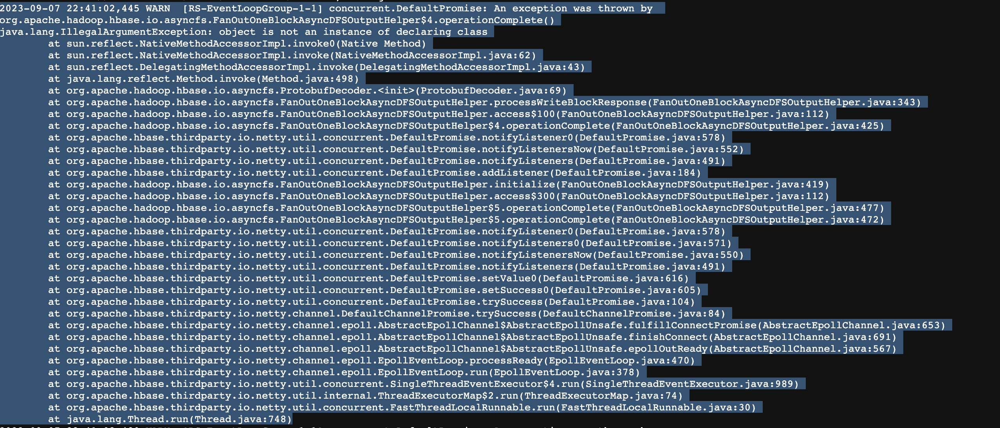

## 集群安装部署

1. 启动Hadoop、Zookeeper

2. 解压 Hbase 到指定目录

   ```sh
   tar -zxvf hbase-2.4.11-bin.tar.gz -C /opt/module/
   mv /opt/module/hbase-2.4.11 /opt/module/hbase
   ```

3. 配置环境变量

   ```sh
   vim /etc/profile.d/my_env.sh
   
   #HBASE_HOME
   export HBASE_HOME=/usr/local/hbase
   export PATH=$PATH:$HBASE_HOME/bin
   
   source /etc/profile
   ```

4. hbase-env.sh 修改内容

   ```sh
   export HBASE_MANAGES_ZK=false
   ```

5. hbase-site.xml 修改内容

   ```xml
   <?xml version="1.0"?>
   <?xml-stylesheet type="text/xsl" href="configuration.xsl"?>
   <configuration>
    <property>
    <name>hbase.zookeeper.quorum</name>
    <value>hadoop102,hadoop103,hadoop104</value>
    <description>The directory shared by RegionServers.
    </description>
    </property>
   <!-- <property>-->
   <!-- <name>hbase.zookeeper.property.dataDir</name>-->
   <!-- <value>/export/zookeeper</value>-->
   <!-- <description> 记得修改 ZK 的配置文件 -->
   <!-- ZK 的信息不能保存到临时文件夹-->
   <!-- </description>-->
   <!-- </property>-->
    <property>
    <name>hbase.rootdir</name>
    <value>hdfs://hadoop102:8020/hbase</value>
    <description>The directory shared by RegionServers.
    </description>
    </property>
    <property>
    <name>hbase.cluster.distributed</name>
    <value>true</value>
    </property>
   </configuration>
   ```

6. regionservers

   ```sh
   hbase01
   hbase02
   hbase03
   ```

7. 解决 HBase 和 Hadoop 的 log4j 兼容性问题，修改 HBase 的 jar 包，使用 Hadoop 的 jar 包

   ```sh
    mv /usr/local/hbase/lib/client-facing-thirdparty/slf4j-reload4j-1.7.33.jar /usr/local/hbase/lib/client-facing-thirdparty/slf4j-reload4j-1.7.33.jar.bak
   ```

8. 分发

   ```sh
   xsync hbase/
   ```

9. 单点启动

   ```sh
    bin/hbase-daemon.sh start master
    bin/hbase-daemon.sh start regionserver
   ```

10. 群启、群停

    ```sh
     bin/start-hbase.sh
     bin/stop-hbase.sh
    ```

11. 其他

    

    编辑hbase-env.sh

    ```sh
    # 打开这行注释
    export HBASE_DISABLE_HADOOP_CLASSPATH_LOOKUP="true" 
    ```

    