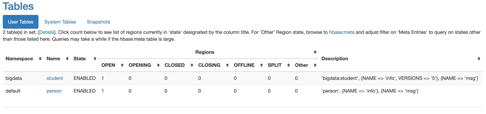

1. 创建表

   ```sh
   create 'bigdata:student',{NAME=>'info',VERSIONS=>5},{NAME=>'msg'}
   create 'person','info','msg'
   ```

   

2. 查看所有的表名

   ```sh
   list
   ```

3. 查看一个表的详情

   ```sh
    describe 'student1'
    desc 'student1'
   ```

4. 修改表格(upsert)

   ```sh
   # upsert
   alter 'person', NAME => 'info', VERSIONS => 5
   # 删除一个列簇
   alter 'person', 'delete' => 'info1'
   ```

5. 删除表 

   ```sh
   disable 'bigdata:student'
   drop 'bigdata:student'
   ```

   