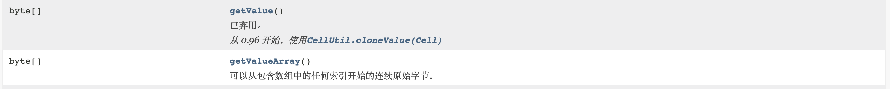

### 插入数据

```java
/**
 * 插入数据（upsert操作）
 * @param namespace 命名空间名称
 * @param tableName 表格名称
 * @param rowKey 主键
 * @param columnFamily 列族名称
 * @param columnName 列名
 * @param value 值
 */
public static void putCell(String namespace,String
        tableName,String rowKey, String columnFamily,String
                                   columnName,String value) throws IOException {
    // 1. 获取 table
    Table table =
            connection.getTable(TableName.valueOf(namespace, tableName));
    // 2. 调用相关方法插入数据
    // 2.1 创建 put 对象
    Put put = new Put(Bytes.toBytes(rowKey));
    // 2.2. 给 put 对象添加数据

    put.addColumn(Bytes.toBytes(columnFamily),Bytes.toBytes(columnName),Bytes.toBytes(value));
    // 2.3 将对象写入对应的方法
    try {
        table.put(put);
    } catch (IOException e) {
        e.printStackTrace();
    }
    // 3. 关闭 table
    table.close();
}
```

### 读取数据

```java
/**
 * 读取数据 读取对应的一行中的某一列
 *
 * @param namespace 命名空间名称
 * @param tableName 表格名称
 * @param rowKey 主键
 * @param columnFamily 列族名称
 * @param columnName 列名
 */
public static void getCells(String namespace, String tableName,
                            String rowKey, String columnFamily, String columnName) throws
        IOException {
    // 1. 获取 table
    Table table =
            connection.getTable(TableName.valueOf(namespace, tableName));
    // 2. 创建 get 对象
    Get get = new Get(Bytes.toBytes(rowKey));
    // 如果直接调用 get 方法读取数据 此时读一整行数据
    // 如果想读取某一列的数据 需要添加对应的参数
    get.addColumn(Bytes.toBytes(columnFamily),
            Bytes.toBytes(columnName));
    // 设置读取数据的版本
    get.readAllVersions();
    try {
        // 读取数据 得到 result 对象
        Result result = table.get(get);
        // 处理数据
        Cell[] cells = result.rawCells();
        // 测试方法: 直接把读取的数据打印到控制台
        // 如果是实际开发 需要再额外写方法 对应处理数据
        for (Cell cell : cells) {
            //cell.getValueArray()返回的byte数组不可用，CellUtil.cloneValue()
            // cell 存储数据比较底层
            String value = new String(CellUtil.cloneValue(cell));
            System.out.println(value);
            String value1 = new String(cell.getValueArray());
            System.out.println(value1);

            System.out.println(value.equals(value1));
        }
    } catch (IOException e) {
        e.printStackTrace();
    }
    // 关闭 table
    table.close();
}
```

zhaoliu
1002infoname����Wzhaoliu
false

wangwu
1002infoname���s�wangwu
false

https://hbase.apache.org/1.1/apidocs/org/apache/hadoop/hbase/Cell.html



### 扫描数据

```java
/**
 * 扫描数据
 *
 * @param namespace 命名空间
 * @param tableName 表格名称
 * @param startRow 开始的 row 包含的
 * @param stopRow 结束的 row 不包含
 */
public static void scanRows(String namespace, String tableName,
                            String startRow, String stopRow) throws IOException {
    // 1. 获取 table
    Table table =
            connection.getTable(TableName.valueOf(namespace, tableName));
    // 2. 创建 scan 对象
    Scan scan = new Scan();
    // 如果此时直接调用 会直接扫描整张表
    // 添加参数 来控制扫描的数据
    // 默认包含
    scan.withStartRow(Bytes.toBytes(startRow));
    // 默认不包含
    scan.withStopRow(Bytes.toBytes(stopRow));
    try {
        // 读取多行数据 获得 scanner
        ResultScanner scanner = table.getScanner(scan);
        // result 来记录一行数据 cell 数组
        // ResultScanner 来记录多行数据 result 的数组
        for (Result result : scanner) {
            Cell[] cells = result.rawCells();
            for (Cell cell : cells) {
                System.out.print (new
                        String(CellUtil.cloneRow(cell)) + "-" + new
                        String(CellUtil.cloneFamily(cell)) + "-" + new
                        String(CellUtil.cloneQualifier(cell)) + "-" + new
                        String(CellUtil.cloneValue(cell)) + "\t");
            }
            System.out.println();
        }
    } catch (IOException e) {
        e.printStackTrace();
    }
    // 3. 关闭 table
    table.close();
}

输出：
  1001-info-age-10	1001-info-name-hahahah	
```

### 带过滤扫描

```java
/**
 * 带过滤的扫描
 *
 * @param namespace 命名空间
 * @param tableName 表格名称
 * @param startRow 开始 row
 * @param stopRow 结束 row
 * @param columnFamily 列族名称
 * @param columnName 列名
 * @param value value 值
 * @throws IOException
 */
public static void filterScan(String namespace, String tableName,
                              String startRow, String stopRow, String columnFamily, String
                                      columnName, String value) throws IOException {
    // 1. 获取 table
    Table table =
            connection.getTable(TableName.valueOf(namespace, tableName));
    // 2. 创建 scan 对象
    Scan scan = new Scan();
    // 如果此时直接调用 会直接扫描整张表
    // 添加参数 来控制扫描的数据
    // 默认包含
    scan.withStartRow(Bytes.toBytes(startRow));
    // 默认不包含
    scan.withStopRow(Bytes.toBytes(stopRow));
    // 可以添加多个过滤
    FilterList filterList = new FilterList();
    // 创建过滤器
    // (1) 结果只保留当前列的数据
  	// 1002-info-name-zhaoliu
    ColumnValueFilter columnValueFilter = new ColumnValueFilter(
            // 列族名称
            Bytes.toBytes(columnFamily),
            // 列名
            Bytes.toBytes(columnName),
            // 比较关系
            CompareOperator.EQUAL,
            // 值
            Bytes.toBytes(value)
    );
    // (2) 结果保留整行数据
    // 结果同时会保留没有当前列的数据
    // 1002-info-age-20	1002-info-name-zhaoliu
    SingleColumnValueFilter singleColumnValueFilter = new
            SingleColumnValueFilter(
            // 列族名称
            Bytes.toBytes(columnFamily),
            // 列名
            Bytes.toBytes(columnName),
            // 比较关系
            CompareOperator.EQUAL,
            // 值
            Bytes.toBytes(value)
    );
    // 本身可以添加多个过滤器
    filterList.addFilter(singleColumnValueFilter);
    // 添加过滤
    scan.setFilter(filterList);
    try {
        // 读取多行数据 获得 scanner
        ResultScanner scanner = table.getScanner(scan);
        // result 来记录一行数据 cell 数组
        // ResultScanner 来记录多行数据 result 的数组
        for (Result result : scanner) {
            Cell[] cells = result.rawCells();
            for (Cell cell : cells) {
                System.out.print(new
                        String(CellUtil.cloneRow(cell)) + "-" + new
                        String(CellUtil.cloneFamily(cell)) + "-" + new
                        String(CellUtil.cloneQualifier(cell)) + "-" + new
                        String(CellUtil.cloneValue(cell)) + "\t");
            }
            System.out.println();
        }
    } catch (IOException e) {
        e.printStackTrace();
    }
    // 3. 关闭 table
    table.close();
}
```

### 删除数据

```java
/**
 * 删除 column 数据
 *
 * @param nameSpace
 * @param tableName
 * @param rowKey
 * @param family
 * @param column
 * @throws IOException
 */
public static void deleteColumn(String nameSpace, String tableName,
                                String rowKey, String family, String column) throws IOException {
    // 1.获取 table
    Table table = connection.getTable(TableName.valueOf(nameSpace,
            tableName));
    // 2.创建 Delete 对象
    Delete delete = new Delete(Bytes.toBytes(rowKey));
    // 3.添加删除信息
    // 3.1 删除单个版本
    //delete.addColumn(Bytes.toBytes(family),Bytes.toBytes(column));
    // 3.2 删除所有版本
		//delete.addColumns(Bytes.toBytes(family),
		//Bytes.toBytes(column));
    // 3.3 删除列族
     delete.addFamily(Bytes.toBytes(family));
    // 3.删除数据
    table.delete(delete);
    // 5.关闭资源
    table.close();
}
```