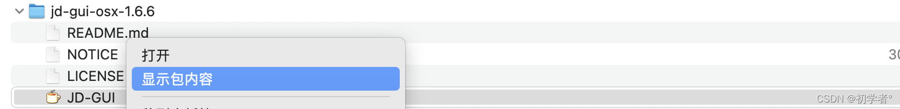
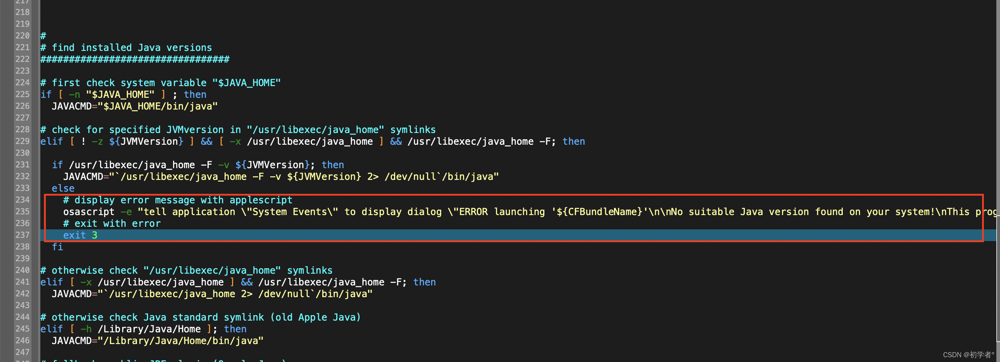
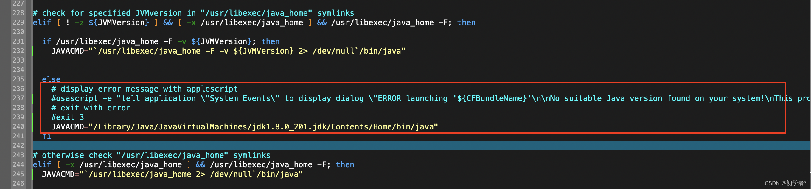

1、右键显示JD-[GUI](https://so.csdn.net/so/search?q=GUI&spm=1001.2101.3001.7020)显示包内容，找到“Contents/MacOS/universalJavaApplicationStub.sh”编辑

2、找到提示错误的这里，我这里是234-237行

3、注释或删除掉235和237行，并增加JAVACMD="/Library/Java/JavaVirtualMachines/jdk1.8.0_201.jdk/Contents/Home/bin/java"

路径中的jdk1.8.0_201.jdk需要改成你自己的安装的版本，之后就可以启动了

