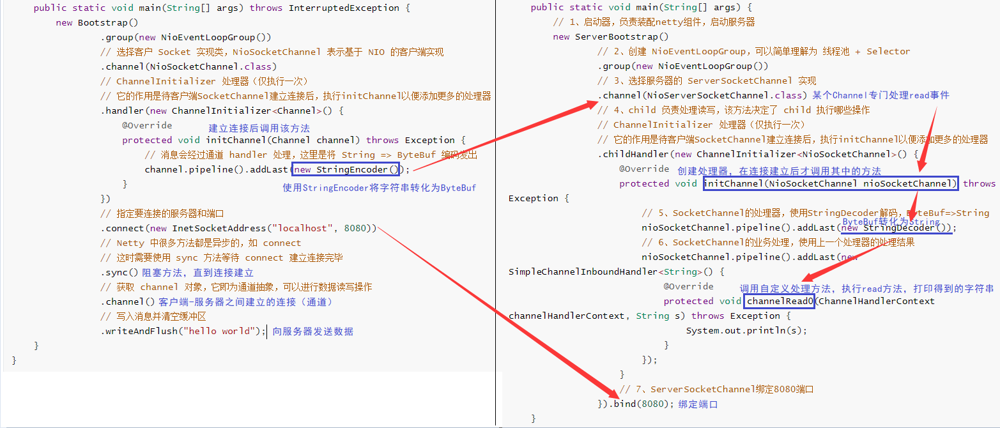

## 1、服务器端代码

```java
public class HelloServer {
    public static void main(String[] args) {
        // 1、启动器，负责装配netty组件，启动服务器
        new ServerBootstrap()
                // 2、创建 NioEventLoopGroup，可以简单理解为 线程池 + Selector
                .group(new NioEventLoopGroup())
                // 3、选择服务器的 ServerSocketChannel 实现
                .channel(NioServerSocketChannel.class)
                // 4、child 负责处理读写，该方法决定了 child 执行哪些操作
            	// ChannelInitializer 处理器（仅执行一次）
            	// 它的作用是待客户端SocketChannel建立连接后，执行initChannel以便添加更多的处理器
                .childHandler(new ChannelInitializer<NioSocketChannel>() {
                    @Override
                    protected void initChannel(NioSocketChannel nioSocketChannel) throws Exception {
                        // 5、SocketChannel的处理器，使用StringDecoder解码，ByteBuf=>String
                        nioSocketChannel.pipeline().addLast(new StringDecoder());
                        // 6、SocketChannel的业务处理，使用上一个处理器的处理结果
                        nioSocketChannel.pipeline().addLast(new SimpleChannelInboundHandler<String>() {
                            @Override
                            protected void channelRead0(ChannelHandlerContext channelHandlerContext, String s) throws Exception {
                                System.out.println(s);
                            }
                        });
                    }
                    // 7、ServerSocketChannel绑定8080端口
                }).bind(8080);
    }
}
```

## 2、客户端代码

```java
public class HelloClient {
    public static void main(String[] args) throws InterruptedException {
        new Bootstrap()
                .group(new NioEventLoopGroup())
                // 选择客户 Socket 实现类，NioSocketChannel 表示基于 NIO 的客户端实现
                .channel(NioSocketChannel.class)
                // ChannelInitializer 处理器（仅执行一次）
                // 它的作用是待客户端SocketChannel建立连接后，执行initChannel以便添加更多的处理器
                .handler(new ChannelInitializer<Channel>() {
                    @Override
                    protected void initChannel(Channel channel) throws Exception {
                        // 消息会经过通道 handler 处理，这里是将 String => ByteBuf 编码发出
                        channel.pipeline().addLast(new StringEncoder());
                    }
                })
                // 指定要连接的服务器和端口
                .connect(new InetSocketAddress("localhost", 8080))
                // Netty 中很多方法都是异步的，如 connect
                // 这时需要使用 sync 方法等待 connect 建立连接完毕
                .sync()
                // 获取 channel 对象，它即为通道抽象，可以进行数据读写操作
                .channel()
                // 写入消息并清空缓冲区
                .writeAndFlush("hello world");
    }
}
```

## 3、运行流程

**左：客户端 右：服务器端**

[](https://nyimapicture.oss-cn-beijing.aliyuncs.com/img/20210420132155.png)

### 组件解释

- channel 可以理解为数据的通道

- msg 理解为流动的数据，最开始输入是 ByteBuf，但经过 pipeline 中的各个 handler 加工，会变成其它类型对象，最后输出又变成 ByteBuf

- handler 可以理解为数据的处理工序

  - 工序有多道，

    合在一起就是 pipeline（传递途径）

    ，pipeline 负责发布事件（读、读取完成…）传播给每个 handler， handler 对自己感兴趣的事件进行处理（重写了相应事件处理方法）

    - pipeline 中有多个 handler，处理时会依次调用其中的 handler

  - handler 分 Inbound 和 Outbound 两类

    - Inbound 入站
    - Outbound 出站

- eventLoop 可以理解为处理数据的工人

  - eventLoop 可以管理多个 channel 的 io 操作，并且一旦 eventLoop 负责了某个 channel，就**会将其与channel进行绑定**，以后该 channel 中的 io 操作都由该 eventLoop 负责
  - eventLoop 既可以执行 io 操作，**也可以进行任务处理**，每个 eventLoop 有自己的任务队列，队列里可以堆放多个 channel 的待处理任务，任务分为普通任务、定时任务
  - eventLoop 按照 pipeline 顺序，依次按照 handler 的规划（代码）处理数据，可以为每个 handler 指定不同的 eventLoop