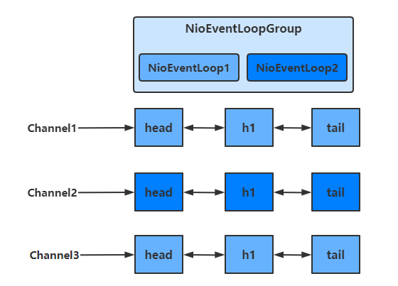
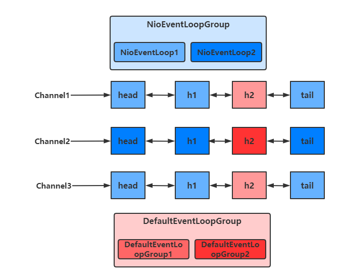

## 1、EventLoop

**事件循环对象** EventLoop

EventLoop 本质是一个**单线程执行器**（同时**维护了一个 Selector**），里面有 run 方法处理一个或多个 Channel 上源源不断的 io 事件

它的继承关系如下

- 继承自 j.u.c.ScheduledExecutorService 因此包含了线程池中所有的方法
- 继承自 netty 自己的 OrderedEventExecutor
  - 提供了 boolean inEventLoop(Thread thread) 方法判断一个线程是否属于此 EventLoop
  - 提供了 EventLoopGroup parent() 方法来看看自己属于哪个 EventLoopGroup

**事件循环组** EventLoopGroup

EventLoopGroup 是一组 EventLoop，Channel 一般会调用 EventLoopGroup 的 register 方法来绑定其中一个 EventLoop，后续这个 Channel 上的 io 事件都由此 EventLoop 来处理（保证了 io 事件处理时的线程安全）

- 继承自 netty 自己的 EventExecutorGroup
  - 实现了 Iterable 接口提供遍历 EventLoop 的能力
  - 另有 next 方法获取集合中下一个 EventLoop

### 处理普通与定时任务

```java
public class TestEventLoop {
    public static void main(String[] args) {
        // 创建拥有两个EventLoop的NioEventLoopGroup，对应两个线程
        EventLoopGroup group = new NioEventLoopGroup(2);
        // 通过next方法可以获得下一个 EventLoop
        System.out.println(group.next());
        System.out.println(group.next());

        // 通过EventLoop执行普通任务
        group.next().execute(()->{
            System.out.println(Thread.currentThread().getName() + " hello");
        });

        // 通过EventLoop执行定时任务
        group.next().scheduleAtFixedRate(()->{
            System.out.println(Thread.currentThread().getName() + " hello2");
        }, 0, 1, TimeUnit.SECONDS);
        
        // 优雅地关闭
        group.shutdownGracefully();
    }
}Copy
```

输出结果如下

```
io.netty.channel.nio.NioEventLoop@7bb11784
io.netty.channel.nio.NioEventLoop@33a10788
nioEventLoopGroup-2-1 hello
nioEventLoopGroup-2-2 hello2
nioEventLoopGroup-2-2 hello2
nioEventLoopGroup-2-2 hello2Copy
```

**关闭 EventLoopGroup**

优雅关闭 `shutdownGracefully` 方法。该方法会首先切换 `EventLoopGroup` 到关闭状态从而拒绝新的任务的加入，然后在任务队列的任务都处理完成后，停止线程的运行。从而确保整体应用是在正常有序的状态下退出的

### 处理IO任务

#### 服务器代码

```java
public class MyServer {
    public static void main(String[] args) {
        new ServerBootstrap()
                .group(new NioEventLoopGroup())
                .channel(NioServerSocketChannel.class)
                .childHandler(new ChannelInitializer<SocketChannel>() {
                    @Override
                    protected void initChannel(SocketChannel socketChannel) throws Exception {
                        socketChannel.pipeline().addLast(new ChannelInboundHandlerAdapter() {
                            @Override
                            public void channelRead(ChannelHandlerContext ctx, Object msg) throws Exception {
                                ByteBuf buf = (ByteBuf) msg;
                                System.out.println(Thread.currentThread().getName() + " " + buf.toString(StandardCharsets.UTF_8));

                            }
                        });
                    }
                })
                .bind(8080);
    }
}Copy
```

#### 客户端代码

```java
public class MyClient {
    public static void main(String[] args) throws IOException, InterruptedException {
        Channel channel = new Bootstrap()
                .group(new NioEventLoopGroup())
                .channel(NioSocketChannel.class)
                .handler(new ChannelInitializer<SocketChannel>() {
                    @Override
                    protected void initChannel(SocketChannel socketChannel) throws Exception {
                        socketChannel.pipeline().addLast(new StringEncoder());
                    }
                })
                .connect(new InetSocketAddress("localhost", 8080))
                .sync()
                .channel();
        System.out.println(channel);
        // 此处打断点调试，调用 channel.writeAndFlush(...);
        System.in.read();
    }
}
```

### 分工

Bootstrap的group()方法**可以传入两个EventLoopGroup参数**，分别负责处理不同的事件

```
public class MyServer {
    public static void main(String[] args) {
        new ServerBootstrap()
            	// 两个Group，分别为Boss 负责Accept事件，Worker 负责读写事件
                .group(new NioEventLoopGroup(1), new NioEventLoopGroup(2))
            
				...
    }
}Copy
```

多个客户端分别发送 `hello` 结果

```
nioEventLoopGroup-3-1 hello1
nioEventLoopGroup-3-2 hello2
nioEventLoopGroup-3-1 hello3
nioEventLoopGroup-3-2 hello4
nioEventLoopGroup-3-2 hello4Copy
```

可以看出，一个EventLoop可以**负责多个**Channel，且EventLoop一旦与Channel绑定，则**一直负责**处理该Channel中的事件

[](https://nyimapicture.oss-cn-beijing.aliyuncs.com/img/20210421103251.png)

#### 增加自定义EventLoopGroup

当有的**任务需要较长的时间处理时，可以使用非NioEventLoopGroup**，避免同一个NioEventLoop中的其他Channel在较长的时间内都无法得到处理

```
public class MyServer {
    public static void main(String[] args) {
        // 增加自定义的非NioEventLoopGroup
        EventLoopGroup group = new DefaultEventLoopGroup();
        
        new ServerBootstrap()
                .group(new NioEventLoopGroup(1), new NioEventLoopGroup(2))
                .channel(NioServerSocketChannel.class)
                .childHandler(new ChannelInitializer<SocketChannel>() {
                    @Override
                    protected void initChannel(SocketChannel socketChannel) throws Exception {
                        // 增加两个handler，第一个使用NioEventLoopGroup处理，第二个使用自定义EventLoopGroup处理
                        socketChannel.pipeline().addLast("nioHandler",new ChannelInboundHandlerAdapter() {
                            @Override
                            public void channelRead(ChannelHandlerContext ctx, Object msg) throws Exception {
                                ByteBuf buf = (ByteBuf) msg;
                                System.out.println(Thread.currentThread().getName() + " " + buf.toString(StandardCharsets.UTF_8));
                                // 调用下一个handler
                                ctx.fireChannelRead(msg);
                            }
                        })
                        // 该handler绑定自定义的Group
                        .addLast(group, "myHandler", new ChannelInboundHandlerAdapter() {
                            @Override
                            public void channelRead(ChannelHandlerContext ctx, Object msg) throws Exception {
                                ByteBuf buf = (ByteBuf) msg;
                                System.out.println(Thread.currentThread().getName() + " " + buf.toString(StandardCharsets.UTF_8));
                            }
                        });
                    }
                })
                .bind(8080);
    }
}Copy
```

启动四个客户端发送数据

```
nioEventLoopGroup-4-1 hello1
defaultEventLoopGroup-2-1 hello1
nioEventLoopGroup-4-2 hello2
defaultEventLoopGroup-2-2 hello2
nioEventLoopGroup-4-1 hello3
defaultEventLoopGroup-2-3 hello3
nioEventLoopGroup-4-2 hello4
defaultEventLoopGroup-2-4 hello4Copy
```

可以看出，客户端与服务器之间的事件，被nioEventLoopGroup和defaultEventLoopGroup分别处理

[](https://nyimapicture.oss-cn-beijing.aliyuncs.com/img/20210421103607.png)

#### 切换的实现

**不同的EventLoopGroup切换的实现原理如下**

由上面的图可以看出，当handler中绑定的Group不同时，需要切换Group来执行不同的任务

```
static void invokeChannelRead(final AbstractChannelHandlerContext next, Object msg) {
    final Object m = next.pipeline.touch(ObjectUtil.checkNotNull(msg, "msg"), next);
    // 获得下一个EventLoop, excutor 即为 EventLoopGroup
    EventExecutor executor = next.executor();
    
    // 如果下一个EventLoop 在当前的 EventLoopGroup中
    if (executor.inEventLoop()) {
        // 使用当前 EventLoopGroup 中的 EventLoop 来处理任务
        next.invokeChannelRead(m);
    } else {
        // 否则让另一个 EventLoopGroup 中的 EventLoop 来创建任务并执行
        executor.execute(new Runnable() {
            public void run() {
                next.invokeChannelRead(m);
            }
        });
    }
}Copy
```

- 如果两个 handler 绑定的是**同一个EventLoopGroup**，那么就直接调用
- 否则，把要调用的代码封装为一个任务对象，由下一个 handler 的 EventLoopGroup 来调用