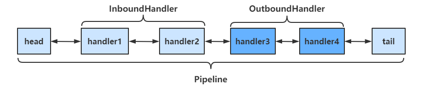

## Handler与Pipeline

### Pipeline

```java
public class PipeLineServer {
    public static void main(String[] args) {
        new ServerBootstrap()
                .group(new NioEventLoopGroup())
                .channel(NioServerSocketChannel.class)
                .childHandler(new ChannelInitializer<SocketChannel>() {
                    @Override
                    protected void initChannel(SocketChannel socketChannel) throws Exception {
                        // 在socketChannel的pipeline中添加handler
                        // pipeline中handler是带有head与tail节点的双向链表，的实际结构为
    				 	// head <-> handler1 <-> ... <-> handler4 <->tail
                        // Inbound主要处理入站操作，一般为读操作，发生入站操作时会触发Inbound方法
                        // 入站时，handler是从head向后调用的
                        socketChannel.pipeline().addLast("handler1" ,new ChannelInboundHandlerAdapter() {
                            @Override
                            public void channelRead(ChannelHandlerContext ctx, Object msg) throws Exception {
                                System.out.println(Thread.currentThread().getName() + " Inbound handler 1");
                                // 父类该方法内部会调用fireChannelRead
                                // 将数据传递给下一个handler
                                super.channelRead(ctx, msg);
                            }
                        });
                        socketChannel.pipeline().addLast("handler2", new ChannelInboundHandlerAdapter() {
                            @Override
                            public void channelRead(ChannelHandlerContext ctx, Object msg) throws Exception {
                                System.out.println(Thread.currentThread().getName() + " Inbound handler 2");
                                // 执行write操作，使得Outbound的方法能够得到调用
          socketChannel.writeAndFlush(ctx.alloc().buffer().writeBytes("Server...".getBytes(StandardCharsets.UTF_8)));
                                super.channelRead(ctx, msg);
                            }
                        });
                        // Outbound主要处理出站操作，一般为写操作，发生出站操作时会触发Outbound方法
                        // 出站时，handler的调用是从tail向前调用的
                        socketChannel.pipeline().addLast("handler3" ,new ChannelOutboundHandlerAdapter(){
                            @Override
                            public void write(ChannelHandlerContext ctx, Object msg, ChannelPromise promise) throws Exception {
                                System.out.println(Thread.currentThread().getName() + " Outbound handler 1");
                                super.write(ctx, msg, promise);
                            }
                        });
                        socketChannel.pipeline().addLast("handler4" ,new ChannelOutboundHandlerAdapter(){
                            @Override
                            public void write(ChannelHandlerContext ctx, Object msg, ChannelPromise promise) throws Exception {
                                System.out.println(Thread.currentThread().getName() + " Outbound handler 2");
                                super.write(ctx, msg, promise);
                            }
                        });
                    }
                })
                .bind(8080);
    }
}Copy
```

**运行结果如下**

```
nioEventLoopGroup-2-2 Inbound handler 1
nioEventLoopGroup-2-2 Inbound handler 2
nioEventLoopGroup-2-2 Outbound handler 2
nioEventLoopGroup-2-2 Outbound handler 1Copy
```

通过channel.pipeline().addLast(name, handler)添加handler时，**记得给handler取名字**。这样可以调用pipeline的**addAfter、addBefore等方法更灵活地向pipeline中添加handler**

handler需要放入通道的pipeline中，才能根据放入顺序来使用handler

- pipeline是结构是一个带有head与tail指针的双向链表，其中的节点为handler
  - 要通过ctx.fireChannelRead(msg)等方法，**将当前handler的处理结果传递给下一个handler**
- 当有**入站**（Inbound）操作时，会从**head开始向后**调用handler，直到handler不是处理Inbound操作为止
- 当有**出站**（Outbound）操作时，会从**tail开始向前**调用handler，直到handler不是处理Outbound操作为止

**具体结构如下**

[](https://nyimapicture.oss-cn-beijing.aliyuncs.com/img/20210423102354.png)

**调用顺序如下**

[](https://nyimapicture.oss-cn-beijing.aliyuncs.com/img/20210423105200.png)

### OutboundHandler

#### socketChannel.writeAndFlush()

当handler中调用该方法进行写操作时，会触发Outbound操作，**此时是从tail向前寻找OutboundHandler**

[](https://nyimapicture.oss-cn-beijing.aliyuncs.com/img/20210423122010.png)

#### ctx.writeAndFlush()

当handler中调用该方法进行写操作时，会触发Outbound操作，**此时是从当前handler向前寻找OutboundHandler**

[](https://nyimapicture.oss-cn-beijing.aliyuncs.com/img/20210423122050.png)

### EmbeddedChannel

EmbeddedChannel可以用于测试各个handler，通过其构造函数按顺序传入需要测试handler，然后调用对应的Inbound和Outbound方法即可

```java
public class TestEmbeddedChannel {
    public static void main(String[] args) {
        ChannelInboundHandlerAdapter h1 = new ChannelInboundHandlerAdapter() {
            @Override
            public void channelRead(ChannelHandlerContext ctx, Object msg) throws Exception {
                System.out.println("1");
                super.channelRead(ctx, msg);
            }
        };

        ChannelInboundHandlerAdapter h2 = new ChannelInboundHandlerAdapter() {
            @Override
            public void channelRead(ChannelHandlerContext ctx, Object msg) throws Exception {
                System.out.println("2");
                super.channelRead(ctx, msg);
            }
        };

        ChannelOutboundHandlerAdapter h3 = new ChannelOutboundHandlerAdapter() {
            @Override
            public void write(ChannelHandlerContext ctx, Object msg, ChannelPromise promise) throws Exception {
                System.out.println("3");
                super.write(ctx, msg, promise);
            }
        };

        ChannelOutboundHandlerAdapter h4 = new ChannelOutboundHandlerAdapter() {
            @Override
            public void write(ChannelHandlerContext ctx, Object msg, ChannelPromise promise) throws Exception {
                System.out.println("4");
                super.write(ctx, msg, promise);
            }
        };

        // 用于测试Handler的Channel
        EmbeddedChannel channel = new EmbeddedChannel(h1, h2, h3, h4);
        
        // 执行Inbound操作 
        channel.writeInbound(ByteBufAllocator.DEFAULT.buffer().writeBytes("hello".getBytes(StandardCharsets.UTF_8)));
        // 执行Outbound操作
        channel.writeOutbound(ByteBufAllocator.DEFAULT.buffer().writeBytes("hello".getBytes(StandardCharsets.UTF_8)));
    }
}
```