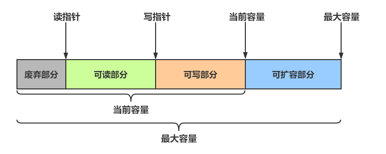

## ByteBuf

**调试工具方法**

```
private static void log(ByteBuf buffer) {
    int length = buffer.readableBytes();
    int rows = length / 16 + (length % 15 == 0 ? 0 : 1) + 4;
    StringBuilder buf = new StringBuilder(rows * 80 * 2)
        .append("read index:").append(buffer.readerIndex())
        .append(" write index:").append(buffer.writerIndex())
        .append(" capacity:").append(buffer.capacity())
        .append(NEWLINE);
    appendPrettyHexDump(buf, buffer);
    System.out.println(buf.toString());
}Copy
```

该方法可以帮助我们更为详细地查看ByteBuf中的内容

### 创建

```
public class ByteBufStudy {
    public static void main(String[] args) {
        // 创建ByteBuf
        ByteBuf buffer = ByteBufAllocator.DEFAULT.buffer(16);
        ByteBufUtil.log(buffer);

        // 向buffer中写入数据
        StringBuilder sb = new StringBuilder();
        for(int i = 0; i < 20; i++) {
            sb.append("a");
        }
        buffer.writeBytes(sb.toString().getBytes(StandardCharsets.UTF_8));

        // 查看写入结果
        ByteBufUtil.log(buffer);
    }
}Copy
```

**运行结果**

```
read index:0 write index:0 capacity:16

read index:0 write index:20 capacity:64
         +-------------------------------------------------+
         |  0  1  2  3  4  5  6  7  8  9  a  b  c  d  e  f |
+--------+-------------------------------------------------+----------------+
|00000000| 61 61 61 61 61 61 61 61 61 61 61 61 61 61 61 61 |aaaaaaaaaaaaaaaa|
|00000010| 61 61 61 61                                     |aaaa            |
+--------+-------------------------------------------------+----------------+Copy
```

ByteBuf**通过`ByteBufAllocator`选择allocator并调用对应的buffer()方法来创建的**，默认使用**直接内存**作为ByteBuf，容量为256个字节，可以指定初始容量的大小

当ByteBuf的容量无法容纳所有数据时，**ByteBuf会进行扩容操作**

**如果在handler中创建ByteBuf，建议使用`ChannelHandlerContext ctx.alloc().buffer()`来创建**

### 直接内存与堆内存

通过该方法创建的ByteBuf，使用的是**基于直接内存**的ByteBuf

```
ByteBuf buffer = ByteBufAllocator.DEFAULT.buffer(16);Copy
```

可以使用下面的代码来创建池化**基于堆**的 ByteBuf

```
ByteBuf buffer = ByteBufAllocator.DEFAULT.heapBuffer(16);Copy
```

也可以使用下面的代码来创建池化**基于直接内存**的 ByteBuf

```
ByteBuf buffer = ByteBufAllocator.DEFAULT.directBuffer(16);Copy
```

- 直接内存创建和销毁的代价昂贵，但读写性能高（少一次内存复制），适合配合池化功能一起用
- 直接内存对 GC 压力小，因为这部分内存不受 JVM 垃圾回收的管理，但也要注意及时主动释放

**验证**

```
public class ByteBufStudy {
    public static void main(String[] args) {
        ByteBuf buffer = ByteBufAllocator.DEFAULT.buffer(16);
        System.out.println(buffer.getClass());

        buffer = ByteBufAllocator.DEFAULT.heapBuffer(16);
        System.out.println(buffer.getClass());

        buffer = ByteBufAllocator.DEFAULT.directBuffer(16);
        System.out.println(buffer.getClass());
    }
}Copy
// 使用池化的直接内存
class io.netty.buffer.PooledUnsafeDirectByteBuf
    
// 使用池化的堆内存    
class io.netty.buffer.PooledUnsafeHeapByteBuf
    
// 使用池化的直接内存    
class io.netty.buffer.PooledUnsafeDirectByteBufCopy
```

### 池化与非池化

池化的最大意义在于可以**重用** ByteBuf，优点有

- 没有池化，则每次都得创建新的 ByteBuf 实例，这个操作对直接内存代价昂贵，就算是堆内存，也会增加 GC 压力
- 有了池化，则可以重用池中 ByteBuf 实例，并且采用了与 jemalloc 类似的内存分配算法提升分配效率
- 高并发时，池化功能更节约内存，减少内存溢出的可能

池化功能是否开启，可以通过下面的系统环境变量来设置

```
-Dio.netty.allocator.type={unpooled|pooled}Copy
```

- 4.1 以后，**非 Android 平台默认启用池化实现**，Android 平台启用非池化实现
- 4.1 之前，池化功能还不成熟，默认是非池化实现

### 组成

ByteBuf主要有以下几个组成部分

- 最大容量与当前容量

  - 在构造ByteBuf时，可传入两个参数，分别代表初始容量和最大容量，若未传入第二个参数（最大容量），最大容量默认为Integer.MAX_VALUE
  - 当ByteBuf容量无法容纳所有数据时，会进行扩容操作，若**超出最大容量**，会抛出`java.lang.IndexOutOfBoundsException`异常

- 读写操作不同于ByteBuffer只用position进行控制，

  ByteBuf分别由读指针和写指针两个指针控制

  。进行读写操作时，无需进行模式的切换

  - 读指针前的部分被称为废弃部分，是已经读过的内容
  - 读指针与写指针之间的空间称为可读部分
  - 写指针与当前容量之间的空间称为可写部分

[](https://nyimapicture.oss-cn-beijing.aliyuncs.com/img/20210423143030.png)

### 写入

常用方法如下

| 方法签名                                                     | 含义                       | 备注                                                    |
| ------------------------------------------------------------ | -------------------------- | ------------------------------------------------------- |
| writeBoolean(boolean value)                                  | 写入 boolean 值            | **用一字节 01\|00 代表 true\|false**                    |
| writeByte(int value)                                         | 写入 byte 值               |                                                         |
| writeShort(int value)                                        | 写入 short 值              |                                                         |
| writeInt(int value)                                          | 写入 int 值                | Big Endian（大端写入），即 0x250，写入后 00 00 02 50    |
| writeIntLE(int value)                                        | 写入 int 值                | Little Endian（小端写入），即 0x250，写入后 50 02 00 00 |
| writeLong(long value)                                        | 写入 long 值               |                                                         |
| writeChar(int value)                                         | 写入 char 值               |                                                         |
| writeFloat(float value)                                      | 写入 float 值              |                                                         |
| writeDouble(double value)                                    | 写入 double 值             |                                                         |
| writeBytes(ByteBuf src)                                      | 写入 netty 的 ByteBuf      |                                                         |
| writeBytes(byte[] src)                                       | 写入 byte[]                |                                                         |
| writeBytes(ByteBuffer src)                                   | 写入 nio 的 **ByteBuffer** |                                                         |
| int writeCharSequence(CharSequence sequence, Charset charset) | 写入字符串                 | CharSequence为字符串类的父类，第二个参数为对应的字符集  |

> 注意
>
> - 这些方法的未指明返回值的，其返回值都是 ByteBuf，意味着可以链式调用来写入不同的数据
> - 网络传输中，**默认习惯是 Big Endian**，使用 writeInt(int value)

**使用方法**

```
public class ByteBufStudy {
    public static void main(String[] args) {
        // 创建ByteBuf
        ByteBuf buffer = ByteBufAllocator.DEFAULT.buffer(16, 20);
        ByteBufUtil.log(buffer);

        // 向buffer中写入数据
        buffer.writeBytes(new byte[]{1, 2, 3, 4});
        ByteBufUtil.log(buffer);

        buffer.writeInt(5);
        ByteBufUtil.log(buffer);

        buffer.writeIntLE(6);
        ByteBufUtil.log(buffer);

        buffer.writeLong(7);
        ByteBufUtil.log(buffer);
    }
}Copy
```

**运行结果**

```
read index:0 write index:0 capacity:16

read index:0 write index:4 capacity:16
         +-------------------------------------------------+
         |  0  1  2  3  4  5  6  7  8  9  a  b  c  d  e  f |
+--------+-------------------------------------------------+----------------+
|00000000| 01 02 03 04                                     |....            |
+--------+-------------------------------------------------+----------------+

read index:0 write index:8 capacity:16
         +-------------------------------------------------+
         |  0  1  2  3  4  5  6  7  8  9  a  b  c  d  e  f |
+--------+-------------------------------------------------+----------------+
|00000000| 01 02 03 04 00 00 00 05                         |........        |
+--------+-------------------------------------------------+----------------+

read index:0 write index:12 capacity:16
         +-------------------------------------------------+
         |  0  1  2  3  4  5  6  7  8  9  a  b  c  d  e  f |
+--------+-------------------------------------------------+----------------+
|00000000| 01 02 03 04 00 00 00 05 06 00 00 00             |............    |
+--------+-------------------------------------------------+----------------+

read index:0 write index:20 capacity:20
         +-------------------------------------------------+
         |  0  1  2  3  4  5  6  7  8  9  a  b  c  d  e  f |
+--------+-------------------------------------------------+----------------+
|00000000| 01 02 03 04 00 00 00 05 06 00 00 00 00 00 00 00 |................|
|00000010| 00 00 00 07                                     |....            |
+--------+-------------------------------------------------+----------------+Copy
```

还有一类方法是 **set 开头**的一系列方法，也**可以写入数据，但不会改变写指针位置**

### 扩容

当ByteBuf中的容量无法容纳写入的数据时，会进行扩容操作

```
buffer.writeLong(7);
ByteBufUtil.log(buffer);Copy
// 扩容前
read index:0 write index:12 capacity:16
...

// 扩容后
read index:0 write index:20 capacity:20
         +-------------------------------------------------+
         |  0  1  2  3  4  5  6  7  8  9  a  b  c  d  e  f |
+--------+-------------------------------------------------+----------------+
|00000000| 01 02 03 04 00 00 00 05 06 00 00 00 00 00 00 00 |................|
|00000010| 00 00 00 07                                     |....            |
+--------+-------------------------------------------------+----------------+Copy
```

#### 扩容规则

- 如何写入后数据大小未超过 512 字节，则选择下一个 16 的整数倍进行扩容

  - 例如写入后大小为 12 字节，则扩容后 capacity 是 16 字节

- 如果写入后数据大小超过 512 字节，则选择下一个 2

  n

  - 例如写入后大小为 513 字节，则扩容后 capacity 是 210=1024 字节（29=512 已经不够了）

- 扩容**不能超过** maxCapacity，否则会抛出`java.lang.IndexOutOfBoundsException`异常

```
Exception in thread "main" java.lang.IndexOutOfBoundsException: writerIndex(20) + minWritableBytes(8) exceeds maxCapacity(20): PooledUnsafeDirectByteBuf(ridx: 0, widx: 20, cap: 20/20)
...Copy
```

### 读取

读取主要是通过一系列read方法进行读取，读取时会根据读取数据的字节数移动读指针

如果需要**重复读取**，需要调用`buffer.markReaderIndex()`对读指针进行标记，并通过`buffer.resetReaderIndex()`将读指针恢复到mark标记的位置

```
public class ByteBufStudy {
    public static void main(String[] args) {
        // 创建ByteBuf
        ByteBuf buffer = ByteBufAllocator.DEFAULT.buffer(16, 20);

        // 向buffer中写入数据
        buffer.writeBytes(new byte[]{1, 2, 3, 4});
        buffer.writeInt(5);

        // 读取4个字节
        System.out.println(buffer.readByte());
        System.out.println(buffer.readByte());
        System.out.println(buffer.readByte());
        System.out.println(buffer.readByte());
        ByteBufUtil.log(buffer);

        // 通过mark与reset实现重复读取
        buffer.markReaderIndex();
        System.out.println(buffer.readInt());
        ByteBufUtil.log(buffer);

        // 恢复到mark标记处
        buffer.resetReaderIndex();
        ByteBufUtil.log(buffer);
    }
}Copy
1
2
3
4
read index:4 write index:8 capacity:16
         +-------------------------------------------------+
         |  0  1  2  3  4  5  6  7  8  9  a  b  c  d  e  f |
+--------+-------------------------------------------------+----------------+
|00000000| 00 00 00 05                                     |....            |
+--------+-------------------------------------------------+----------------+
5
read index:8 write index:8 capacity:16

read index:4 write index:8 capacity:16
         +-------------------------------------------------+
         |  0  1  2  3  4  5  6  7  8  9  a  b  c  d  e  f |
+--------+-------------------------------------------------+----------------+
|00000000| 00 00 00 05                                     |....            |
+--------+-------------------------------------------------+----------------+Copy
```

还有以 get 开头的一系列方法，这些**方法不会改变读指针的位置**

### 释放

由于 Netty 中有堆外内存（直接内存）的 ByteBuf 实现，**堆外内存最好是手动来释放**，而不是等 GC 垃圾回收。

- UnpooledHeapByteBuf 使用的是 JVM 内存，只需等 GC 回收内存即可
- UnpooledDirectByteBuf 使用的就是直接内存了，需要特殊的方法来回收内存
- PooledByteBuf 和它的子类使用了池化机制，需要更复杂的规则来回收内存

Netty 这里采用了引用计数法来控制回收内存，每个 ByteBuf 都实现了 ReferenceCounted 接口

- 每个 ByteBuf 对象的初始计数为 1
- 调用 release 方法计数减 1，如果计数为 0，ByteBuf 内存被回收
- 调用 retain 方法计数加 1，表示调用者没用完之前，其它 handler 即使调用了 release 也不会造成回收
- 当计数为 0 时，底层内存会被回收，这时即使 ByteBuf 对象还在，其各个方法均无法正常使用

#### 释放规则

因为 pipeline 的存在，一般需要将 ByteBuf 传递给下一个 ChannelHandler，如果在每个 ChannelHandler 中都去调用 release ，就失去了传递性（如果在这个 ChannelHandler 内这个 ByteBuf 已完成了它的使命，那么便无须再传递）

**基本规则是，谁是最后使用者，谁负责 release**

- 起点，对于 NIO 实现来讲，在 io.netty.channel.nio.AbstractNioByteChannel.NioByteUnsafe.read 方法中首次创建 ByteBuf 放入 pipeline（line 163 pipeline.fireChannelRead(byteBuf)）

- 入站 ByteBuf 处理原则

  - 对原始 ByteBuf 不做处理，调用 ctx.fireChannelRead(msg) 向后传递，这时无须 release
  - **将原始 ByteBuf 转换为其它类型的 Java 对象，这时 ByteBuf 就没用了，必须 release**
  - **如果不调用 ctx.fireChannelRead(msg) 向后传递，那么也必须 release**
  - **注意各种异常，如果 ByteBuf 没有成功传递到下一个 ChannelHandler，必须 release**
  - 假设消息**一直向后传**，那么 TailContext 会负责释放未处理消息（原始的 ByteBuf）

- 出站 ByteBuf 处理原则

  - **出站消息最终都会转为 ByteBuf 输出，一直向前传，由 HeadContext flush 后 release**

- 异常处理原则

  - 有时候不清楚 ByteBuf 被引用了多少次，但又必须彻底释放，可以**循环调用 release 直到返回 true**

    ```
    while (!buffer.release()) {}Copy
    ```

当ByteBuf**被传到了pipeline的head与tail时**，ByteBuf会被其中的方法彻底释放，但**前提是ByteBuf被传递到了head与tail中**

**TailConext中释放ByteBuf的源码**

```
protected void onUnhandledInboundMessage(Object msg) {
    try {
        logger.debug("Discarded inbound message {} that reached at the tail of the pipeline. Please check your pipeline configuration.", msg);
    } finally {
        // 具体的释放方法
        ReferenceCountUtil.release(msg);
    }
}Copy
```

判断传过来的是否为ByteBuf，是的话才需要释放

```
public static boolean release(Object msg) {
	return msg instanceof ReferenceCounted ? ((ReferenceCounted)msg).release() : false;
}Copy
```

### 切片

ByteBuf切片是【零拷贝】的体现之一，对原始 ByteBuf 进行切片成多个 ByteBuf，**切片后的 ByteBuf 并没有发生内存复制，还是使用原始 ByteBuf 的内存**，切片后的 ByteBuf 维护独立的 read，write 指针

得到分片后的buffer后，要调用其retain方法，使其内部的引用计数加一。避免原ByteBuf释放，导致切片buffer无法使用

修改原ByteBuf中的值，也会影响切片后得到的ByteBuf

[](https://nyimapicture.oss-cn-beijing.aliyuncs.com/img/20210423154059.png)

```
public class TestSlice {
    public static void main(String[] args) {
        // 创建ByteBuf
        ByteBuf buffer = ByteBufAllocator.DEFAULT.buffer(16, 20);

        // 向buffer中写入数据
        buffer.writeBytes(new byte[]{1, 2, 3, 4, 5, 6, 7, 8, 9, 10});

        // 将buffer分成两部分
        ByteBuf slice1 = buffer.slice(0, 5);
        ByteBuf slice2 = buffer.slice(5, 5);

        // 需要让分片的buffer引用计数加一
        // 避免原Buffer释放导致分片buffer无法使用
        slice1.retain();
        slice2.retain();
        
        ByteBufUtil.log(slice1);
        ByteBufUtil.log(slice2);

        // 更改原始buffer中的值
        System.out.println("===========修改原buffer中的值===========");
        buffer.setByte(0,5);

        System.out.println("===========打印slice1===========");
        ByteBufUtil.log(slice1);
    }
}Copy
```

运行结果

```
read index:0 write index:5 capacity:5
         +-------------------------------------------------+
         |  0  1  2  3  4  5  6  7  8  9  a  b  c  d  e  f |
+--------+-------------------------------------------------+----------------+
|00000000| 01 02 03 04 05                                  |.....           |
+--------+-------------------------------------------------+----------------+
read index:0 write index:5 capacity:5
         +-------------------------------------------------+
         |  0  1  2  3  4  5  6  7  8  9  a  b  c  d  e  f |
+--------+-------------------------------------------------+----------------+
|00000000| 06 07 08 09 0a                                  |.....           |
+--------+-------------------------------------------------+----------------+
===========修改原buffer中的值===========
===========打印slice1===========
read index:0 write index:5 capacity:5
         +-------------------------------------------------+
         |  0  1  2  3  4  5  6  7  8  9  a  b  c  d  e  f |
+--------+-------------------------------------------------+----------------+
|00000000| 05 02 03 04 05                                  |.....           |
+--------+-------------------------------------------------+----------------+Copy
```

### 优势

- 池化思想 - 可以重用池中 ByteBuf 实例，更节约内存，减少内存溢出的可能
- **读写指针分离**，不需要像 ByteBuffer 一样切换读写模式
- 可以**自动扩容**
- 支持链式调用，使用更流畅
- 很多地方体现零拷贝，例如
  - slice、duplicate、CompositeByteBuf