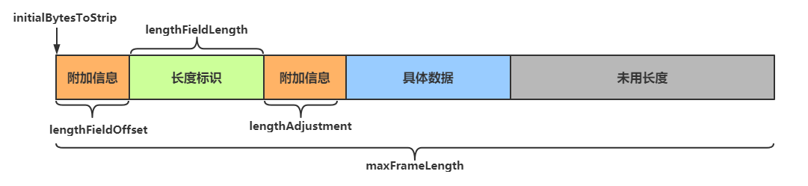

## 粘包与半包

### 服务器代码

```
public class StudyServer {
    static final Logger log = LoggerFactory.getLogger(StudyServer.class);
    void start() {
        NioEventLoopGroup boss = new NioEventLoopGroup(1);
        NioEventLoopGroup worker = new NioEventLoopGroup();
        try {
            ServerBootstrap serverBootstrap = new ServerBootstrap();
            serverBootstrap.channel(NioServerSocketChannel.class);
            serverBootstrap.group(boss, worker);
            serverBootstrap.childHandler(new ChannelInitializer<SocketChannel>() {
                @Override
                protected void initChannel(SocketChannel ch) {
                    ch.pipeline().addLast(new LoggingHandler(LogLevel.DEBUG));
                    ch.pipeline().addLast(new ChannelInboundHandlerAdapter() {
                        @Override
                        public void channelActive(ChannelHandlerContext ctx) throws Exception {
                            // 连接建立时会执行该方法
                            log.debug("connected {}", ctx.channel());
                            super.channelActive(ctx);
                        }

                        @Override
                        public void channelInactive(ChannelHandlerContext ctx) throws Exception {
                            // 连接断开时会执行该方法
                            log.debug("disconnect {}", ctx.channel());
                            super.channelInactive(ctx);
                        }
                    });
                }
            });
            ChannelFuture channelFuture = serverBootstrap.bind(8080);
            log.debug("{} binding...", channelFuture.channel());
            channelFuture.sync();
            log.debug("{} bound...", channelFuture.channel());
            // 关闭channel
            channelFuture.channel().closeFuture().sync();
        } catch (InterruptedException e) {
            log.error("server error", e);
        } finally {
            boss.shutdownGracefully();
            worker.shutdownGracefully();
            log.debug("stopped");
        }
    }

    public static void main(String[] args) {
        new StudyServer().start();
    }
}Copy
```

### 粘包现象

**客户端代码**

```
public class StudyClient {
    static final Logger log = LoggerFactory.getLogger(StudyClient.class);
    public static void main(String[] args) {
        NioEventLoopGroup worker = new NioEventLoopGroup();
        try {
            Bootstrap bootstrap = new Bootstrap();
            bootstrap.channel(NioSocketChannel.class);
            bootstrap.group(worker);
            bootstrap.handler(new ChannelInitializer<SocketChannel>() {
                @Override
                protected void initChannel(SocketChannel ch) throws Exception {
                    log.debug("connected...");
                    ch.pipeline().addLast(new ChannelInboundHandlerAdapter() {
                        @Override
                        public void channelActive(ChannelHandlerContext ctx) throws Exception {
                            log.debug("sending...");
                            // 每次发送16个字节的数据，共发送10次
                            for (int i = 0; i < 10; i++) {
                                ByteBuf buffer = ctx.alloc().buffer();
                                buffer.writeBytes(new byte[]{0, 1, 2, 3, 4, 5, 6, 7, 8, 9, 10, 11, 12, 13, 14, 15});
                                ctx.writeAndFlush(buffer);
                            }
                        }
                    });
                }
            });
            ChannelFuture channelFuture = bootstrap.connect("127.0.0.1", 8080).sync();
            channelFuture.channel().closeFuture().sync();

        } catch (InterruptedException e) {
            log.error("client error", e);
        } finally {
            worker.shutdownGracefully();
        }
    }
}Copy
```

**服务器接收结果**

```
7999 [nioEventLoopGroup-3-1] DEBUG io.netty.handler.logging.LoggingHandler  - [id: 0x5b43ecb0, L:/127.0.0.1:8080 - R:/127.0.0.1:53797] READ: 160B
         +-------------------------------------------------+
         |  0  1  2  3  4  5  6  7  8  9  a  b  c  d  e  f |
+--------+-------------------------------------------------+----------------+
|00000000| 00 01 02 03 04 05 06 07 08 09 0a 0b 0c 0d 0e 0f |................|
|00000010| 00 01 02 03 04 05 06 07 08 09 0a 0b 0c 0d 0e 0f |................|
|00000020| 00 01 02 03 04 05 06 07 08 09 0a 0b 0c 0d 0e 0f |................|
|00000030| 00 01 02 03 04 05 06 07 08 09 0a 0b 0c 0d 0e 0f |................|
|00000040| 00 01 02 03 04 05 06 07 08 09 0a 0b 0c 0d 0e 0f |................|
|00000050| 00 01 02 03 04 05 06 07 08 09 0a 0b 0c 0d 0e 0f |................|
|00000060| 00 01 02 03 04 05 06 07 08 09 0a 0b 0c 0d 0e 0f |................|
|00000070| 00 01 02 03 04 05 06 07 08 09 0a 0b 0c 0d 0e 0f |................|
|00000080| 00 01 02 03 04 05 06 07 08 09 0a 0b 0c 0d 0e 0f |................|
|00000090| 00 01 02 03 04 05 06 07 08 09 0a 0b 0c 0d 0e 0f |................|
+--------+-------------------------------------------------+----------------+Copy
```

可见虽然客户端是分别以16字节为单位，通过channel向服务器发送了10次数据，可是**服务器端却只接收了一次，接收数据的大小为160B，即客户端发送的数据总大小，这就是粘包现象**

### 半包现象

将客户端-服务器之间的channel容量进行调整

**服务器代码**

```
// 调整channel的容量
serverBootstrap.option(ChannelOption.SO_RCVBUF, 10);Copy
```

**注意**

> serverBootstrap.option(ChannelOption.SO_RCVBUF, 10) 影响的底层接收缓冲区（即滑动窗口）大小，仅决定了 netty 读取的最小单位，**netty 实际每次读取的一般是它的整数倍**

**服务器接收结果**

```
5901 [nioEventLoopGroup-3-1] DEBUG io.netty.handler.logging.LoggingHandler  - [id: 0xc73284f3, L:/127.0.0.1:8080 - R:/127.0.0.1:49679] READ: 36B
         +-------------------------------------------------+
         |  0  1  2  3  4  5  6  7  8  9  a  b  c  d  e  f |
+--------+-------------------------------------------------+----------------+
|00000000| 00 01 02 03 04 05 06 07 08 09 0a 0b 0c 0d 0e 0f |................|
|00000010| 00 01 02 03 04 05 06 07 08 09 0a 0b 0c 0d 0e 0f |................|
|00000020| 00 01 02 03                                     |....            |
+--------+-------------------------------------------------+----------------+

5901 [nioEventLoopGroup-3-1] DEBUG io.netty.handler.logging.LoggingHandler  - [id: 0xc73284f3, L:/127.0.0.1:8080 - R:/127.0.0.1:49679] READ: 40B
         +-------------------------------------------------+
         |  0  1  2  3  4  5  6  7  8  9  a  b  c  d  e  f |
+--------+-------------------------------------------------+----------------+
|00000000| 04 05 06 07 08 09 0a 0b 0c 0d 0e 0f 00 01 02 03 |................|
|00000010| 04 05 06 07 08 09 0a 0b 0c 0d 0e 0f 00 01 02 03 |................|
|00000020| 04 05 06 07 08 09 0a 0b                         |........        |
+--------+-------------------------------------------------+----------------+

5901 [nioEventLoopGroup-3-1] DEBUG io.netty.handler.logging.LoggingHandler  - [id: 0xc73284f3, L:/127.0.0.1:8080 - R:/127.0.0.1:49679] READ: 40B
         +-------------------------------------------------+
         |  0  1  2  3  4  5  6  7  8  9  a  b  c  d  e  f |
+--------+-------------------------------------------------+----------------+
|00000000| 0c 0d 0e 0f 00 01 02 03 04 05 06 07 08 09 0a 0b |................|
|00000010| 0c 0d 0e 0f 00 01 02 03 04 05 06 07 08 09 0a 0b |................|
|00000020| 0c 0d 0e 0f 00 01 02 03                         |........        |
+--------+-------------------------------------------------+----------------+

5901 [nioEventLoopGroup-3-1] DEBUG io.netty.handler.logging.LoggingHandler  - [id: 0xc73284f3, L:/127.0.0.1:8080 - R:/127.0.0.1:49679] READ: 40B
         +-------------------------------------------------+
         |  0  1  2  3  4  5  6  7  8  9  a  b  c  d  e  f |
+--------+-------------------------------------------------+----------------+
|00000000| 04 05 06 07 08 09 0a 0b 0c 0d 0e 0f 00 01 02 03 |................|
|00000010| 04 05 06 07 08 09 0a 0b 0c 0d 0e 0f 00 01 02 03 |................|
|00000020| 04 05 06 07 08 09 0a 0b                         |........        |
+--------+-------------------------------------------------+----------------+

5901 [nioEventLoopGroup-3-1] DEBUG io.netty.handler.logging.LoggingHandler  - [id: 0xc73284f3, L:/127.0.0.1:8080 - R:/127.0.0.1:49679] READ: 4B
         +-------------------------------------------------+
         |  0  1  2  3  4  5  6  7  8  9  a  b  c  d  e  f |
+--------+-------------------------------------------------+----------------+
|00000000| 0c 0d 0e 0f                                     |....            |
+--------+-------------------------------------------------+----------------+Copy
```

可见客户端每次发送的数据，**因channel容量不足，无法将发送的数据一次性接收**，便产生了半包现象

### 现象分析

#### 粘包

- 现象
  - 发送 abc def，接收 abcdef
- 原因
  - 应用层
    - 接收方 ByteBuf 设置太大（Netty 默认 1024）
  - 传输层-网络层
    - 滑动窗口：假设发送方 256 bytes 表示一个完整报文，但由于接收方处理不及时且**窗口大小足够大（大于256 bytes），这 256 bytes 字节就会缓冲在接收方的滑动窗口中，**当滑动窗口中缓冲了多个报文就会粘包
    - Nagle 算法：会造成粘包

#### 半包

- 现象
  - 发送 abcdef，接收 abc def
- 原因
  - 应用层
    - 接收方 ByteBuf 小于实际发送数据量
  - 传输层-网络层
    - 滑动窗口：假设接收方的窗口只剩了 128 bytes，发送方的报文大小是 256 bytes，这时**接收方窗口中无法容纳发送方的全部报文，发送方只能先发送前 128 bytes，等待 ack 后才能发送剩余部分，这就造成了半包**
  - 数据链路层
    - MSS 限制：当发送的数据超过 MSS 限制后，会将数据切分发送，就会造成半包

#### 本质

发生粘包与半包现象的本质是**因为 TCP 是流式协议，消息无边界**

### 解决方案

#### 短链接

**客户端每次向服务器发送数据以后，就与服务器断开连接，此时的消息边界为连接建立到连接断开**。这时便无需使用滑动窗口等技术来缓冲数据，则不会发生粘包现象。但如果一次性数据发送过多，接收方无法一次性容纳所有数据，还是会发生半包现象，所以**短链接无法解决半包现象**

**客户端代码改进**

修改channelActive方法

```
public void channelActive(ChannelHandlerContext ctx) throws Exception {
    log.debug("sending...");
    ByteBuf buffer = ctx.alloc().buffer(16);
    buffer.writeBytes(new byte[]{0, 1, 2, 3, 4, 5, 6, 7, 8, 9, 10, 11, 12, 13, 14, 15});
    ctx.writeAndFlush(buffer);
    // 使用短链接，每次发送完毕后就断开连接
    ctx.channel().close();
}Copy
```

将发送步骤整体封装为send()方法，调用10次send()方法，模拟发送10次数据

```
public static void main(String[] args) {
    // 发送10次
    for (int i = 0; i < 10; i++) {
        send();
    }
}Copy
```

**运行结果**

```
6452 [nioEventLoopGroup-3-1] DEBUG io.netty.handler.logging.LoggingHandler  - [id: 0x3eb6a684, L:/127.0.0.1:8080 - R:/127.0.0.1:65024] ACTIVE

6468 [nioEventLoopGroup-3-1] DEBUG io.netty.handler.logging.LoggingHandler  - [id: 0x3eb6a684, L:/127.0.0.1:8080 - R:/127.0.0.1:65024] READ: 16B
         +-------------------------------------------------+
         |  0  1  2  3  4  5  6  7  8  9  a  b  c  d  e  f |
+--------+-------------------------------------------------+----------------+
|00000000| 00 01 02 03 04 05 06 07 08 09 0a 0b 0c 0d 0e 0f |................|
+--------+-------------------------------------------------+----------------+

6468 [nioEventLoopGroup-3-1] DEBUG io.netty.handler.logging.LoggingHandler  - [id: 0x3eb6a684, L:/127.0.0.1:8080 ! R:/127.0.0.1:65024] INACTIVE

6483 [nioEventLoopGroup-3-2] DEBUG io.netty.handler.logging.LoggingHandler  - [id: 0x7dcc31ff, L:/127.0.0.1:8080 - R:/127.0.0.1:65057] ACTIVE

6483 [nioEventLoopGroup-3-2] DEBUG io.netty.handler.logging.LoggingHandler  - [id: 0x7dcc31ff, L:/127.0.0.1:8080 - R:/127.0.0.1:65057] READ: 16B
         +-------------------------------------------------+
         |  0  1  2  3  4  5  6  7  8  9  a  b  c  d  e  f |
+--------+-------------------------------------------------+----------------+
|00000000| 00 01 02 03 04 05 06 07 08 09 0a 0b 0c 0d 0e 0f |................|
+--------+-------------------------------------------------+----------------+

6483 [nioEventLoopGroup-3-2] DEBUG io.netty.handler.logging.LoggingHandler  - [id: 0x7dcc31ff, L:/127.0.0.1:8080 ! R:/127.0.0.1:65057] INACTIVE

...Copy
```

客户端先于服务器建立连接，此时控制台打印`ACTIVE`，之后客户端向服务器发送了16B的数据，发送后断开连接，此时控制台打印`INACTIVE`，可见**未出现粘包现象**

#### 定长解码器

客户端于服务器**约定一个最大长度，保证客户端每次发送的数据长度都不会大于该长度**。若发送数据长度不足则需要**补齐**至该长度

服务器接收数据时，**将接收到的数据按照约定的最大长度进行拆分**，即使发送过程中产生了粘包，也可以通过定长解码器将数据正确地进行拆分。**服务端需要用到`FixedLengthFrameDecoder`对数据进行定长解码**，具体使用方法如下

```
ch.pipeline().addLast(new FixedLengthFrameDecoder(16));Copy
```

**客户端代码**

客户端发送数据的代码如下

```
// 约定最大长度为16
final int maxLength = 16;
// 被发送的数据
char c = 'a';
// 向服务器发送10个报文
for (int i = 0; i < 10; i++) {
    ByteBuf buffer = ctx.alloc().buffer(maxLength);
    // 定长byte数组，未使用部分会以0进行填充
    byte[] bytes = new byte[maxLength];
    // 生成长度为0~15的数据
    for (int j = 0; j < (int)(Math.random()*(maxLength-1)); j++) {
        bytes[j] = (byte) c;
    }
    buffer.writeBytes(bytes);
    c++;
    // 将数据发送给服务器
    ctx.writeAndFlush(buffer);
}Copy
```

**服务器代码**

使用`FixedLengthFrameDecoder`对粘包数据进行拆分，该handler需要添加在`LoggingHandler`之前，保证数据被打印时已被拆分

```
// 通过定长解码器对粘包数据进行拆分
ch.pipeline().addLast(new FixedLengthFrameDecoder(16));
ch.pipeline().addLast(new LoggingHandler(LogLevel.DEBUG));Copy
```

**运行结果**

```
8222 [nioEventLoopGroup-3-1] DEBUG io.netty.handler.logging.LoggingHandler  - [id: 0xbc122d07, L:/127.0.0.1:8080 - R:/127.0.0.1:52954] READ: 16B
         +-------------------------------------------------+
         |  0  1  2  3  4  5  6  7  8  9  a  b  c  d  e  f |
+--------+-------------------------------------------------+----------------+
|00000000| 61 61 61 61 00 00 00 00 00 00 00 00 00 00 00 00 |aaaa............|
+--------+-------------------------------------------------+----------------+

8222 [nioEventLoopGroup-3-1] DEBUG io.netty.handler.logging.LoggingHandler  - [id: 0xbc122d07, L:/127.0.0.1:8080 - R:/127.0.0.1:52954] READ: 16B
         +-------------------------------------------------+
         |  0  1  2  3  4  5  6  7  8  9  a  b  c  d  e  f |
+--------+-------------------------------------------------+----------------+
|00000000| 62 62 62 00 00 00 00 00 00 00 00 00 00 00 00 00 |bbb.............|
+--------+-------------------------------------------------+----------------+


8222 [nioEventLoopGroup-3-1] DEBUG io.netty.handler.logging.LoggingHandler  - [id: 0xbc122d07, L:/127.0.0.1:8080 - R:/127.0.0.1:52954] READ: 16B
         +-------------------------------------------------+
         |  0  1  2  3  4  5  6  7  8  9  a  b  c  d  e  f |
+--------+-------------------------------------------------+----------------+
|00000000| 63 63 00 00 00 00 00 00 00 00 00 00 00 00 00 00 |cc..............|
+--------+-------------------------------------------------+----------------+

...Copy
```

#### 行解码器

行解码器的是**通过分隔符对数据进行拆分**来解决粘包半包问题的

可以通过`LineBasedFrameDecoder(int maxLength)`来拆分以**换行符(\n)**为分隔符的数据，也可以通过`DelimiterBasedFrameDecoder(int maxFrameLength, ByteBuf... delimiters)`来**指定通过什么分隔符来拆分数据（可以传入多个分隔符）**

两种解码器**都需要传入数据的最大长度**，若超出最大长度，会抛出`TooLongFrameException`异常

**以换行符 \n 为分隔符**

客户端代码

```
// 约定最大长度为 64
final int maxLength = 64;
// 被发送的数据
char c = 'a';
for (int i = 0; i < 10; i++) {
    ByteBuf buffer = ctx.alloc().buffer(maxLength);
    // 生成长度为0~62的数据
    Random random = new Random();
    StringBuilder sb = new StringBuilder();
    for (int j = 0; j < (int)(random.nextInt(maxLength-2)); j++) {
        sb.append(c);
    }
    // 数据以 \n 结尾
    sb.append("\n");
    buffer.writeBytes(sb.toString().getBytes(StandardCharsets.UTF_8));
    c++;
    // 将数据发送给服务器
    ctx.writeAndFlush(buffer);
}Copy
```

服务器代码

```
// 通过行解码器对粘包数据进行拆分，以 \n 为分隔符
// 需要指定最大长度
ch.pipeline().addLast(new DelimiterBasedFrameDecoder(64));
ch.pipeline().addLast(new LoggingHandler(LogLevel.DEBUG));Copy
```

运行结果

```
4184 [nioEventLoopGroup-3-1] DEBUG io.netty.handler.logging.LoggingHandler  - [id: 0x9d6ac701, L:/127.0.0.1:8080 - R:/127.0.0.1:58282] READ: 10B
         +-------------------------------------------------+
         |  0  1  2  3  4  5  6  7  8  9  a  b  c  d  e  f |
+--------+-------------------------------------------------+----------------+
|00000000| 61 61 61 61 61 61 61 61 61 61                   |aaaaaaaaaa      |
+--------+-------------------------------------------------+----------------+

4184 [nioEventLoopGroup-3-1] DEBUG io.netty.handler.logging.LoggingHandler  - [id: 0x9d6ac701, L:/127.0.0.1:8080 - R:/127.0.0.1:58282] READ: 11B
         +-------------------------------------------------+
         |  0  1  2  3  4  5  6  7  8  9  a  b  c  d  e  f |
+--------+-------------------------------------------------+----------------+
|00000000| 62 62 62 62 62 62 62 62 62 62 62                |bbbbbbbbbbb     |
+--------+-------------------------------------------------+----------------+

4184 [nioEventLoopGroup-3-1] DEBUG io.netty.handler.logging.LoggingHandler  - [id: 0x9d6ac701, L:/127.0.0.1:8080 - R:/127.0.0.1:58282] READ: 2B
         +-------------------------------------------------+
         |  0  1  2  3  4  5  6  7  8  9  a  b  c  d  e  f |
+--------+-------------------------------------------------+----------------+
|00000000| 63 63                                           |cc              |
+--------+-------------------------------------------------+----------------+

...Copy
```

**以自定义分隔符 \c 为分隔符**

客户端代码

```
...
    
// 数据以 \c 结尾
sb.append("\\c");
buffer.writeBytes(sb.toString().getBytes(StandardCharsets.UTF_8));

...Copy
```

服务器代码

```
// 将分隔符放入ByteBuf中
ByteBuf bufSet = ch.alloc().buffer().writeBytes("\\c".getBytes(StandardCharsets.UTF_8));
// 通过行解码器对粘包数据进行拆分，以 \c 为分隔符
ch.pipeline().addLast(new DelimiterBasedFrameDecoder(64, ch.alloc().buffer().writeBytes(bufSet)));
ch.pipeline().addLast(new LoggingHandler(LogLevel.DEBUG));Copy
```

运行结果

```
8246 [nioEventLoopGroup-3-1] DEBUG io.netty.handler.logging.LoggingHandler  - [id: 0x86215ccd, L:/127.0.0.1:8080 - R:/127.0.0.1:65159] READ: 14B
         +-------------------------------------------------+
         |  0  1  2  3  4  5  6  7  8  9  a  b  c  d  e  f |
+--------+-------------------------------------------------+----------------+
|00000000| 61 61 61 61 61 61 61 61 61 61 61 61 61 61       |aaaaaaaaaaaaaa  |
+--------+-------------------------------------------------+----------------+


8247 [nioEventLoopGroup-3-1] DEBUG io.netty.handler.logging.LoggingHandler  - [id: 0x86215ccd, L:/127.0.0.1:8080 - R:/127.0.0.1:65159] READ: 3B
         +-------------------------------------------------+
         |  0  1  2  3  4  5  6  7  8  9  a  b  c  d  e  f |
+--------+-------------------------------------------------+----------------+
|00000000| 62 62 62                                        |bbb             |
+--------+-------------------------------------------------+----------------+

...Copy
```

#### 长度字段解码器

在传送数据时可以在数据中**添加一个用于表示有用数据长度的字段**，在解码时读取出这个用于表明长度的字段，同时读取其他相关参数，即可知道最终需要的数据是什么样子的

`LengthFieldBasedFrameDecoder`解码器可以提供更为丰富的拆分方法，其构造方法有五个参数

```
public LengthFieldBasedFrameDecoder(
    int maxFrameLength,
    int lengthFieldOffset, int lengthFieldLength,
    int lengthAdjustment, int initialBytesToStrip)Copy
```

**参数解析**

- maxFrameLength 数据最大长度
  - 表示数据的最大长度（包括附加信息、长度标识等内容）
- lengthFieldOffset **数据长度标识的起始偏移量**
  - 用于指明数据第几个字节开始是用于标识有用字节长度的，因为前面可能还有其他附加信息
- lengthFieldLength **数据长度标识所占字节数**（用于指明有用数据的长度）
  - 数据中用于表示有用数据长度的标识所占的字节数
- lengthAdjustment **长度表示与有用数据的偏移量**
  - 用于指明数据长度标识和有用数据之间的距离，因为两者之间还可能有附加信息
- initialBytesToStrip **数据读取起点**
  - 读取起点，**不读取** 0 ~ initialBytesToStrip 之间的数据

**参数图解**

[](https://nyimapicture.oss-cn-beijing.aliyuncs.com/img/20210425200007.png)

```
lengthFieldOffset   = 0
lengthFieldLength   = 2
lengthAdjustment    = 0
initialBytesToStrip = 0 (= do not strip header)
  
BEFORE DECODE (14 bytes)         AFTER DECODE (14 bytes)
+--------+----------------+      +--------+----------------+
| Length | Actual Content |----->| Length | Actual Content |
| 0x000C | "HELLO, WORLD" |      | 0x000C | "HELLO, WORLD" |
+--------+----------------+      +--------+----------------+Copy
```

从0开始即为长度标识，长度标识长度为2个字节

**0x000C** 即为后面 `HELLO, WORLD`的长度

------

```
lengthFieldOffset   = 0
lengthFieldLength   = 2
lengthAdjustment    = 0
initialBytesToStrip = 2 (= the length of the Length field)
  
BEFORE DECODE (14 bytes)         AFTER DECODE (12 bytes)
+--------+----------------+      +----------------+
| Length | Actual Content |----->| Actual Content |
| 0x000C | "HELLO, WORLD" |      | "HELLO, WORLD" |
+--------+----------------+      +----------------+Copy
```

从0开始即为长度标识，长度标识长度为2个字节，**读取时从第二个字节开始读取**（此处即跳过长度标识）

因为**跳过了用于表示长度的2个字节**，所以此处直接读取`HELLO, WORLD`

------

```
lengthFieldOffset   = 2 (= the length of Header 1)
lengthFieldLength   = 3
lengthAdjustment    = 0
initialBytesToStrip = 0
  
BEFORE DECODE (17 bytes)                      AFTER DECODE (17 bytes)
+----------+----------+----------------+      +----------+----------+----------------+
| Header 1 |  Length  | Actual Content |----->| Header 1 |  Length  | Actual Content |
|  0xCAFE  | 0x00000C | "HELLO, WORLD" |      |  0xCAFE  | 0x00000C | "HELLO, WORLD" |
+----------+----------+----------------+      +----------+----------+----------------+Copy
```

长度标识**前面还有2个字节的其他内容**（0xCAFE），第三个字节开始才是长度标识，长度表示长度为3个字节(0x00000C)

Header1中有附加信息，**读取长度标识时需要跳过这些附加信息来获取长度**

------

```
lengthFieldOffset   = 0
lengthFieldLength   = 3
lengthAdjustment    = 2 (= the length of Header 1)
initialBytesToStrip = 0
  
BEFORE DECODE (17 bytes)                      AFTER DECODE (17 bytes)
+----------+----------+----------------+      +----------+----------+----------------+
|  Length  | Header 1 | Actual Content |----->|  Length  | Header 1 | Actual Content |
| 0x00000C |  0xCAFE  | "HELLO, WORLD" |      | 0x00000C |  0xCAFE  | "HELLO, WORLD" |
+----------+----------+----------------+      +----------+----------+----------------+Copy
```

从0开始即为长度标识，长度标识长度为3个字节，**长度标识之后还有2个字节的其他内容**（0xCAFE）

长度标识(0x00000C)表示的是**从其后lengthAdjustment（2个字节）开始的数据的长度，即`HELLO, WORLD`**，不包括0xCAFE

------

```
lengthFieldOffset   = 1 (= the length of HDR1)
lengthFieldLength   = 2
lengthAdjustment    = 1 (= the length of HDR2)
initialBytesToStrip = 3 (= the length of HDR1 + LEN)
  
BEFORE DECODE (16 bytes)                       AFTER DECODE (13 bytes)
+------+--------+------+----------------+      +------+----------------+
| HDR1 | Length | HDR2 | Actual Content |----->| HDR2 | Actual Content |
| 0xCA | 0x000C | 0xFE | "HELLO, WORLD" |      | 0xFE | "HELLO, WORLD" |
+------+--------+------+----------------+      +------+----------------+Copy
```

长度标识**前面有1个字节的其他内容，后面也有1个字节的其他内容，读取时从长度标识之后3个字节处开始读取**，即读取 `0xFE HELLO, WORLD`

------

**使用**

通过 **EmbeddedChannel** 对 handler 进行测试

```
public class EncoderStudy {
    public static void main(String[] args) {
        // 模拟服务器
        // 使用EmbeddedChannel测试handler
        EmbeddedChannel channel = new EmbeddedChannel(
                // 数据最大长度为1KB，长度标识前后各有1个字节的附加信息，长度标识长度为4个字节（int）
                new LengthFieldBasedFrameDecoder(1024, 1, 4, 1, 0),
                new LoggingHandler(LogLevel.DEBUG)
        );

        // 模拟客户端，写入数据
        ByteBuf buffer = ByteBufAllocator.DEFAULT.buffer();
        send(buffer, "Hello");
        channel.writeInbound(buffer);
        send(buffer, "World");
        channel.writeInbound(buffer);
    }

    private static void send(ByteBuf buf, String msg) {
        // 得到数据的长度
        int length = msg.length();
        byte[] bytes = msg.getBytes(StandardCharsets.UTF_8);
        // 将数据信息写入buf
        // 写入长度标识前的其他信息
        buf.writeByte(0xCA);
        // 写入数据长度标识
        buf.writeInt(length);
        // 写入长度标识后的其他信息
        buf.writeByte(0xFE);
        // 写入具体的数据
        buf.writeBytes(bytes);
    }
}Copy
```

运行结果

```
146  [main] DEBUG io.netty.handler.logging.LoggingHandler  - [id: 0xembedded, L:embedded - R:embedded] READ: 11B
         +-------------------------------------------------+
         |  0  1  2  3  4  5  6  7  8  9  a  b  c  d  e  f |
+--------+-------------------------------------------------+----------------+
|00000000| ca 00 00 00 05 fe 48 65 6c 6c 6f                |......Hello     |
+--------+-------------------------------------------------+----------------+

146  [main] DEBUG io.netty.handler.logging.LoggingHandler  - [id: 0xembedded, L:embedded - R:embedded] READ: 11B
         +-------------------------------------------------+
         |  0  1  2  3  4  5  6  7  8  9  a  b  c  d  e  f |
+--------+-------------------------------------------------+----------------+
|00000000| ca 00 00 00 05 fe 57 6f 72 6c 64                |......World     |
+--------+-------------------------------------------------+----------------+
```