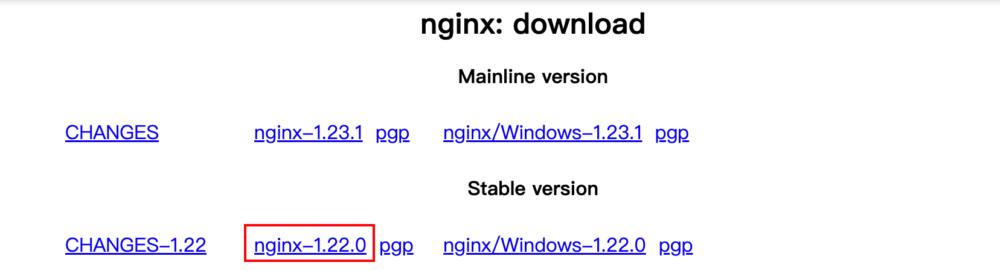
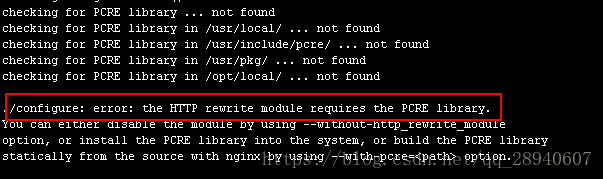
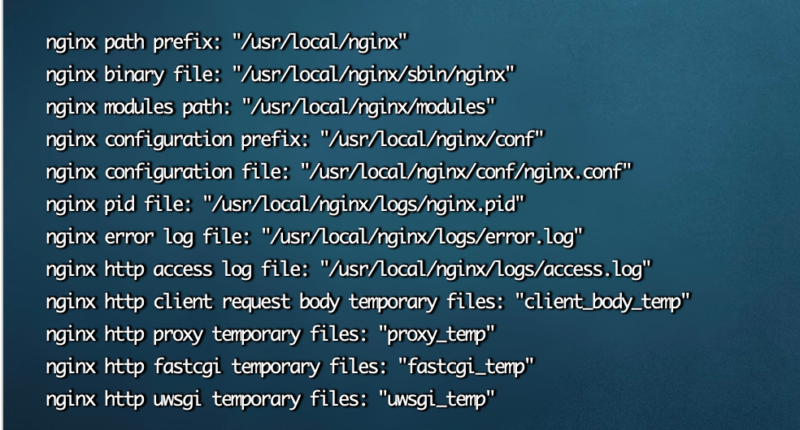

1. [下载](https://nginx.org/en/download.html)

   

2. 解压

   ```sh
   tar -zxvf  nginx-1.22.0.tar.gz
   ```

3. 配置nginx安装环境

   ```sh
   cd /usr/local/nginx-1.22.0
   ./configure
   make
   make install
   # 编译后会生成一个新目录/usr/local/nginx
   ```

4. 启动

   ```sh
   /usr/local/nginx/sbin/nginx -c /usr/local/nginx/conf/nginx.conf
   ```

## 踩坑

1. 报错centos the HTTP rewrite module requires the PCRE library.

   

   说明nginx安装缺少依赖，安装依赖

   ```sh
   yum -y install pcre-devel
   yum -y install openssl openssl-devel
   ```

   然后再去执行nginx的配置命令configure，顺利执行。

   

2. 报错 conf/koi-win" 与"/usr/local/nginx/conf/koi-win" 为同一文件

   注意：安装过程不需要执行“mv nginx-1.22.0 nginx”，安装资源目录和编译出来的可运行文件的目录是两个目录
   
   
