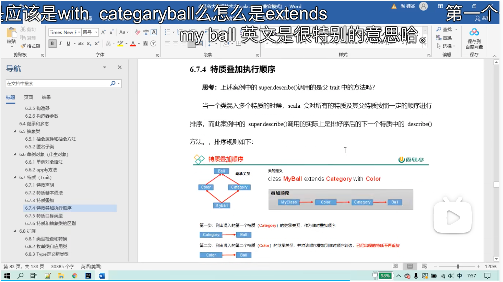
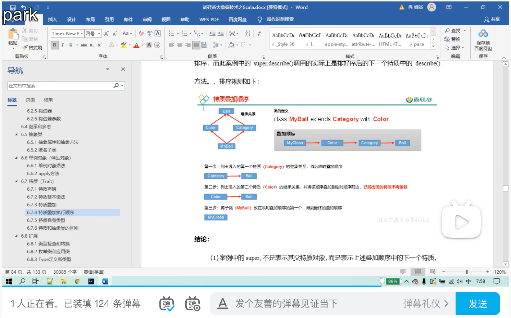
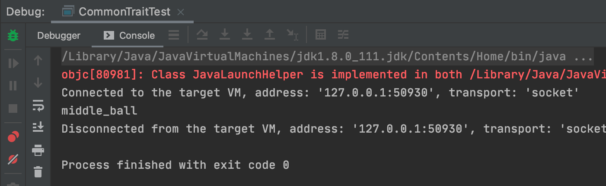
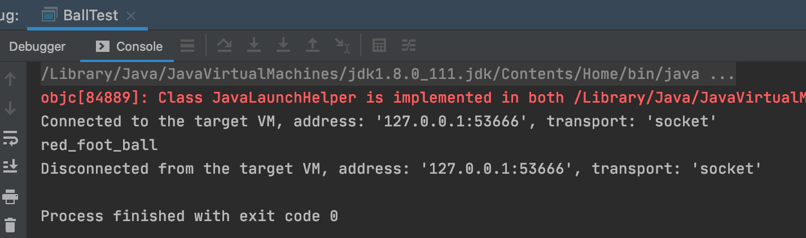

### 普通混入

```scala
package chapter02

object CommonTraitTest {

  def main(args: Array[String]): Unit = {
    val ball = new MyBall
    println(ball.desc())
  }

  trait Ball{
    def desc():String="ball"
  }

  trait MiddleBall{
    def desc():String="middle_ball"
  }

  class MyBall extends Ball with MiddleBall{
    override def desc(): String = super.desc()
  }


}
```



### 钻石混入

```scala
package chapter02

object BallTest {

  def main(args: Array[String]): Unit = {
    val myBall = new MyBall
    println(myBall.describe())

  }

  trait Ball{
    def describe(): String =
      "ball"
  }

  trait CategoryBall extends Ball {
    var category = "foot"
    override def describe():String=category+"_"+super.describe()
  }

  trait ColorBall extends Ball{
    var color = "red"
    override def describe(): String =color+"_"+ super.describe()
  }


  class MyBall extends ColorBall  with CategoryBall{
    override def describe(): String = super.describe()
  }

}
```



总结：钻石问题的混入效果和普通混入不太一样，普通混入当出现继承的多特质中都有相同的方法时，直接调用的是继承关系中最右边特质中使用的方法。而在钻石混入中，并非只混入所有特质的一部分，上面测试代码的结果是red-foot-ball，describe执行的结果进行了叠加。

### 指定特质方法

```scala
class MyBall extends SizeBall with CategoryBall  with ColorBall{
  override def describe(): String = super[SizeBall].describe()
}
```

