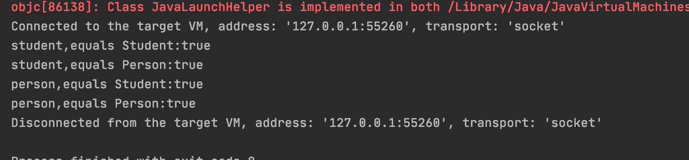

运行时类型识别RTTI：

- 判断类型：`obj.isInstanceOf[T]`，确切匹配的类型或者父类都返回true。
- 转换类型：`obj.asInstance[T]`，转换为目标类型。
- 获取类名：`classOf[T]`，得到类对应的`Class`对象`Class[T]`，转字符串结果是`class package.xxx.className`。
- 获取对象的类：`obj.getClass`

```scala
package chapter02

object InstanceOfTest {

  class Person(val name:String,val age:Int){
    def sayHello(): Unit ={
      println(s"person hello,$name")
    }
  }

  class Student(name:String,age:Int) extends Person(name,age){
    override def sayHello(): Unit = {
      println(s"student hello,$name")
    }
    def sayHi(): Unit ={
      println(s"student hi,$name")
    }
  }

  def main(args: Array[String]): Unit = {
    val student:Student = new Student("alice", 25)
    val person:Person = new Student("leo", 20)

    println("student,equals Student:"+student.isInstanceOf[Student])
    println("student,equals Person:"+student.isInstanceOf[Person])
    println("person,equals Student:"+person.isInstanceOf[Student])
    println("person,equals Person:"+person.isInstanceOf[Person])
  }

}
```

