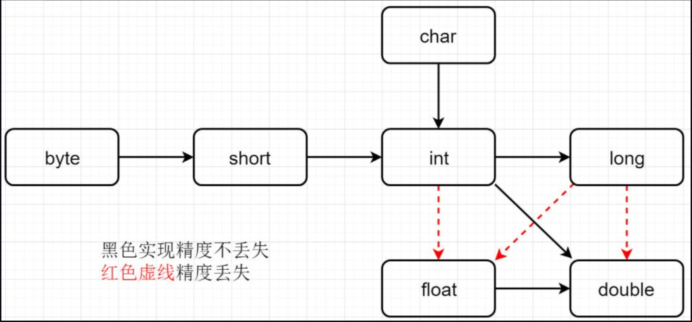

数据类型：

- java基本类型`char byte short int long float double boolean`。
- java基本类型对应包装类型：`Charater Byte Short Integer Long Float Double Boolean`。
- java中不是纯粹的面向对象。
- Scala吸取了这一点，所有数据都是对象，都是`Any`的子类。
- `Any`有两个子类：`AnyVal`值类型 `AnyRef`引用类型。
- 数值类型都是`AnyVal`子类，和Java数值包装类型都一样，只有整数在scala中是`Int`、字符是`Char`有点区别。
- `StringOps`是java中`String`类增强，`AnyVal`子类。
- `Unit`对应java中的`void`，`AnyVal`子类。用于方法返回值的位置，表示方法无返回值，`Unit`是一个类型，只有一个单例的对象，转成字符串打印出来为`()`。
- `Void`不是数据类型，只是一个关键字。
- `Null`是一个类型，只有一个单例对象`null`就是空引用，所有引用类型`AnyRef`的子类，这个类型主要用途是与其他JVM语言互操作，几乎不在Scala代码中使用。
- `Nothing`所有类型的子类型，也称为底部类型。它常见的用途是发出终止信号，例如抛出异常、程序退出或无限循环。

整数类型：都是有符号整数，标准补码表示。

- `Byte` 1字节
- `Short` 2字节
- `Int` 4字节
- `Long` 8字节
- 整数赋初值超出表示范围报错。
- 自动类型推断，整数字面值默认类型`Int`，长整型字面值必须加`L`后缀表示。
- 直接向下转换会失败，需要使用强制类型转换，`(a + 10).toByte`。

浮点类型：

- `Float` IEEE 754 32位浮点数
- `Double` IEEE 754 64位浮点数
- 字面值默认`Double`

字符类型：

- 同java的`Character`，2字节，UTF-16编码的字符。
- 字符常量：`''`
- 类型`Char`
- 转义：`\t \n \r \\ \" \'`etc

布尔类型：`true false`

空类型：

- `Unit` 无值，只有一个实例，用于函数返回值。
- `Null` 只有一个实例`null`，空引用。
- `Nothing` 确定没有正常的返回值，可以用Nothing来指定返回值类型。好像意思是抛异常时返回Nothing，不是特别懂。

```
object NullType {
    def main(arg : Array[String]) : Unit = {
        // Unit
        def f1(): Unit = {
            println("just nothing!")
        }
        val a = f1()
        println(a) // ()

        // null only used for AnyRef
        // val n:Int = null // invalid
    }
}
```

数据类型转换：

- 自动类型提升：多种数据类型混合运算，自动提升到精度最大的数据类型。
- 高精度赋值到低精度，直接报错。
- 除了图中的隐式类型转换，都需要强制类型转换。
- `Byte Short Char`计算时会直接提升为`Int`。
- `Boolean`不能参与整数浮点运算，不能隐式转换为整数。 

  

强制类型转换：

- `toByte toInt toChar toXXXX`
- `'a'.toInt` `2.7.toInt`
- 数值与String的转换：`"" + n` `"100".toInt` `"12.3".toFloat` `12.3".toDouble.toInt`
- 整数强转是二进制截取，整数高精度转低精度可能会溢出，比如`128.toByte`。