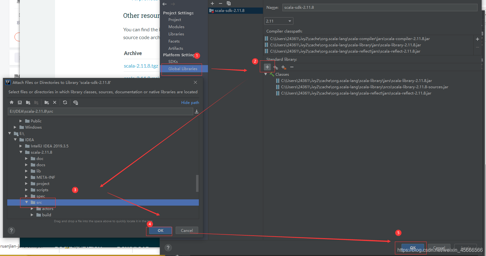

1. 下载

   

2. 在intellij idea设置指向源代码

   在intellij中打开File –> Project Structure，
   选择Global Libraries
   在右侧面板中的Scala Library下方点击“+”按钮；
   选择解压后的源码包的src目录；
   好像连续三次点击ok即可

   

   出现以下页面就可以了
   

3. 查看源码

4. 

   