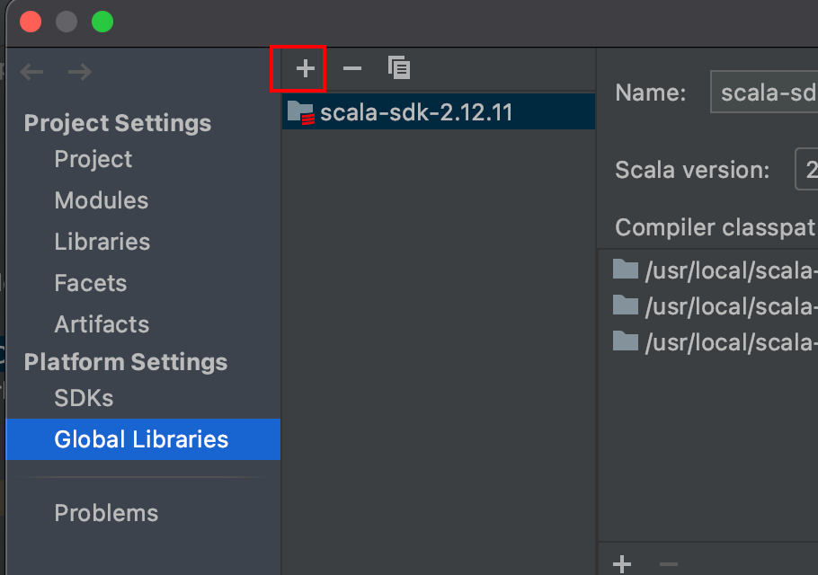
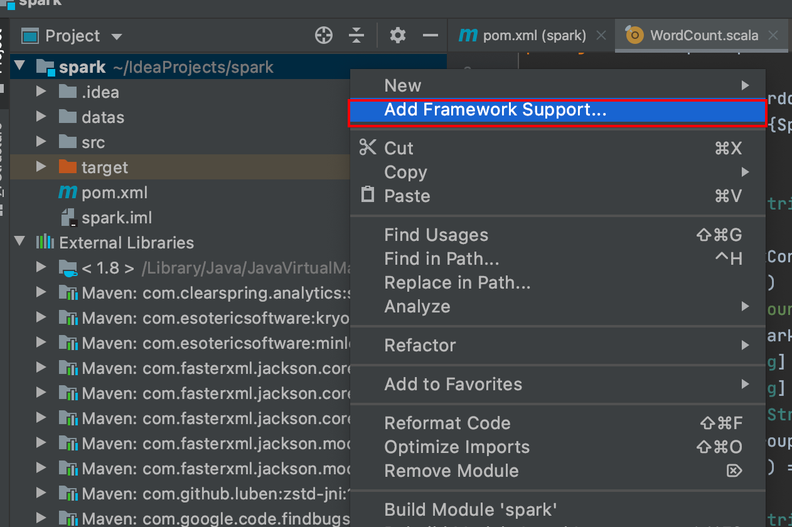
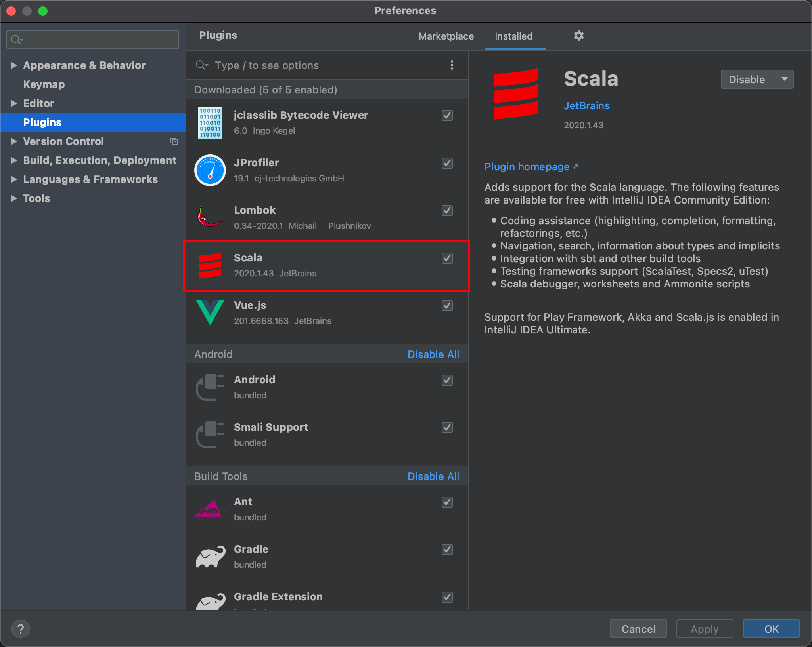

### 添加SDK



### 添加框架支持



* 选择Scala

### 增加 Scala 插件 

Spark 由 Scala 语言开发的，所以本课件接下来的开发所使用的语言也为 Scala，咱们当 前使用的 Spark 版本为 3.0.0，默认采用的 Scala 编译版本为 2.12，所以后续开发时。我们依 然采用这个版本。开发前请保证 IDEA 开发工具中含有 Scala 开发插件 



### 增加Maven依赖

```xml
<dependencies>
    <dependency>
        <groupId>org.apache.spark</groupId>
        <artifactId>spark-core_2.12</artifactId>
        <version>3.0.0</version>
    </dependency>
</dependencies>
```


