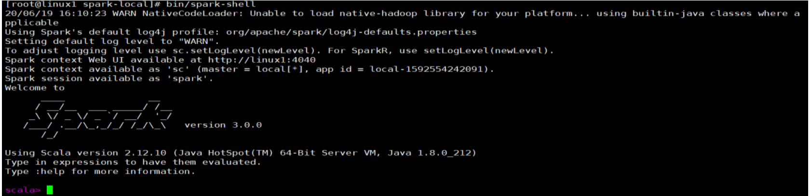
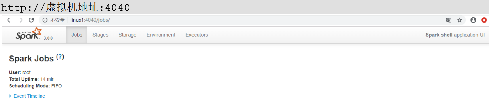
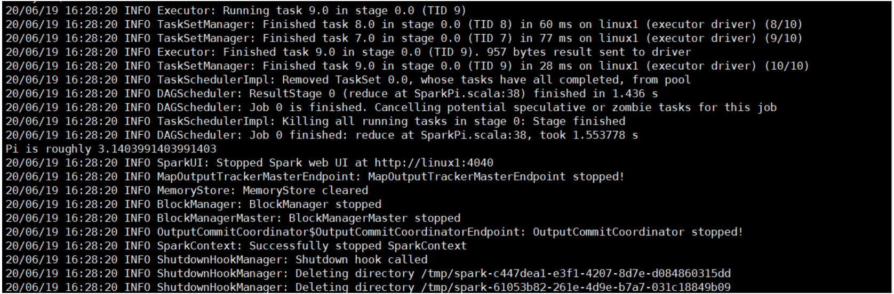

1. 进入解压缩后的路径，执行如下指令

   ```sh
   bin/spark-shell
   ```

   

2. 启动成功后，可以输入网址进行 Web UI 监控页面访问

   

3. 可用简单的命令执行wordCount

   ```sh
   sc.textFile("data/word.txt").flatMap(_.split(" ")).map((_,1)).reduceByKey(_+_).collect
   ```

4. 退出shell

   ```sh
   :quit
   ```

5. 提交应用

   ```sh
   bin/spark-submit \
   --class org.apache.spark.examples.SparkPi \
   --master local[2] \
   ./examples/jars/spark-examples_2.12-3.0.0.jar \
   10
   ```

   * --class 表示要执行程序的主类，此处可以更换为咱们自己写的应用程序
   * --master local[2] 部署模式，默认为本地模式，数字表示分配的虚拟 CPU 核数量
   * spark-examples_2.12-3.0.0.jar 运行的应用类所在的 jar 包，实际使用时，可以设定为咱 们自己打的 jar 包
   * 数字 10 表示程序的入口参数，用于设定当前应用的任务数量

6. 运行结果

   


