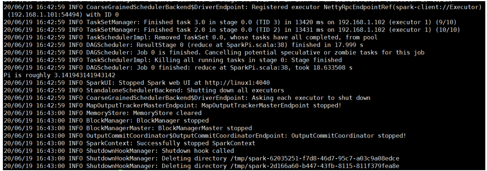
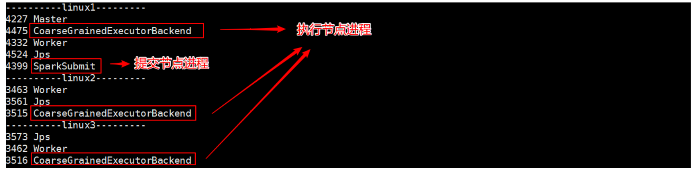

### Standalone 模式

local 本地模式毕竟只是用来进行练习演示的，真实工作中还是要将应用提交到对应的 集群中去执行，这里我们来看看只使用 Spark 自身节点运行的集群模式，也就是我们所谓的 独立部署（Standalone）模式。Spark 的 Standalone 模式体现了经典的 master-slave 模式。


#### 解压

```sh
tar -zxvf spark-3.0.0-bin-hadoop3.2.tgz -C /opt/module
cd /opt/module
mv spark-3.0.0-bin-hadoop3.2 spark-standalone
```

#### 修改配置文件 

* 进入解压缩后路径的 conf 目录，修改 slaves.template 文件名为 slaves

  ```sh
  mv slaves.template slaves
  ```

* 修改 slaves 文件，添加 work 节点

  ```sh
  linux1
  linux2
  linux3
  ```

* 修改 spark-env.sh.template 文件名为 spark-env.sh

  ```sh
  mv spark-env.sh.template spark-env.sh
  ```

* 修改 spark-env.sh 文件，添加 JAVA_HOME 环境变量和集群对应的 master 节点

  ```sh
  export JAVA_HOME=/opt/module/jdk1.8.0_144
  SPARK_MASTER_HOST=linux1
  SPARK_MASTER_PORT=7077
  ```

  注意：7077 端口，相当于 hadoop3 内部通信的 8020 端口，此处的端口需要确认自己的 Hadoop 配置

* 分发 spark-standalone 目录

  ```sh
  xsync spark-standalone
  ```


#### 启动集群

* 执行脚本命令

  ```sh
  sbin/start-all.sh
  ```

* 查看三台服务器运行进程

  

* 查看 Master 资源监控 Web UI 界面: http://linux1:8080

  

#### 提交应用

```sh
bin/spark-submit \
--class org.apache.spark.examples.SparkPi \
--master spark://linux1:7077 \
./examples/jars/spark-examples_2.12-3.0.0.jar \
10
```

* --class 表示要执行程序的主类
* --master spark://linux1:7077 独立部署模式，连接到 Spark 集群
* spark-examples_2.12-3.0.0.jar 运行类所在的 jar 包
* 数字 10 表示程序的入口参数，用于设定当前应用的任务数量




执行任务时，会产生多个 Java 进程



执行任务时，默认采用服务器集群节点的总核数，每个节点内存 1024M。


#### 配置历史服务

由于 spark-shell 停止掉后，集群监控 linux1:4040 页面就看不到历史任务的运行情况，所以 开发时都配置历史服务器记录任务运行情况。

* 修改 spark-defaults.conf.template 文件名为 spark-defaults.conf

  ```sh
  mv spark-defaults.conf.template spark-defaults.conf
  ```

* 修改 spark-default.conf 文件，配置日志存储路径

  ```sh
  spark.eventLog.enabled true
  spark.eventLog.dir hdfs://linux1:8020/directory
  ```

  注意：需要启动 hadoop 集群，HDFS 上的 directory 目录需要提前存在。

  ```sh
  sbin/start-dfs.sh
  hadoop fs -mkdir /directory
  ```

* 修改 spark-env.sh 文件, 添加日志配置

  ```sh
  export SPARK_HISTORY_OPTS="
  -Dspark.history.ui.port=18080
  -Dspark.history.fs.logDirectory=hdfs://linux1:8020/directory
  -Dspark.history.retainedApplications=30"
  ```

  * 参数 1 含义：WEB UI 访问的端口号为 18080
  * 参数 2 含义：指定历史服务器日志存储路径
  * 参数 3 含义：指定保存 Application 历史记录的个数，如果超过这个值，旧的应用程序 信息将被删除，这个是内存中的应用数，而不是页面上显示的应用数。

* 分发配置文件

  ```sh
  xsync conf
  ```

* 重新启动集群和历史服务

  ```sh
  sbin/start-all.sh
  sbin/start-history-server.sh
  ```

* 重新执行任务

  ```sh
  bin/spark-submit \
  --class org.apache.spark.examples.SparkPi \
  --master spark://linux1:7077 \
  ./examples/jars/spark-examples_2.12-3.0.0.jar \
  10
  ```

* 查看历史服务：http://linux1:18080

  

  
