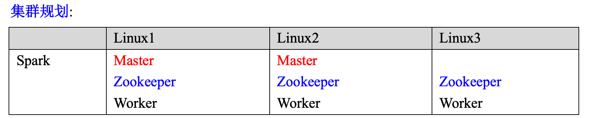
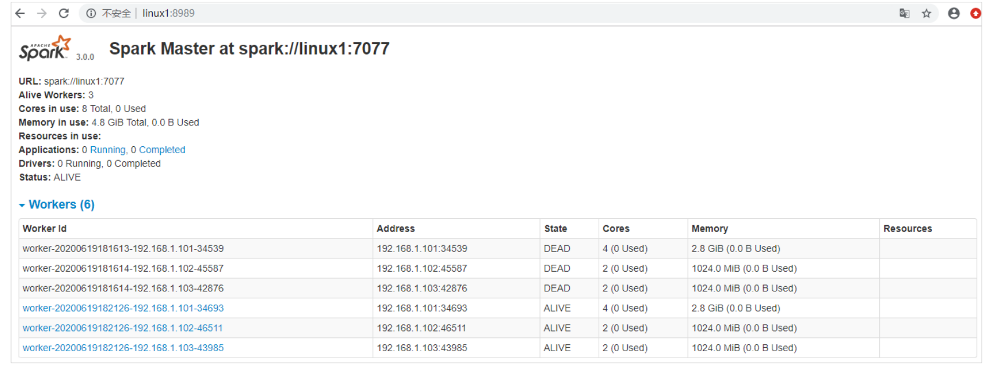
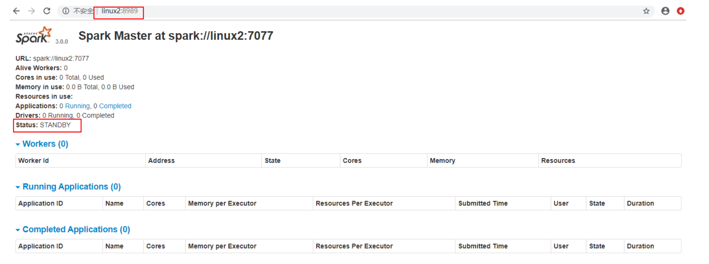
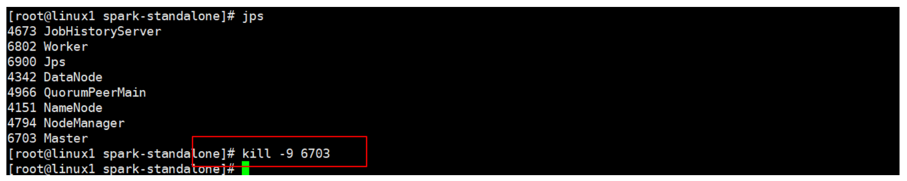
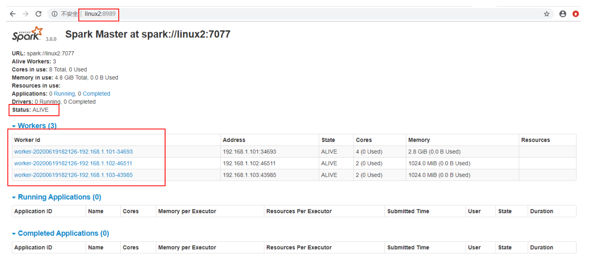

### standalone模式高可用

所谓的高可用是因为当前集群中的 Master 节点只有一个，所以会存在单点故障问题。所以 为了解决单点故障问题，需要在集群中配置多个 Master 节点，一旦处于活动状态的 Master 发生故障时，由备用 Master 提供服务，保证作业可以继续执行。这里的高可用一般采用 Zookeeper 设置



* 停止集群

  ```sh
  sbin/stop-all.sh
  ```

* 启动 Zookeeper

  ```sh
  xstart zk
  ```

* 修改 spark-env.sh 文件添加如下配置

  ```sh
  注释如下内容：
  #SPARK_MASTER_HOST=linux1
  #SPARK_MASTER_PORT=7077
  添加如下内容:
  #Master 监控页面默认访问端口为 8080，但是可能会和 Zookeeper 冲突，所以改成 8989，也可以自
  定义，访问 UI 监控页面时请注意
  SPARK_MASTER_WEBUI_PORT=8989
  export SPARK_DAEMON_JAVA_OPTS="
  -Dspark.deploy.recoveryMode=ZOOKEEPER
  -Dspark.deploy.zookeeper.url=linux1,linux2,linux3
  -Dspark.deploy.zookeeper.dir=/spark"
  ```

* 分发配置文件

  ```sh
  xsync conf/
  ```

* 启动集群

  ```sh
  sbin/start-all.sh
  ```

  

* 启动 linux2 的单独 Master 节点，此时 linux2 节点 Master 状态处于备用状态

  ```sh
  sbin/start-master.sh
  ```

  

* 提交应用到高可用集群

  ```sh
  bin/spark-submit \
  --class org.apache.spark.examples.SparkPi \
  --master spark://linux1:7077,linux2:7077 \
  ./examples/jars/spark-examples_2.12-3.0.0.jar \
  10
  ```

* 停止 linux1 的 Master 资源监控进程

  

* 查看 linux2 的 Master 资源监控 Web UI，稍等一段时间后，linux2 节点的 Master 状态 提升为活动状态

  

  