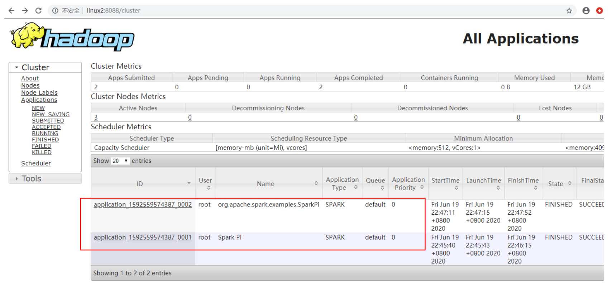
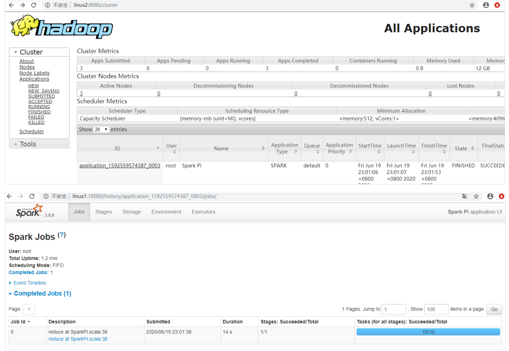

### Yarn 模式

独立部署（Standalone）模式由 Spark 自身提供计算资源，无需其他框架提供资源。这 种方式降低了和其他第三方资源框架的耦合性，独立性非常强。但是你也要记住，Spark 主 要是计算框架，而不是资源调度框架，所以本身提供的资源调度并不是它的强项，所以还是 和其他专业的资源调度框架集成会更靠谱一些。所以接下来我们来学习在强大的 Yarn 环境 下 Spark 是如何工作的（其实是因为在国内工作中，Yarn 使用的非常多）。

* 解压缩文件

  将 spark-3.0.0-bin-hadoop3.2.tgz 文件上传到 linux 并解压缩，放置在指定位置。

  ```sh
  tar -zxvf spark-3.0.0-bin-hadoop3.2.tgz -C /opt/module
  cd /opt/module
  mv spark-3.0.0-bin-hadoop3.2 spark-yarn
  ```

* 修改配置文件 

  * 修改 hadoop 配置文件/opt/module/hadoop/etc/hadoop/yarn-site.xml, 并分发

    ```xml
    <!--是否启动一个线程检查每个任务正使用的物理内存量，如果任务超出分配值，则直接将其杀掉，默认
    是 true -->
    <property>
     <name>yarn.nodemanager.pmem-check-enabled</name>
     <value>false</value>
    </property>
    <!--是否启动一个线程检查每个任务正使用的虚拟内存量，如果任务超出分配值，则直接将其杀掉，默认
    是 true -->
    <property>
     <name>yarn.nodemanager.vmem-check-enabled</name>
     <value>false</value>
    </property>
    ```

  * 修改 conf/spark-env.sh，添加 JAVA_HOME 和 YARN_CONF_DIR 配置

    ```sh
    mv spark-env.sh.template spark-env.sh
    。。。
    export JAVA_HOME=/opt/module/jdk1.8.0_144
    YARN_CONF_DIR=/opt/module/hadoop/etc/hadoop
    ```

* 启动 HDFS 以及 YARN 集群

* 提交应用

  ```sh
  bin/spark-submit \
  --class org.apache.spark.examples.SparkPi \
  --master yarn \
  --deploy-mode cluster \
  ./examples/jars/spark-examples_2.12-3.0.0.jar \
  10
  ```

  查看 http://linux2:8088 页面，点击 History，查看历史页面

  

#### 配置历史服务器

* 修改 spark-defaults.conf.template 文件名为 spark-defaults.conf

  ```sh
  mv spark-defaults.conf.template spark-defaults.conf
  ```

* 修改 spark-default.conf 文件，配置日志存储路径

  ```sh
  spark.eventLog.enabled true
  spark.eventLog.dir hdfs://linux1:8020/directory
  ```

  注意：需要启动 hadoop 集群，HDFS 上的目录需要提前存在。

  ```sh
  sbin/start-dfs.sh
  hadoop fs -mkdir /directory

* 修改 spark-env.sh 文件, 添加日志配置

  ```sh
  export SPARK_HISTORY_OPTS="
  -Dspark.history.ui.port=18080
  -Dspark.history.fs.logDirectory=hdfs://linux1:8020/directory
  -Dspark.history.retainedApplications=30"
  ```

  * 参数 1 含义：WEB UI 访问的端口号为 18080 
  * 参数 2 含义：指定历史服务器日志存储路径 
  * 参数 3 含义：指定保存 Application 历史记录的个数，如果超过这个值，旧的应用程序 信息将被删除，这个是内存中的应用数，而不是页面上显示的应用数。

* 修改 spark-defaults.conf

  ```sh
  spark.yarn.historyServer.address=linux1:18080
  spark.history.ui.port=18080
  ```

* 启动历史服务器

  ```sh
  sbin/start-history-server.sh
  ```

* 重新提交应用

  ```sh
  bin/spark-submit \
  --class org.apache.spark.examples.SparkPi \
  --master yarn \
  --deploy-mode client \
  ./examples/jars/spark-examples_2.12-3.0.0.jar \
  10
  ```

* Web 页面查看日志：http://linux2:8088

  

  

