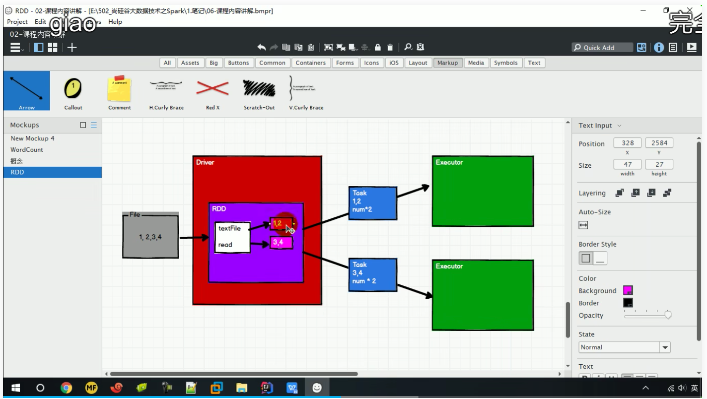
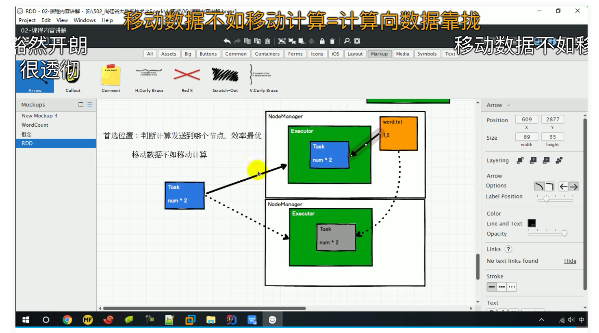

# RDD核心属性

 **分区列表**
  RDD 数据结构中存在分区列表，用于执行任务时并行计算，是实现分布式计算的重要属性。
   protected def getPartitions: Array[Partition]
 **分区计算函数**
  Spark 在计算时，是使用分区函数对每一个分区进行计算
   @DeveloperApi
  def compute(split: Partition, context: TaskContext): Iterator[T]
 **RDD之间的依赖关系**
  RDD 是计算模型的封装，当需求中需要将多个计算模型进行组合时，就需要将多个 RDD 建立依赖关系
   protected def getDependencies: Seq[Dependency[_]] = deps
 **分区器（可选）**

  当数据为 KV 类型数据时，可以通过设定分区器自定义数据的分区
   @transient val partitioner: Option[Partitioner] = None

备注：上图中之所以被（1，2），（3，4）而不是（1，3），（2，4）

 **首选位置（可选）**
  计算数据时，可以根据计算节点的状态选择不同的节点位置进行计算
   protected def getPreferredLocations(split: Partition): Seq[String] = Nil

备注：优先会将任务发送给数据存储的节点上，***移动数据不如移动计算***

 