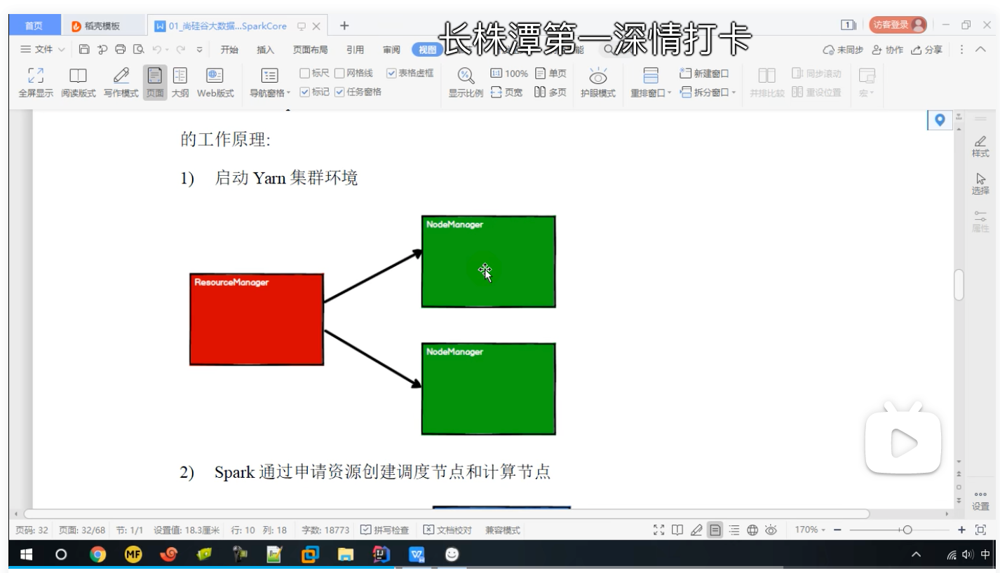
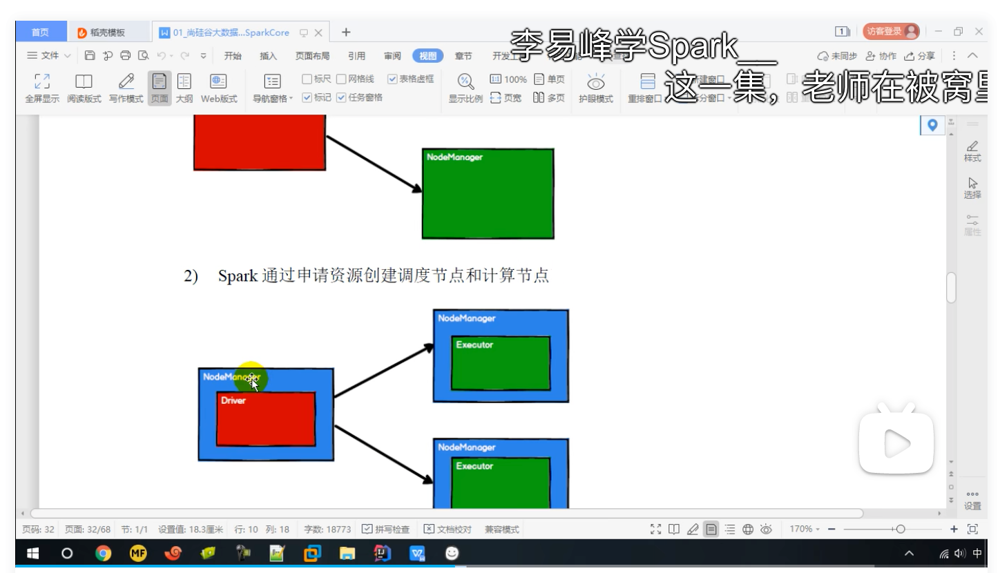
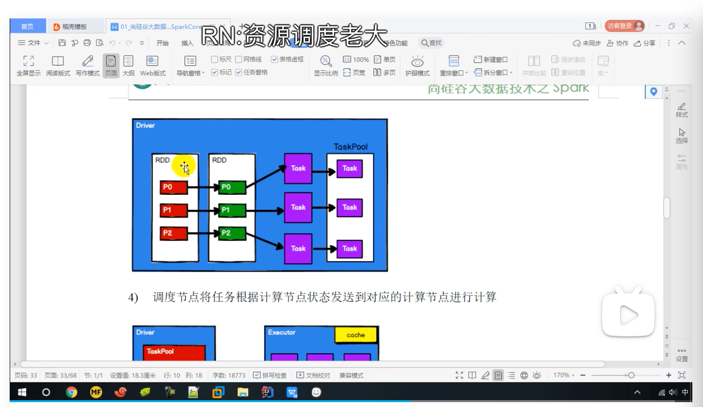

# 执行原理

 Spark 框架在执行时，先申请资源，然后将应用程序的数据处理逻辑分解成一个一个的计算任务。然后将任务发到已经分配资源的计算节点上, 按照指定的计算模型进行数据计算。最后得到计算结果。
 在 Yarn 环境中，RDD的工作原理:

1. 启动 Yarn 集群环境

   

2. Spark 通过申请资源创建调度节点和计算节点

   

   注意：Driver和Executor都是运行在NodeManager上

3.  Spark 框架根据需求将计算逻辑根据分区划分成不同的任务

   

4. 调度节点将任务根据计算节点状态发送到对应的计算节点进行计算

   

