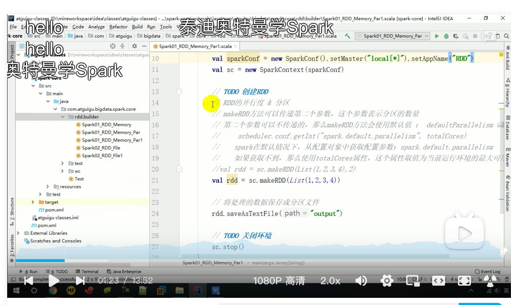
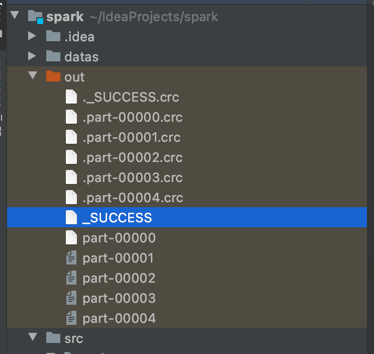

### 方式1 numSlices



```scala
object CreateRDDPar {
  def main(args: Array[String]): Unit = {
    val conf: SparkConf = new SparkConf()
      .setMaster("local[*]")
      .setAppName("Spark")
    val context = new SparkContext(conf)
    val rdd: RDD[Int] = context.makeRDD(List(1, 2, 3, 4),2)//第二个参数2代表numSlices，表示分区的数量
    rdd.saveAsTextFile("out")
    context.stop()
  }
}
```

### 方式2 SparkConf中设置参数

```scala
object CreateRDDPar {
  def main(args: Array[String]): Unit = {
    val conf: SparkConf = new SparkConf()
      .setMaster("local[*]")
      .setAppName("Spark")
      .set("spark.default.parallelism","5")//通过设置并行度，改变分区数量
    val context = new SparkContext(conf)
    val rdd: RDD[Int] = context.makeRDD(List(1, 2, 3, 4))
    rdd.saveAsTextFile("out")
    context.stop()
  }
}
```

输出结果

