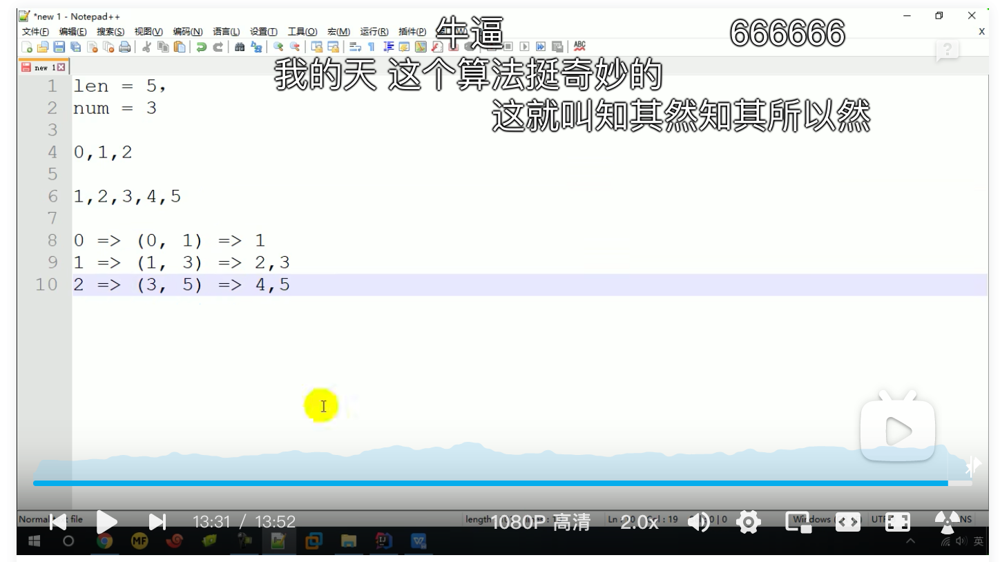
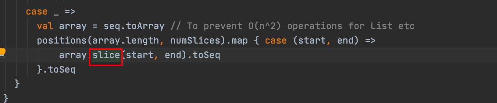
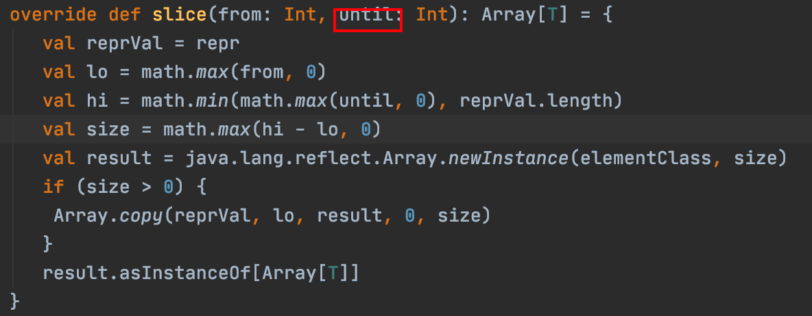

```scala
def main(args: Array[String]): Unit = {
  val conf: SparkConf = new SparkConf()
    .setMaster("local[*]")
    .setAppName("Spark")
  val context = new SparkContext(conf)
  val rdd: RDD[Int] = context.makeRDD(List(1, 2, 3, 4,5),3)//将List切分到3个分区
  rdd.saveAsTextFile("out")
  context.stop()
}
```

我们可以设置将List切分到几个分区，但是有疑问，3个分区是通过什么逻辑切分数据呢，我们可以通过查看源码找到答案

数据切分部分源码

```scala
def positions(length: Long, numSlices: Int): Iterator[(Int, Int)] = {
  (0 until numSlices).iterator.map { i =>
    val start = ((i * length) / numSlices).toInt
    val end = (((i + 1) * length) / numSlices).toInt
    (start, end)
  }
}
```

len=5,num=3可以得到以下数据分区结果







注意一个小细节，array.slice方法切割时是***前闭后开***，因为util代表开