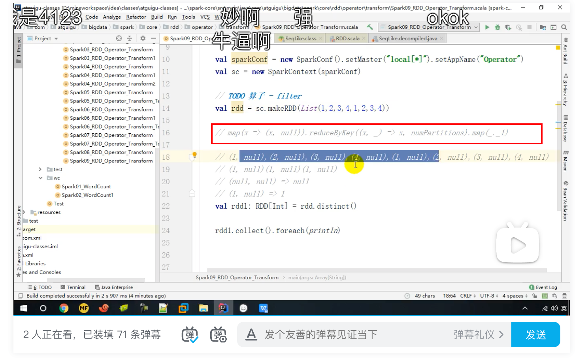
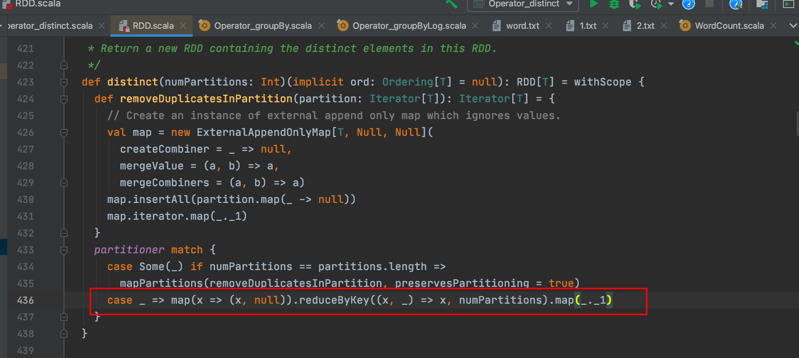

### 函数签名

* def distinct()(implicit ord: Ordering[T] = null): RDD[T] 

* def distinct(numPartitions: Int)(implicit ord: Ordering[T] = null): RDD[T]

### 例子

```scala
val dataRDD = sparkContext.makeRDD(List(
 1,2,3,4,1,2
),1)
val dataRDD1 = dataRDD.distinct()
val dataRDD2 = dataRDD.distinct(2)
```

### 源码剖析



