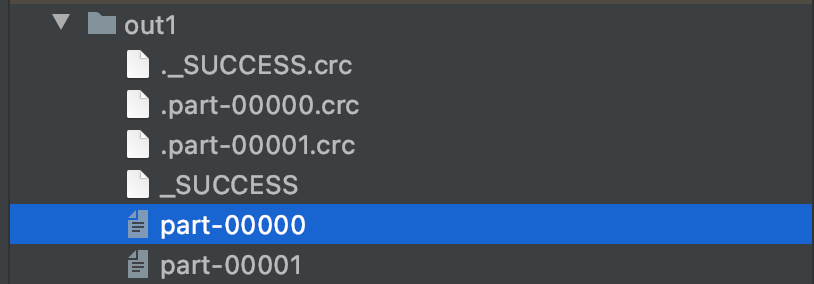
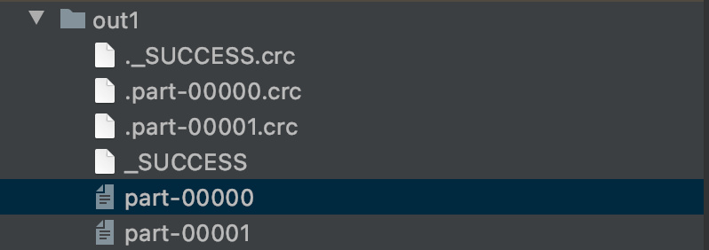
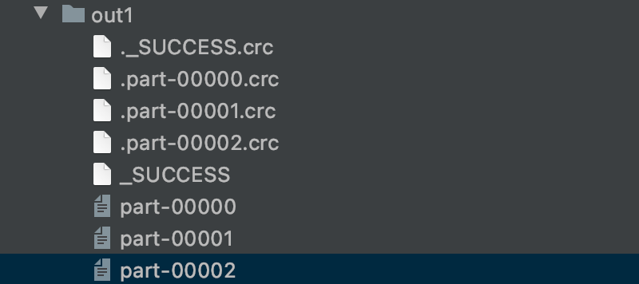

### 作用

根据数据量缩减分区，用于大数据集过滤后，提高小数据集的执行效率 当 spark 程序中，存在过多的小任务的时候，可以通过 coalesce 方法，收缩合并分区，减少 分区的个数，减小任务调度成本

### 例子

```scala
def main(args: Array[String]): Unit = {
  val conf: SparkConf = new SparkConf()
    .setMaster("local[*]")
    .setAppName("Spark")
  val context = new SparkContext(conf)
  val rdd = context.makeRDD(List(1, 2, 3, 4, 5,6),6)
  val rddNew = rdd.coalesce(2)
  rddNew.saveAsTextFile("out1")
  context.stop()
}
```

从6个分区缩减到2个分区



### 默认不拆分分区数据打乱重新组合，只缩减分区数量，可能造成数据不均衡

```scala
def main(args: Array[String]): Unit = {
  val conf: SparkConf = new SparkConf()
    .setMaster("local[*]")
    .setAppName("Spark")
  val context = new SparkContext(conf)
  val rdd = context.makeRDD(List(1, 2, 3, 4, 5,6),3)//[1,2],[3,4],[5,6]
  val rddNew = rdd.coalesce(2)//猜测结果：[1,2,3],[4,5,6] 实际结果：[1,2],[3,4,5,6]，虽然缩减了分区，但是造成数据不均衡
  rddNew.saveAsTextFile("out1")
  context.stop()
}
```

### shuffle

```scala
def main(args: Array[String]): Unit = {
  val conf: SparkConf = new SparkConf()
    .setMaster("local[*]")
    .setAppName("Spark")
  val context = new SparkContext(conf)
  val rdd = context.makeRDD(List(1, 2, 3, 4, 5,6),3)
  val rddNew = rdd.coalesce(2,true)//结果：[1,4,5],[2,3,6]
  rddNew.saveAsTextFile("out1")
  context.stop()
}
```

### 思考：如何扩大分区数量

```scala
def main(args: Array[String]): Unit = {
  val conf: SparkConf = new SparkConf()
    .setMaster("local[*]")
    .setAppName("Spark")
  val context = new SparkContext(conf)
  val rdd = context.makeRDD(List(1, 2, 3, 4, 5,6),2)
  val rddNew = rdd.coalesce(3)//依然只有两个分区，因为默认不拆分分区数据
  rddNew.saveAsTextFile("out1")
  context.stop()
}
```

分区数量未增加



```scala
def main(args: Array[String]): Unit = {
  val conf: SparkConf = new SparkConf()
    .setMaster("local[*]")
    .setAppName("Spark")
  val context = new SparkContext(conf)
  val rdd = context.makeRDD(List(1, 2, 3, 4, 5,6),2)
  val rddNew = rdd.coalesce(3,true) //分区数量增加了
  rddNew.saveAsTextFile("out1")
  context.stop()
}
```

分区数量增加了

