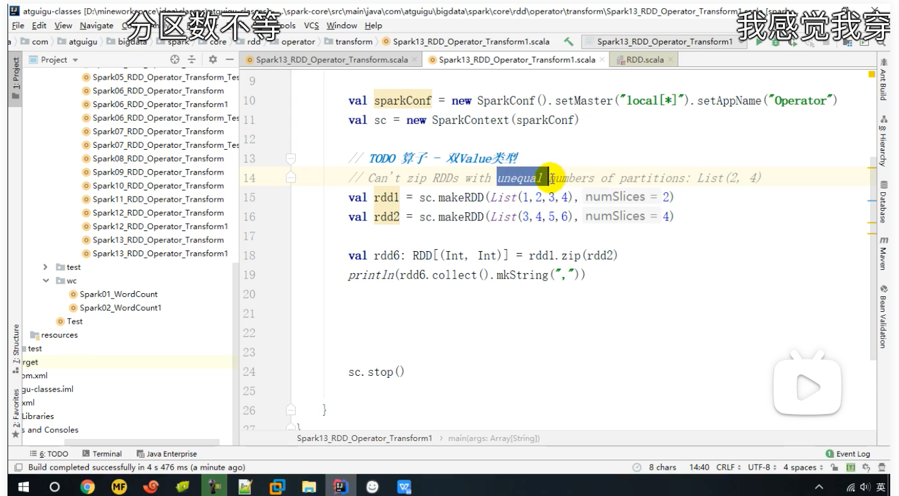
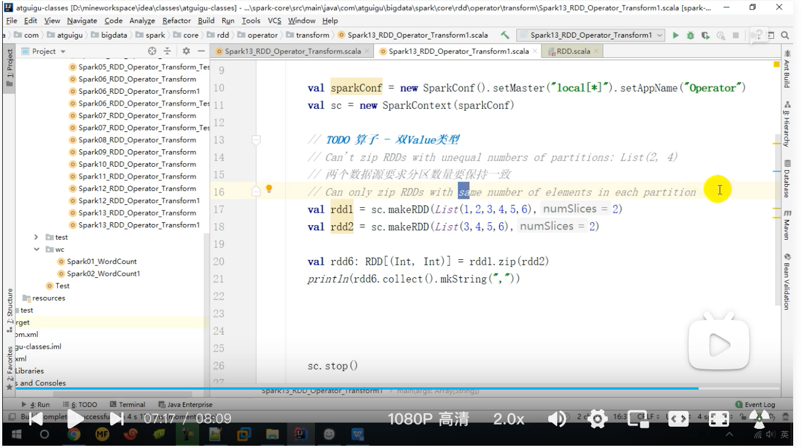

### 例子

```scala
def main(args: Array[String]): Unit = {
  val conf: SparkConf = new SparkConf()
    .setMaster("local[*]")
    .setAppName("Spark")
  val context = new SparkContext(conf)
  val rdd1 = context.makeRDD(List(1,2,3,4))
  val rdd2= context.makeRDD(List(3,4,5,6))
  val rdd3 = rdd1.intersection(rdd2)
  println(rdd3.collect().mkString(","))
  val rdd4 = rdd1.union(rdd2)
  println(rdd4.collect().mkString(","))
  val rdd5 = rdd1.subtract(rdd2)
  println(rdd5.collect().mkString(","))
  val rdd6 = rdd1.zip(rdd2)
  println(rdd6.collect().mkString(","))
  context.stop()
}
```

结果

```log
4,3
1,2,3,4,3,4,5,6
1,2
(1,3),(2,4),(3,5),(4,6)
```

### 思考：如果两个 RDD 数据类型不一致怎么办？

交、并、差集数据类型需要保持一致（编译期间就已经报错），拉链没有这个限制

### 拉链的细节

1. 拉链的两个集合的分区数量必须一致

   

2. 每个分区的元素数量必须一致

   

