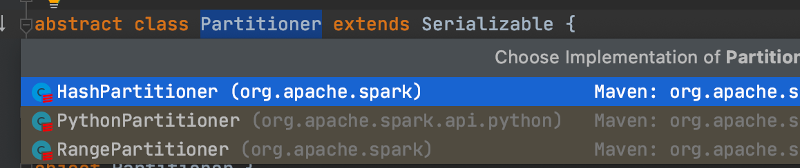

### 介绍

将数据按照指定 Partitioner 重新进行分区。Spark 默认的分区器是 HashPartitioner

### 例子

```scala
def main(args: Array[String]): Unit = {
  val conf: SparkConf = new SparkConf()
    .setMaster("local[*]")
    .setAppName("Spark")
  val context = new SparkContext(conf)
  val rdd1 = context.makeRDD(List(1,2,3,4),2)
  val rdd2 = rdd1.map((_, 1))//因为只有key-value数据才能是调用partitionBy，所以需要转换为tuple
  //扩展（暂时不求甚解）：满足OCP原则，
  //“OCP原则就是"开-闭原则",一个软件应该对扩展开放,对修改关闭。
  //RDD=>PairRDDFunctions
  //隐式转换（二次编译）
  val rdd3 = rdd2.partitionBy(new HashPartitioner(2))
  rdd3.saveAsTextFile("out1")
  context.stop()
}
```

### HashPartitioner分区源码

```scala
//key为null放0分区
 def getPartition(key: Any): Int = key match {
    case null => 0
    case _ => Utils.nonNegativeMod(key.hashCode, numPartitions)
  }

def nonNegativeMod(x: Int, mod: Int): Int = {
  val rawMod = x % mod
  rawMod + (if (rawMod < 0) mod else 0)
}
```

### 隐式转换

```scala
//抽象类RDD的伴生对象
object RDD {

  private[spark] val CHECKPOINT_ALL_MARKED_ANCESTORS =
    "spark.checkpoint.checkpointAllMarkedAncestors"

  // The following implicit functions were in SparkContext before 1.3 and users had to
  // `import SparkContext._` to enable them. Now we move them here to make the compiler find
  // them automatically. However, we still keep the old functions in SparkContext for backward
  // compatibility and forward to the following functions directly.

  implicit def rddToPairRDDFunctions[K, V](rdd: RDD[(K, V)])
    (implicit kt: ClassTag[K], vt: ClassTag[V], ord: Ordering[K] = null): PairRDDFunctions[K, V] = {
    new PairRDDFunctions(rdd)
  }
}
```

### 思考1:如果重分区的分区器和当前 RDD 的分区器一样怎么办？

```scala
class PairRDDFunctions[K, V](self: RDD[(K, V)])
    (implicit kt: ClassTag[K], vt: ClassTag[V], ord: Ordering[K] = null)
  extends Logging with Serializable {
    ...
    def partitionBy(partitioner: Partitioner): RDD[(K, V)] = self.withScope {
      if (keyClass.isArray && partitioner.isInstanceOf[HashPartitioner]) {
        throw new SparkException("HashPartitioner cannot partition array keys.")
      }
      //scala中的“==”就是做了非空校验的“equals”
      if (self.partitioner == Some(partitioner)) {
        //如果连续两次分区类型和分区数一致，那么什么事也不做
        self
      } else {
        new ShuffledRDD[K, V, V](self, partitioner)
      }
    }
    ...
  }
```

```scala
class HashPartitioner(partitions: Int) extends Partitioner {
  ...
  override def equals(other: Any): Boolean = other match {
    //partitioner的类型和分区都一致时，返回true
    case h: HashPartitioner =>
      h.numPartitions == numPartitions
    case _ =>
      false
  }
  ...
}
```

### 思考2:Spark 还有其他分区器吗？



### 思考3：如果想按照自己的方法进行数据分区怎么办？

可以自定义分区器

