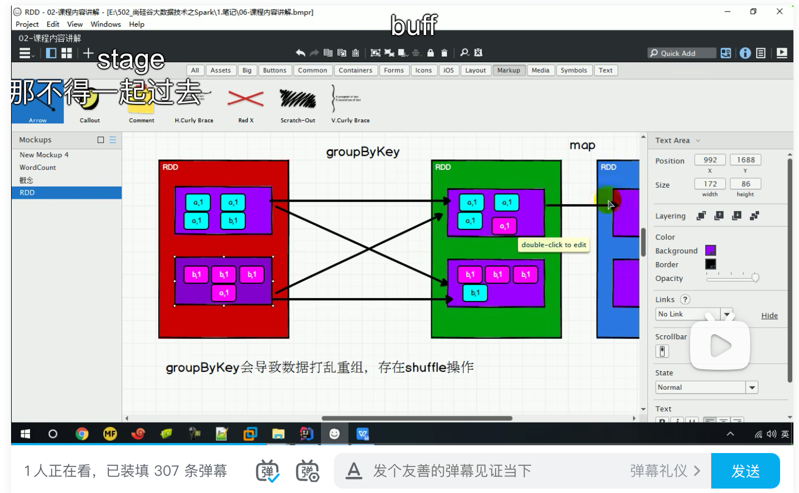
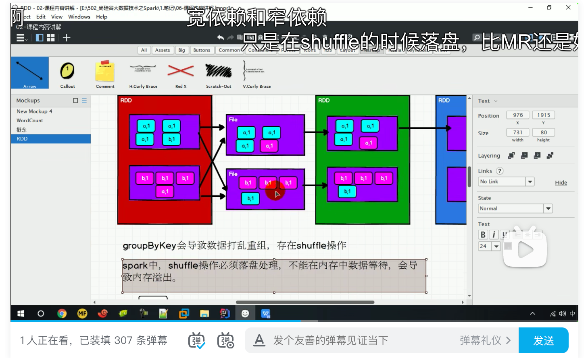
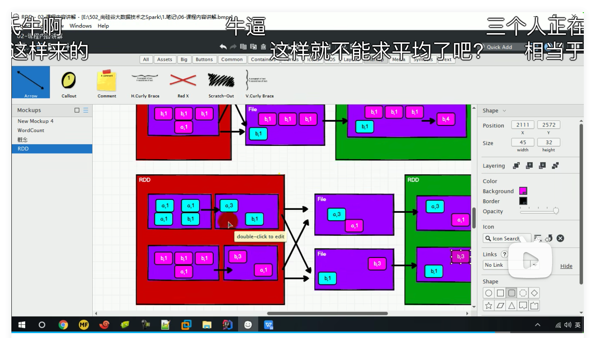

### 介绍

将数据源的数据根据 key 对 value 进行分组

### 例子

```scala
def main(args: Array[String]): Unit = {
    val conf: SparkConf = new SparkConf()
      .setMaster("local[*]")
      .setAppName("Spark")
    val context = new SparkContext(conf)
    val rdd1 = context.makeRDD(List(("a",1),("a",2),("a",3),("b",4)),2)
    val groupRDD: RDD[(String, Iterable[Int])] = rdd1.groupByKey()
    groupRDD.collect().foreach(println)
    context.stop()
  }
```

### 与GroupBy的区别

```scala
def main(args: Array[String]): Unit = {
    val conf: SparkConf = new SparkConf()
      .setMaster("local[*]")
      .setAppName("Spark")
    val context = new SparkContext(conf)
    val rdd1 = context.makeRDD(List(("a",1),("a",2),("a",3),("b",4)),2)
    val groupRDD: RDD[(String, Iterable[Int])] = rdd1.groupByKey()
    val groupRDDNew: RDD[(String, Iterable[(String, Int)])] = rdd1.groupBy(_._1) //返回RDD泛型不同
    groupRDD.collect().foreach(println)
    context.stop()
  }
```

### 与ReduceByKey的区别

* GroupByKey实现按key分组，value相加底层实现

  

  1. 分组。groupByKey会导致数据打乱重组，存在shuffle操作

  2. 并行暂停，需要等待。因为还有后续聚合操作，如：如需要把所有key=a的value相加，所以原本不同分区可以并行计算的到此时并行结束，需要等待其他分区key=a的数据到达后再进行后续操作

  3. 用落盘的方式等待。因为其他分区key=a的数据何时能处理完成我们无法保证，并且key=a的数据也不能一直放在内存当中容易造成OOM，所以shuffle的过程需要将已经处理好的数据按照key落盘存储，直到所有数据都已经到达。

  4. 落盘方案图解

     

* ReduceByKey实现按key分组，value相加底层实现

  

  1. 存在combiner预处理。ReduceByKey和groupByKey一样在shuffle的时候需要落盘，但是不一样的是ReduceByKey在shuffle之前会对做一次预聚合（combiner），这样无论是写入磁盘的时候还是从磁盘中读取数据，都会比GroupByKey高很多

* 功能区别。reduceByKey 其实包含分组和聚合的功能。GroupByKey 只能分组，不能聚 合，所以在分组聚合的场合下，推荐使用 reduceByKey，如果仅仅是分组而不需要聚合。那 么还是只能使用 groupByKey