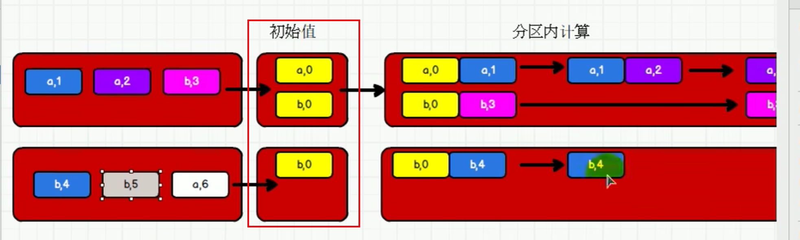
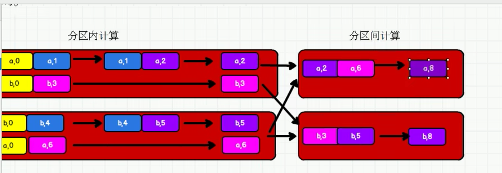
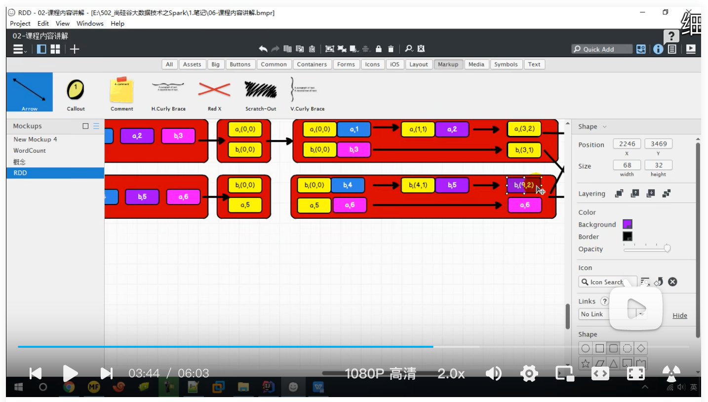
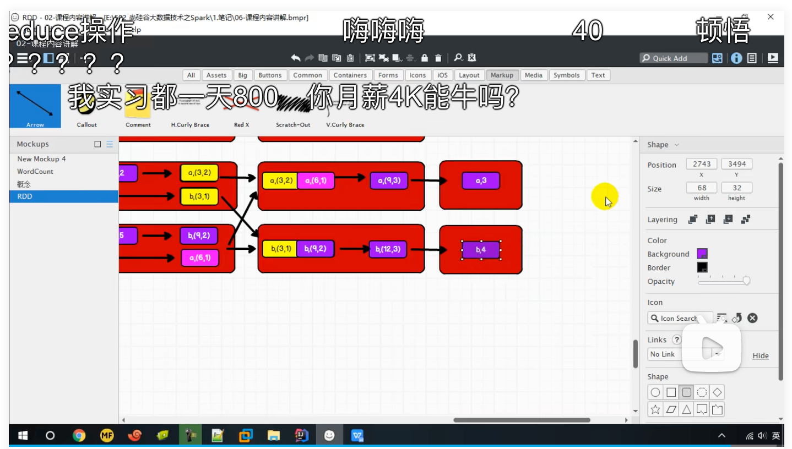

### 介绍

将数据根据不同的规则进行分区内计算和分区间计算

### 例子

```scala
def main(args: Array[String]): Unit = {
  val conf: SparkConf = new SparkConf()
    .setMaster("local[*]")
    .setAppName("Spark")
  val context = new SparkContext(conf)
  val rdd1 = context.makeRDD(List(("a",1),("a",2),("a",3),("a",4)),2)
  // TODO : 取出每个分区内相同 key 的最大值然后分区间相加
// aggregateByKey 算子是函数柯里化，存在两个参数列表
// 1. 第一个参数列表中的参数表示初始值
// 2. 第二个参数列表中含有两个参数
// 2.1 第一个参数表示分区内的计算规则
// 2.2 第二个参数表示分区间的计算规则
  val rddNew = rdd1.aggregateByKey(0)(
    (x, y) => math.max(x, y),
    (x, y) => x + y
  )
  rddNew.collect().foreach(println)
  context.stop()
}
```

### 图解

分区内计算



分区间计算



由于分区内两两计算的过程都相同，所以需要设置初始值，方便开始第一个元素的运算。

### 思考

分区内计算规则和分区间计算规则相同怎么办？是可以的，而且可以用foldByKey进行简化

```scala
def main(args: Array[String]): Unit = {
  val conf: SparkConf = new SparkConf()
    .setMaster("local[*]")
    .setAppName("Spark")
  val context = new SparkContext(conf)
  val rdd1 = context.makeRDD(List(("a",1),("a",2),("b",3),("a",4)),2)
  val rddNew = rdd1.aggregateByKey(0)(
    (x, y) => x + y,
    (x, y) => x + y
  )
  rddNew.collect().foreach(println)
  context.stop()
}
```

### 函数签名

```scala
def aggregateByKey[U: ClassTag](zeroValue: U)(seqOp: (U, V) => U,
    combOp: (U, U) => U): RDD[(K, U)]
```

细化知识点

* aggregateByKey的结果的RDD[(K, U)]中，U的类型取决于zeroValue: U的类型
* aggregateByKey的初始值不限于Int，还可以是元组等

### 分组求平均值案例

```scala
def main(args: Array[String]): Unit = {
  val conf: SparkConf = new SparkConf()
    .setMaster("local[*]")
    .setAppName("Spark")
  val context = new SparkContext(conf)
  val rdd1 = context.makeRDD(List(("a", 1), ("a", 2), ("b", 3), ("a", 4), ("b", 5), ("a", 6)), 2)
  val rddNew: RDD[(String, (Int, Int))] = rdd1.aggregateByKey((0, 0))(
    (t, v) => {
      (t._1 + v, t._2 + 1)
    },
    (t1, t2) => {
      (t1._1 + t2._1, t1._2 + t2._2)
    }
  )
  val rddMap: RDD[(String, Double)] = rddNew.mapValues {
    case (num, count) => {
      (num / count.toDouble)
    }
  }
  rddMap.collect().foreach(println)
  context.stop()
}

结果：
(b,4.0)
(a,3.25)
```





分区内：元组与值进行运算，如：a（0，0）与（a,1)的运算结果为a（1，1）

分区间：元组与元组进行运算，如：a(3，2)与a(6,1)的运算结果为a(9,3)
