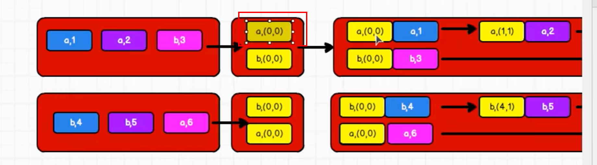
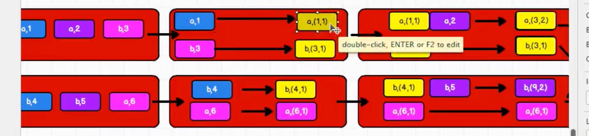
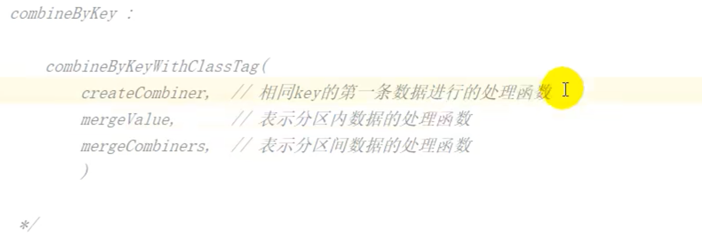
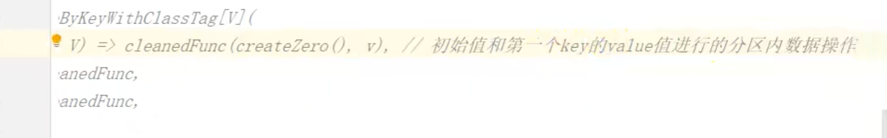
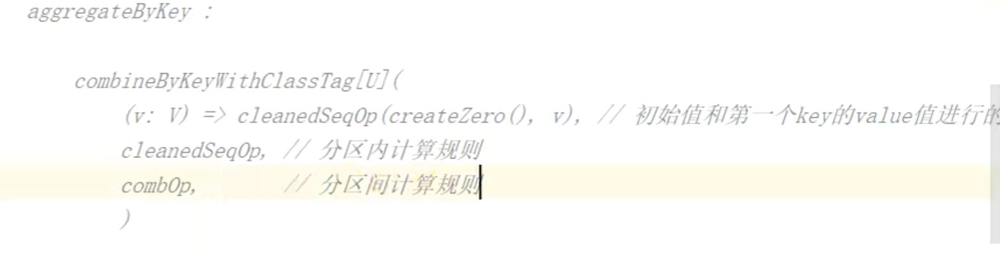
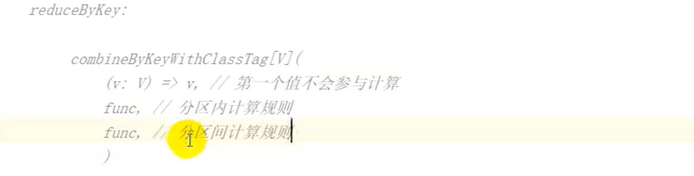

### 思考

一个问题，初始值是不是也算一个值，那么AggregateByKey章节中的分组求平均值的例子是不是计算次数的时候就少算了一次。



PS:初始值不参与计算次数，初始值是为了方便计算而诞生的

### 改变思路



不使用初始值，而是将第一个元素转换为目标类型，例如：a,1转为a(1,1)。combineByKey就是使用了这样的思路，使用第一个元素转换的方式也能获得初始值。

### 例子

```scala
def main(args: Array[String]): Unit = {
  val conf: SparkConf = new SparkConf()
    .setMaster("local[*]")
    .setAppName("Spark")
  val context = new SparkContext(conf)
  val rdd1 = context.makeRDD(List(("a", 1), ("a", 2), ("b", 3), ("a", 4), ("b", 5), ("a", 6)), 2)
  val rddNew: RDD[(String, (Int, Int))] = rdd1.combineByKey(
    v=>(v,1),
    (t:(Int,Int), v) => { //t:(Int,Int)类似标明泛型类型，在编译器器检查阶段即可提示代码错误（个人理解）
        (t._1 + v, t._2 + 1)
      },
      (t1:(Int,Int), t2:(Int,Int)) => {
        (t1._1 + t2._1, t1._2 + t2._2)
      }
  )
  val rddMap: RDD[(String, Double)] = rddNew.mapValues {
    case (num, count) => {
      (num / count.toDouble)
    }
  }


  rddMap.collect().foreach(println)
  context.stop()
}
```

### 对比

reduceByKey、foldByKey、aggregateByKey、combineByKey 的区别

combineByKey

CombineByKey:当计算时，发现数据结构不满足要求时，可以让第一个数据转换结构。分区 内和分区间计算规则不相同。



foldByKey

FoldByKey: 相同 key 的第一个数据和初始值进行分区内计算，分区内和分区间计算规则相 同



aggregateByKey

AggregateByKey：相同 key 的第一个数据和初始值进行分区内计算，分区内和分区间计算规 则可以不相同



reduceByKey

reduceByKey: 相同 key 的第一个数据不进行任何计算，分区内和分区间计算规则相同



总结：以上4个方法底层都是用combineByKeyWithClassTag方法实现。