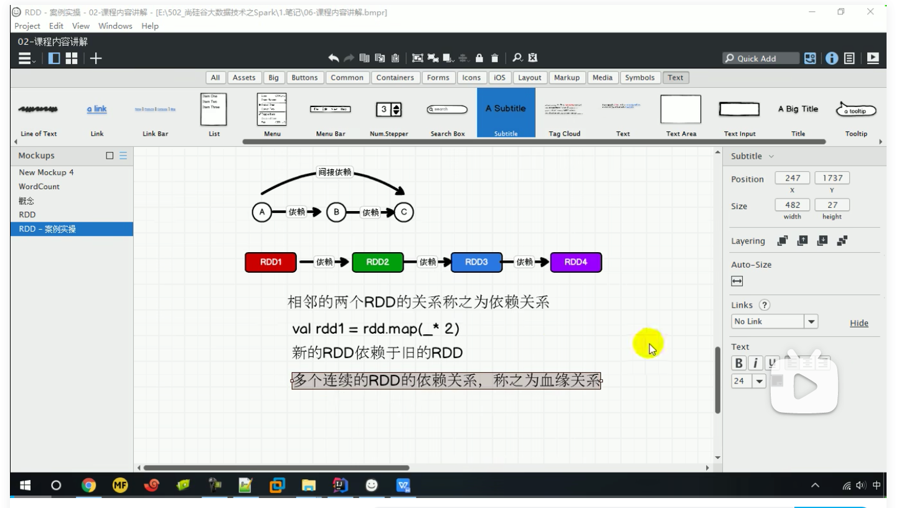

### RDD 依赖关系

这里所谓的依赖关系，其实就是两个相邻 RDD 之间的关系

```scala
val sc: SparkContext = new SparkContext(conf)
val fileRDD: RDD[String] = sc.textFile("input/1.txt")
println(fileRDD.dependencies)
println("----------------------")
val wordRDD: RDD[String] = fileRDD.flatMap(_.split(" "))
println(wordRDD.dependencies)
println("----------------------")
val mapRDD: RDD[(String, Int)] = wordRDD.map((_,1))
println(mapRDD.dependencies)
println("----------------------")
val resultRDD: RDD[(String, Int)] = mapRDD.reduceByKey(_+_)
println(resultRDD.dependencies)
resultRDD.collect()
//结果
List(org.apache.spark.OneToOneDependency@3009eed7)
----------------------
List(org.apache.spark.OneToOneDependency@4f5f474c)
----------------------
List(org.apache.spark.OneToOneDependency@2e952845)
----------------------
List(org.apache.spark.ShuffleDependency@1b8fa2fa)
```

#### RDD 窄依赖

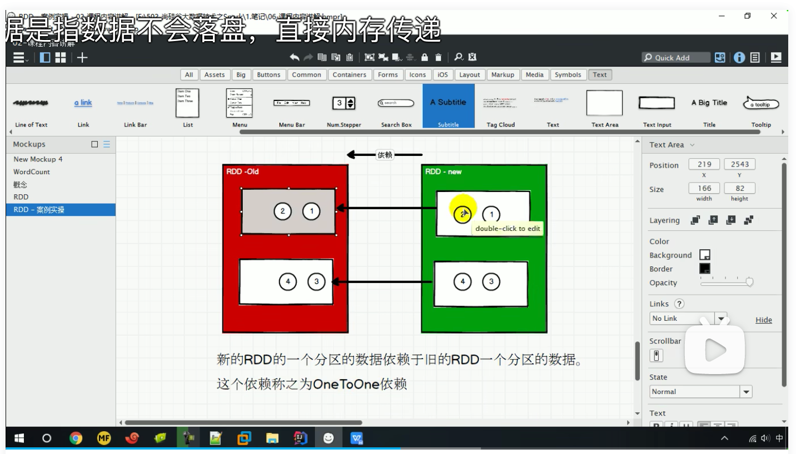

窄依赖表示每一个父(上游)RDD 的 Partition 最多被子（下游）RDD 的一个 Partition 使用， 窄依赖我们形象的比喻为独生子女。

```scala
class OneToOneDependency[T](rdd: RDD[T]) extends NarrowDependency[T](rdd) 
```

窄依赖分区与任务之间的关系。像春游的时候1班、2班分开行动，各只需要一个老师（Task）管理即可(2个任务即可)

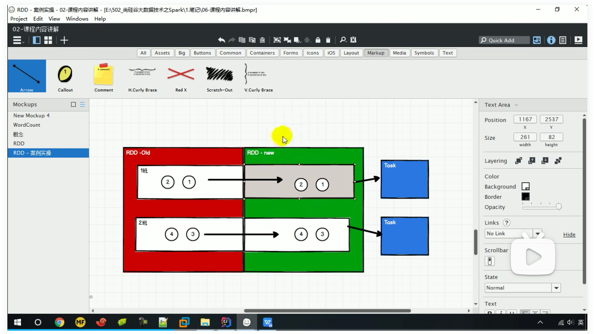

#### RDD 宽依赖

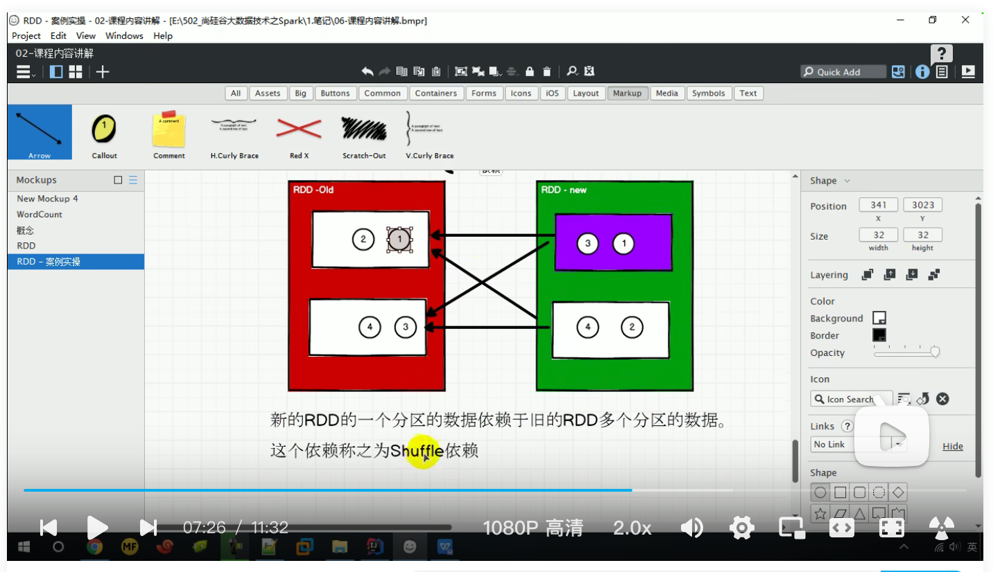

宽依赖表示同一个父（上游）RDD 的 Partition 被多个子（下游）RDD 的 Partition 依赖，会 引起 Shuffle，总结：宽依赖我们形象的比喻为多生。

宽依赖分区与任务之间的关系。像春游时，班主任先分别带领各班游玩（2个任务），游玩后由年段教导主任带领打混的各班学生分别参加爱国注意教育或者参观烈士陵园的活动（2个任务），总共需要4个任务

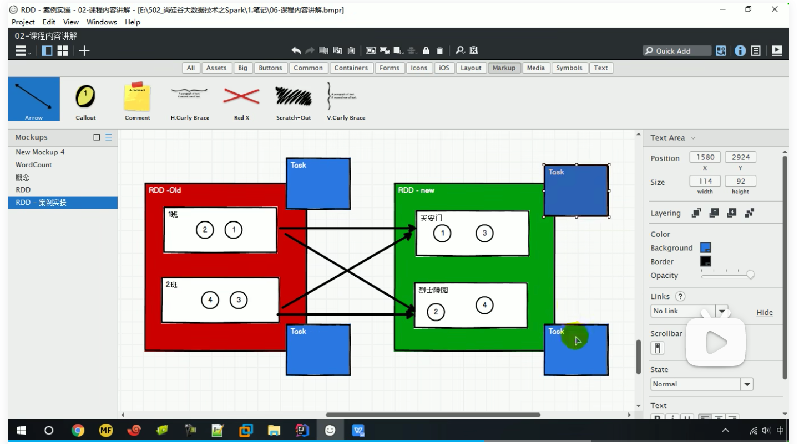

### RDD 血缘关系

RDD 只支持粗粒度转换，即在大量记录上执行的单个操作。将创建 RDD 的一系列 Lineage （血统）记录下来，以便恢复丢失的分区。RDD 的 Lineage 会记录 RDD 的元数据信息和转 换行为，当该 RDD 的部分分区数据丢失时，它可以根据这些信息来重新运算和恢复丢失的 数据分区。

```scala
val fileRDD: RDD[String] = sc.textFile("input/1.txt")
println(fileRDD.toDebugString)
println("----------------------")
val wordRDD: RDD[String] = fileRDD.flatMap(_.split(" "))
println(wordRDD.toDebugString)
println("----------------------")
val mapRDD: RDD[(String, Int)] = wordRDD.map((_,1))
println(mapRDD.toDebugString)
println("----------------------")
val resultRDD: RDD[(String, Int)] = mapRDD.reduceByKey(_+_)
println(resultRDD.toDebugString)
resultRDD.collect()
//每个RDD遇到异常都有根据血缘关系重新计算的能力
(1) datas/1.txt MapPartitionsRDD[1] at textFile at WordCount1.scala:14 []
 |  datas/1.txt HadoopRDD[0] at textFile at WordCount1.scala:14 []
----------------------
(1) MapPartitionsRDD[2] at flatMap at WordCount1.scala:17 []
 |  datas/1.txt MapPartitionsRDD[1] at textFile at WordCount1.scala:14 []
 |  datas/1.txt HadoopRDD[0] at textFile at WordCount1.scala:14 []
----------------------
(1) MapPartitionsRDD[3] at map at WordCount1.scala:20 []
 |  MapPartitionsRDD[2] at flatMap at WordCount1.scala:17 []
 |  datas/1.txt MapPartitionsRDD[1] at textFile at WordCount1.scala:14 []
 |  datas/1.txt HadoopRDD[0] at textFile at WordCount1.scala:14 []
----------------------
(1) ShuffledRDD[4] at reduceByKey at WordCount1.scala:23 []
 +-(1) MapPartitionsRDD[3] at map at WordCount1.scala:20 []
    |  MapPartitionsRDD[2] at flatMap at WordCount1.scala:17 []
    |  datas/1.txt MapPartitionsRDD[1] at textFile at WordCount1.scala:14 []
    |  datas/1.txt HadoopRDD[0] at textFile at WordCount1.scala:14 []
```

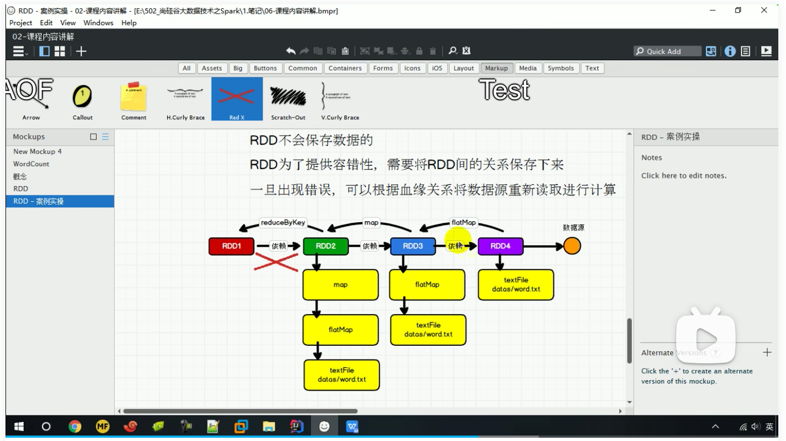

### RDD 阶段划分

DAG（Directed Acyclic Graph）有向无环图是由点和线组成的拓扑图形，该图形具有方向， 不会闭环。例如，DAG 记录了 RDD 的转换过程和任务的阶段。

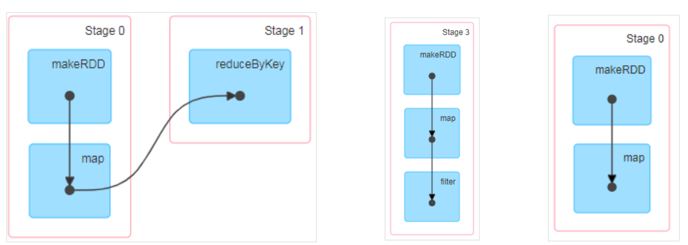

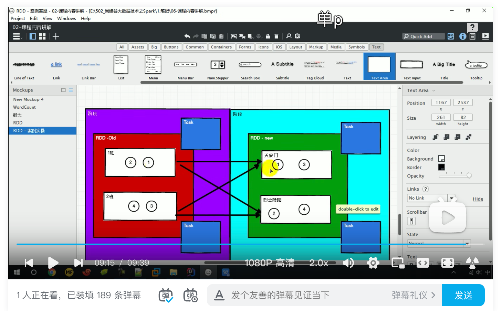

类比春游。去天安门的1班的同学需要等待2班的同学都到齐以后才能进行下一步活动。 

### RDD阶段划分源码

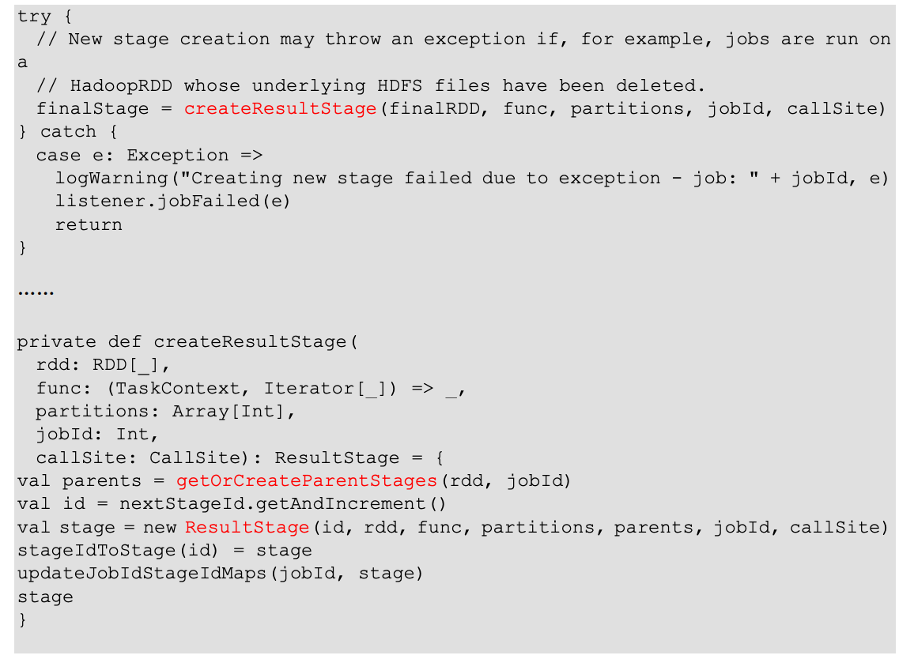

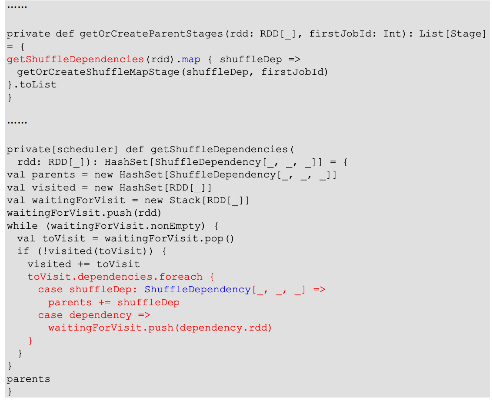

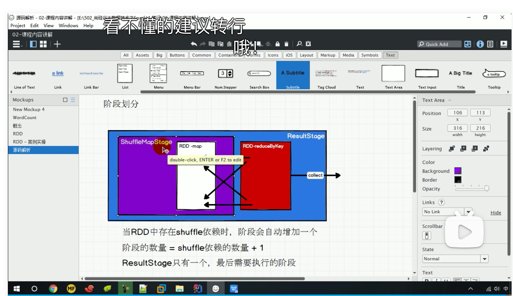

源码总结：当RDD中存在shuffle依赖时，阶段会自动增加一个

### RDD 任务划分

RDD 任务切分中间分为：Application、Job、Stage 和 Task 

*  Application：初始化一个 SparkContext 即生成一个 Application； 
* Job：一个 Action 算子就会生成一个 Job； 
*  Stage：Stage 等于宽依赖(ShuffleDependency)的个数加 1； 
*  Task：一个 Stage 阶段中，最后一个 RDD 的分区个数就是 Task 的个数。 

注意：Application->Job->Stage->Task 每一层都是 1 对 n 的关系。

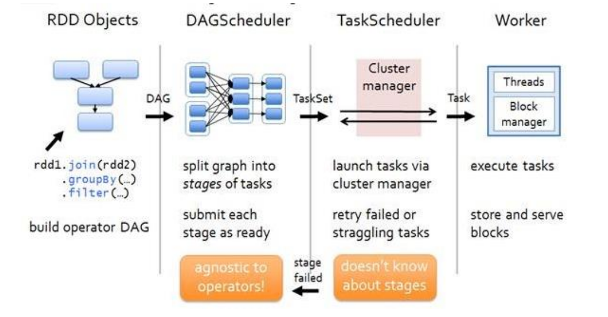

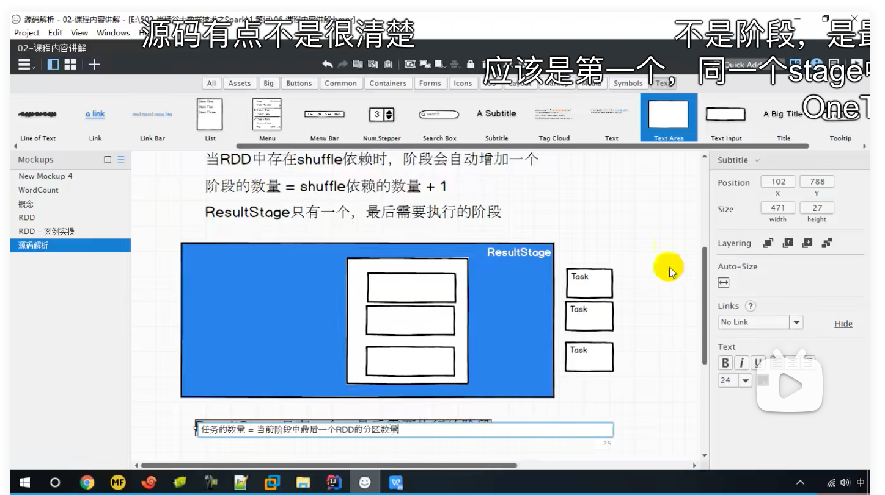

#### 任务划分源码

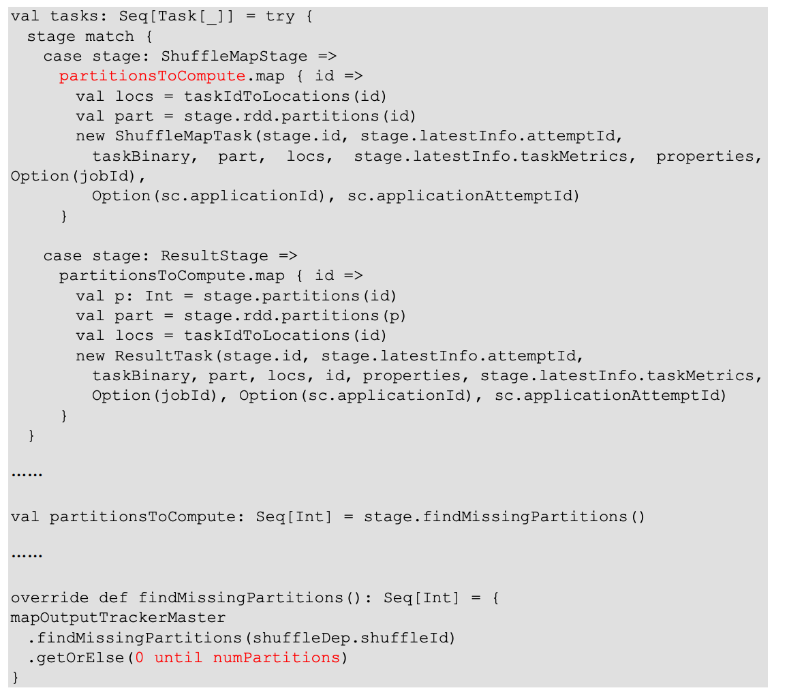

总结：一个 Stage 阶段中，最后一个 RDD 的分区个数就是 Task 的个数。 

#### 任务的分类

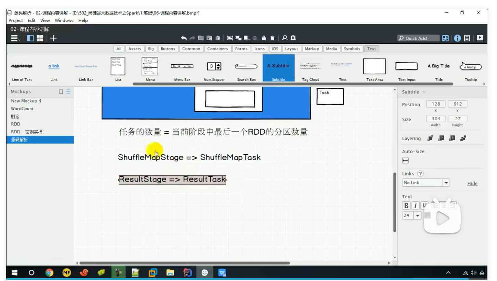

总结：一种阶段对应一种任务