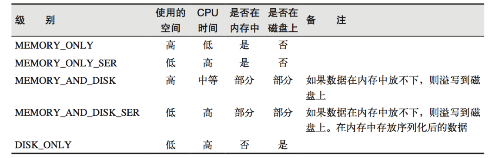

## 持久化

### RDD不存储数据


疑问1：图中MapRDD不会保存数据，但是以下代码为什么能正常运行呢？

```scala
def main(args: Array[String]): Unit = {
  val conf = new SparkConf()
    .setMaster("local")
    .setAppName("WordCount")
  val sc: SparkContext = new SparkContext(conf)
  val rdd = sc.makeRDD(List("Hello Scala", "Hello Spark"))
  val rddFlatMap = rdd.flatMap(_.split(" "))
  val rddMap = rddFlatMap.map(w=>{
    println("@@@@@@@")
    (w,1)
  })
  val rddReduceByKey = rddMap.reduceByKey(_ + _)
  rddReduceByKey.collect().foreach(println)
  println("*******************")
  val rddGroupByKey = rddMap.groupByKey()//rddMap重复使用
  rddGroupByKey.collect().foreach(println) //能正常打印
  sc.stop()
}
//输出
@@@@@@@
@@@@@@@
@@@@@@@
@@@@@@@
(Spark,1)
(Hello,2)
(Scala,1)
*******************
@@@@@@@
@@@@@@@
@@@@@@@
@@@@@@@
(Spark,CompactBuffer(1))
(Hello,CompactBuffer(1, 1))
(Scala,CompactBuffer(1))
```

结论：

* 如果一个RDD需要重复使用，那么需要从头执行来获取数据。
* RDD对象可以重用，但是数据无法重用

### 持久化到内存


```scala
def main(args: Array[String]): Unit = {
    val conf = new SparkConf()
      .setMaster("local")
      .setAppName("WordCount")
    val sc: SparkContext = new SparkContext(conf)
    val rdd = sc.makeRDD(List("Hello Scala", "Hello Spark"))
    val rddFlatMap = rdd.flatMap(_.split(" "))
    val rddMap = rddFlatMap.map(w=>{
      println("@@@@@@@")
      (w,1)
    })
    rddMap.cache() //cache操作
    val rddReduceByKey = rddMap.reduceByKey(_ + _)
    rddReduceByKey.collect().foreach(println)
    println("*******************")
    val rddGroupByKey = rddMap.groupByKey() //rddMap操作及之前的操作没有重复执行，数据已经可以重复使用了
    rddGroupByKey.collect().foreach(println)
    sc.stop()
  }
//输出
@@@@@@@
@@@@@@@
@@@@@@@
@@@@@@@
(Spark,1)
(Hello,2)
(Scala,1)
******************* 
(Spark,CompactBuffer(1))
(Hello,CompactBuffer(1, 1))
(Scala,CompactBuffer(1))
```

### 持久化到磁盘

```scala
//rddMap.cache() //内存
rddMap.persist(StorageLevel.DISK_ONLY) //磁盘
```

### 存储级别

```scala
val NONE = new StorageLevel(false, false, false, false)
val DISK_ONLY = new StorageLevel(true, false, false, false)
val DISK_ONLY_2 = new StorageLevel(true, false, false, false, 2)
val MEMORY_ONLY = new StorageLevel(false, true, false, true)
val MEMORY_ONLY_2 = new StorageLevel(false, true, false, true, 2)
val MEMORY_ONLY_SER = new StorageLevel(false, true, false, false)
val MEMORY_ONLY_SER_2 = new StorageLevel(false, true, false, false, 2)
val MEMORY_AND_DISK = new StorageLevel(true, true, false, true)
val MEMORY_AND_DISK_2 = new StorageLevel(true, true, false, true, 2)
val MEMORY_AND_DISK_SER = new StorageLevel(true, true, false, false)
val MEMORY_AND_DISK_SER_2 = new StorageLevel(true, true, false, false, 2)
val OFF_HEAP = new StorageLevel(true, true, true, false, 1)
```



RDD 通过 Cache 或者 Persist 方法将前面的计算结果缓存，默认情况下会把数据以缓存 在 JVM 的堆内存中。但是并不是这两个方法被调用时立即缓存，而是触发后面的 action 算 子时，该 RDD 将会被缓存在计算节点的内存中，并供后面重用。

### 使用场景

* RDD重用
* 操作执行时间较长或者数据比较重要的场合也可以使用

### Spark中缓存容错机制

​	缓存有可能丢失，或者存储于内存的数据由于内存不足而被删除，RDD 的缓存容错机 制保证了即使缓存丢失也能保证计算的正确执行。通过基于 RDD 的一系列转换，丢失的数 据会被重算，由于 RDD 的各个 Partition 是相对独立的，因此只需要计算丢失的部分即可， 并不需要重算全部 Partition。 Spark 会自动对一些 Shuffle 操作的中间数据做持久化操作(比如：reduceByKey)。这样 做的目的是为了当一个节点 Shuffle 失败了避免重新计算整个输入。但是，在实际使用的时 候，如果想重用数据，仍然建议调用 persist 或 cache。