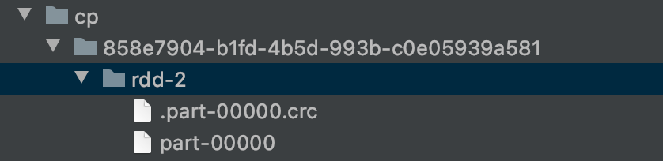
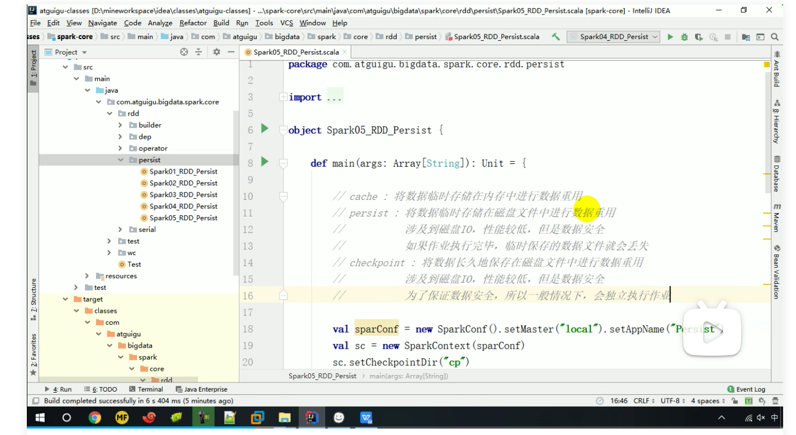
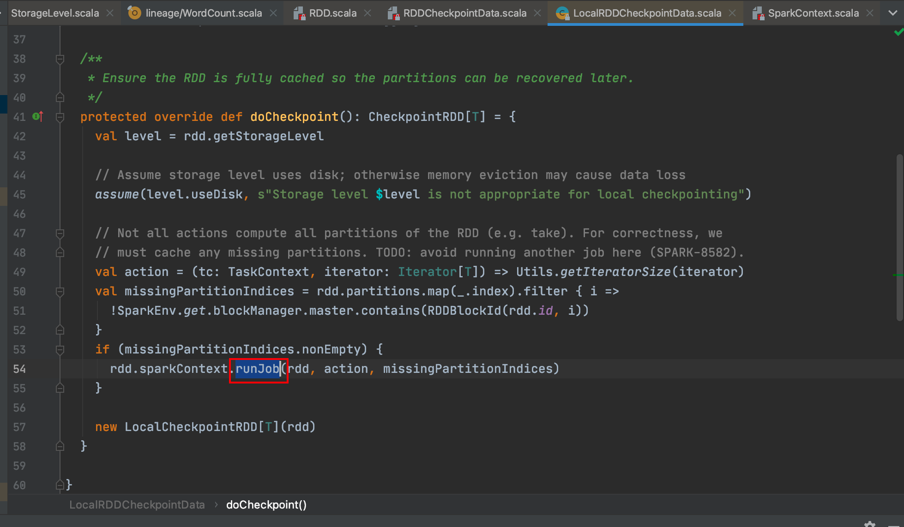

## CheckPoint 检查点

所谓的检查点其实就是通过将 RDD 中间结果写入磁盘 由于血缘依赖过长会造成容错成本过高，这样就不如在中间阶段做检查点容错，如果检查点 之后有节点出现问题，可以从检查点开始重做血缘，减少了开销。 对 RDD 进行 checkpoint 操作并不会马上被执行，必须执行 Action 操作才能触发。

```scala
def main(args: Array[String]): Unit = {
  val conf = new SparkConf()
    .setMaster("local")
    .setAppName("WordCount")
  val sc: SparkContext = new SparkContext(conf)
  sc.setCheckpointDir("cp") //设置检查点保存路径，（通常保存在分布式存储当中，区别于持久化，持久化不需要设置路径，保存在磁盘上的临时文件会在作业执行完后自动清除）
  val rdd = sc.makeRDD(List("Hello Scala", "Hello Spark"))
  val rddFlatMap = rdd.flatMap(_.split(" "))
  val rddMap = rddFlatMap.map(w=>{
    println("@@@@@@@")
    (w,1)
  })
  rddMap.checkpoint() //为rdd设置检查点
  val rddReduceByKey = rddMap.reduceByKey(_ + _)
  rddReduceByKey.collect().foreach(println)
  println("*******************")
  val rddGroupByKey = rddMap.groupByKey()
  rddGroupByKey.collect().foreach(println)
  sc.stop()
}
//输出
@@@@@@@
@@@@@@@
@@@@@@@
@@@@@@@
@@@@@@@ //使用checkPoint,作业被多执行了一遍
@@@@@@@
@@@@@@@
@@@@@@@
(Spark,1)
(Hello,2)
(Scala,1)
*******************
(Spark,CompactBuffer(1))
(Hello,CompactBuffer(1, 1))
(Scala,CompactBuffer(1))
```



### 作业被多执行一遍的原因



为了保证数据安全，所以一般情况下，会独立执行作业（这里视频中描述的比较含糊，多执行一遍就能保证数据安全？）

```scala
rddMap.cache() //在checkpoint方法前执行cache方法可以解决作业被多执行一遍的问题
rddMap.checkpoint()
//输出
@@@@@@@
@@@@@@@
@@@@@@@
@@@@@@@
(Spark,1)
(Hello,2)
(Scala,1)
*******************
(Spark,CompactBuffer(1))
(Hello,CompactBuffer(1, 1))
(Scala,CompactBuffer(1))
```

源码中，执行检查点方法中确实会再执行一次作业



### cache()与checkpoint()对于血缘关系的影响

Cache 缓存只是将数据保存起来，不切断血缘依赖。

Checkpoint 检查点切断血缘依赖。

* Cache()

  ```scala
  def main(args: Array[String]): Unit = {
      val conf = new SparkConf()
        .setMaster("local")
        .setAppName("WordCount")
      val sc: SparkContext = new SparkContext(conf)
  //    sc.setCheckpointDir("cp")
      val rdd = sc.makeRDD(List("Hello Scala", "Hello Spark"))
      val rddFlatMap = rdd.flatMap(_.split(" "))
      val rddMap = rddFlatMap.map(w=>{
        println("@@@@@@@")
        (w,1)
      })
      rddMap.cache() //会在血缘关系中添加新的依赖，一旦出现问题，可以从头执行
  //    rddMap.checkpoint() //执行过程中，会切断血缘关系，重新建立新的血缘关系。checkpoint等同改变数据源
      println(rddMap.toDebugString)
      val rddReduceByKey = rddMap.reduceByKey(_ + _)
      rddReduceByKey.collect().foreach(println)
      println("*******************")
      println(rddMap.toDebugString)
      val rddGroupByKey = rddMap.groupByKey()
      rddGroupByKey.collect().foreach(println)
      sc.stop()
    }
  //输出
  (1) MapPartitionsRDD[2] at map at WordCount2.scala:15 [Memory Deserialized 1x Replicated]
   |  MapPartitionsRDD[1] at flatMap at WordCount2.scala:14 [Memory Deserialized 1x Replicated]
   |  ParallelCollectionRDD[0] at makeRDD at WordCount2.scala:13 [Memory Deserialized 1x Replicated]
  *******************
  (1) MapPartitionsRDD[2] at map at WordCount2.scala:15 [Memory Deserialized 1x Replicated]
   |       CachedPartitions: 1; MemorySize: 368.0 B; ExternalBlockStoreSize: 0.0 B; DiskSize: 0.0 B
   |  MapPartitionsRDD[1] at flatMap at WordCount2.scala:14 [Memory Deserialized 1x Replicated]
   |  ParallelCollectionRDD[0] at makeRDD at WordCount2.scala:13 [Memory Deserialized 1x Replicated]
  
  ```

* Checkpoint()

  ```scala
  (1) MapPartitionsRDD[2] at map at WordCount2.scala:15 []
   |  MapPartitionsRDD[1] at flatMap at WordCount2.scala:14 []
   |  ParallelCollectionRDD[0] at makeRDD at WordCount2.scala:13 []
  *******************
  (1) MapPartitionsRDD[2] at map at WordCount2.scala:15 []
   |  ReliableCheckpointRDD[4] at collect at WordCount2.scala:23 []
  ```

  
