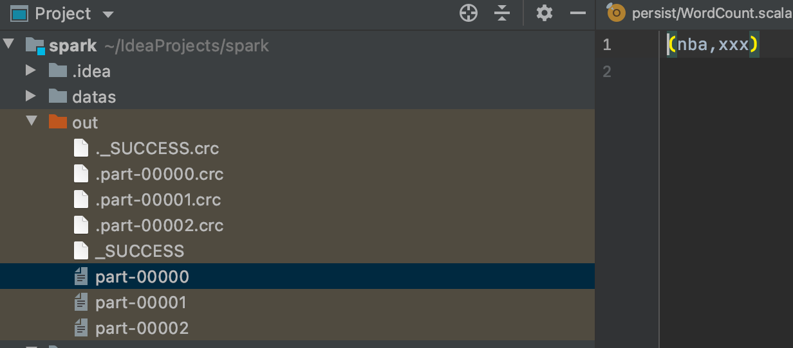
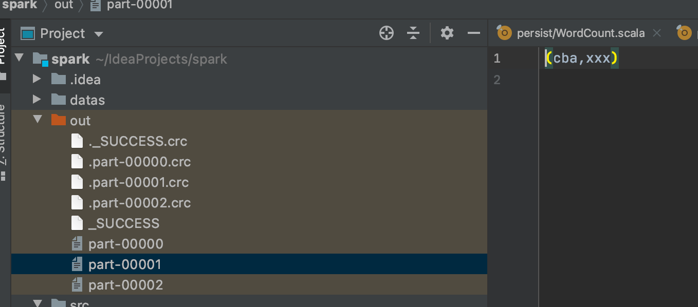
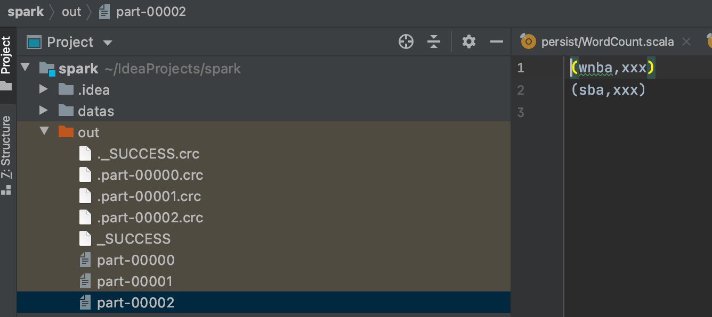

### 分区器

Spark 目前支持 Hash 分区和 Range 分区，和用户自定义分区。

Hash 分区为当前的默认 分区。

分区器直接决定了 RDD 中分区的个数、RDD 中每条数据经过 Shuffle 后进入哪个分 区，进而决定了 Reduce 的个数。 

* 只有 Key-Value 类型的 RDD 才有分区器，非 Key-Value 类型的 RDD 分区的值是 None 

* 每个 RDD 的分区 ID 范围：0 ~ (numPartitions - 1)，决定这个值是属于那个分区的。

### 自定义分区器

```scala
def main(args: Array[String]): Unit = {
  val conf = new SparkConf()
    .setMaster("local")
    .setAppName("WordCount")
  val sc: SparkContext = new SparkContext(conf)
  val rdd: RDD[(String, String)] = sc.makeRDD(List(
    ("nba", "xxx"),
    ("cba", "xxx"),
    ("wnba", "xxx"),
    ("sba", "xxx")
  ))
  val partRDD: RDD[(String, String)] = rdd.partitionBy(new MyPartitioner)
  partRDD.saveAsTextFile("out")
  sc.stop()
}

class MyPartitioner extends Partitioner{
  override def numPartitions: Int = 3

  override def getPartition(key: Any): Int = {
    key match {
      case "nba" => 0
      case "cba" => 1
      case _ => 2
    }
  }
}
```






