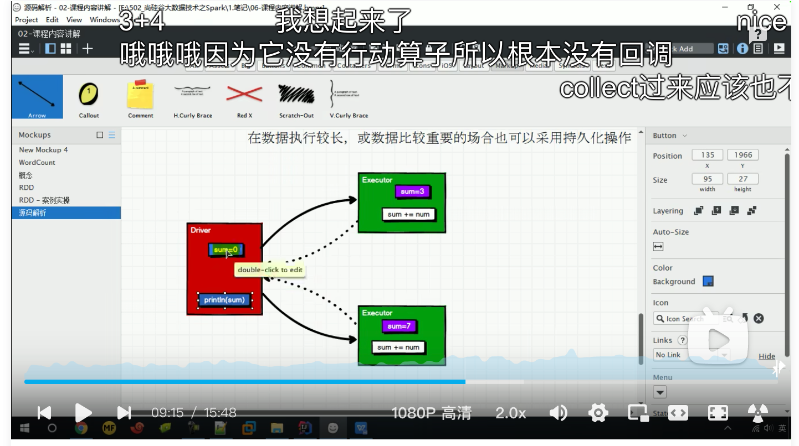
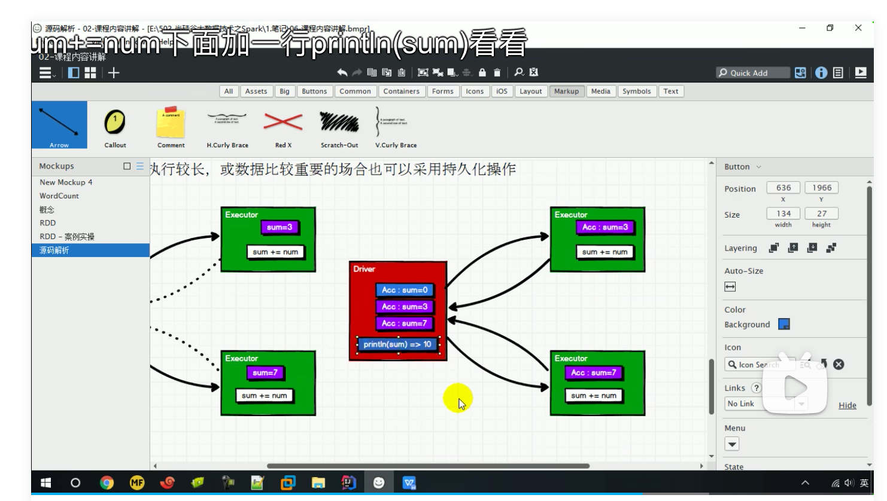
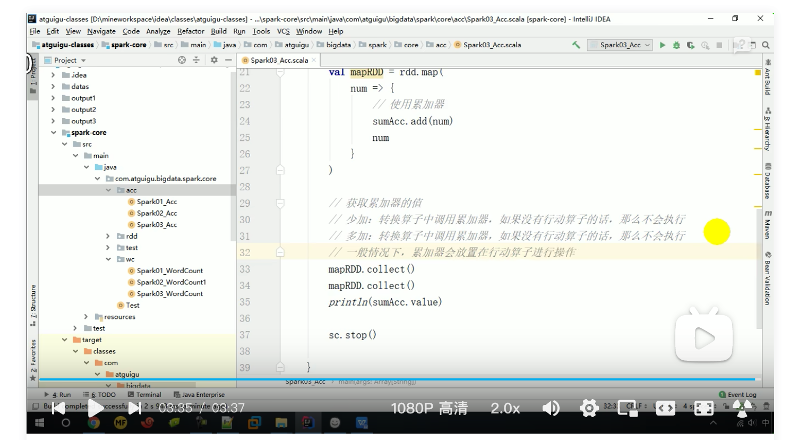

### 介绍

累加器用来把 Executor 端变量信息聚合到 Driver 端。在 Driver 程序中定义的变量，在 Executor 端的每个 Task 都会得到这个变量的一份新的副本，每个 task 更新这些副本的值后， 传回 Driver 端进行 merge。

### Foreach奇怪的现象

```scala
def main(args: Array[String]): Unit = {
  val conf = new SparkConf()
    .setMaster("local")
    .setAppName("acc1")
  val sc: SparkContext = new SparkContext(conf)

  val rdd = sc.makeRDD(List(1, 2, 3, 4))
  var sum:Int = 0;
  rdd.foreach(
    n=> sum += n
  )
  println(sum)  //结果为0
  sc.stop()
}
```

### 图解



总结：foreach计算过程中不会把Executor中的计算结果回传给Driver，所以Driver中的sum始终是0

### 累加器登场



总结：累加器可以将Executor中计算的结果返回给Driver

### 累加器使用

```scala
def main(args: Array[String]): Unit = {
  val conf = new SparkConf()
    .setMaster("local")
    .setAppName("acc2")
  val sc: SparkContext = new SparkContext(conf)
  val rdd = sc.makeRDD(List(1, 2, 3, 4))
  val sumAccumulator = sc.longAccumulator("sum")
  //sc.doubleAccumulator() 
  //sc.collectionAccumulator() List
  rdd.foreach(
    n=>{
      sumAccumulator.add(n)
    }
  )
  println(sumAccumulator.value)

  sc.stop()
}
```

### 问题



少加：

```scala
def main(args: Array[String]): Unit = {
  val conf = new SparkConf()
    .setMaster("local")
    .setAppName("acc2")
  val sc: SparkContext = new SparkContext(conf)
  val rdd = sc.makeRDD(List(1, 2, 3, 4))
  val sumAccumulator = sc.longAccumulator("sum")
  rdd.map(
    n=>{
      sumAccumulator.add(n)
      n
    }
  )
  //rddMap.collect() 
  println(sumAccumulator.value)//未执行collect方法，结果为0
  sc.stop()
}
```

多加

```scala
def main(args: Array[String]): Unit = {
  val conf = new SparkConf()
    .setMaster("local")
    .setAppName("acc2")
  val sc: SparkContext = new SparkContext(conf)
  val rdd = sc.makeRDD(List(1, 2, 3, 4))
  val sumAccumulator = sc.longAccumulator("sum")
  val rddMap = rdd.map(
    n => {
      sumAccumulator.add(n)
      n
    }
  )
  rddMap.cache()
  rddMap.collect()
  rddMap.collect()
  println(sumAccumulator.value) //未执行cache方法，执行结果为20

  sc.stop()
}
```

一般情况累加器放在行动算子上操作

### 自定义累加器

```scala
def main(args: Array[String]): Unit = {
  val conf = new SparkConf()
    .setMaster("local")
    .setAppName("acc3")
  val sc: SparkContext = new SparkContext(conf)
  val rdd = sc.makeRDD(List("hello", "spark", "hello"))
  val accumulator = new MyAccumulator
  sc.register(accumulator)
  rdd.foreach({
    word=>accumulator.add(word)
  })
  println(accumulator.value)
  sc.stop()
}
```

```scala
class MyAccumulator extends AccumulatorV2[String,mutable.Map[String,Long]]{

  var accMap = mutable.Map[String,Long]()

  override def isZero: Boolean = {
    accMap.isEmpty
  }

  override def copy(): AccumulatorV2[String, mutable.Map[String, Long]] = {
    new MyAccumulator
  }

  override def reset(): Unit = {
    accMap.clear()
  }

  override def add(key: String): Unit = {
    val value = accMap.getOrElse(key, 0L)+1
    accMap.update(key,value)
  }

  override def merge(other: AccumulatorV2[String, mutable.Map[String, Long]]): Unit = {
    val map1 = this.accMap
    val map2 = other.value
    map2.foreach{
      case (key,value)=>{
        val count = map1.getOrElse(key, 0L)
        map1.update(key,count+value)
      }
    }
  }

  override def value: mutable.Map[String, Long] = {
    accMap
  }
}
```