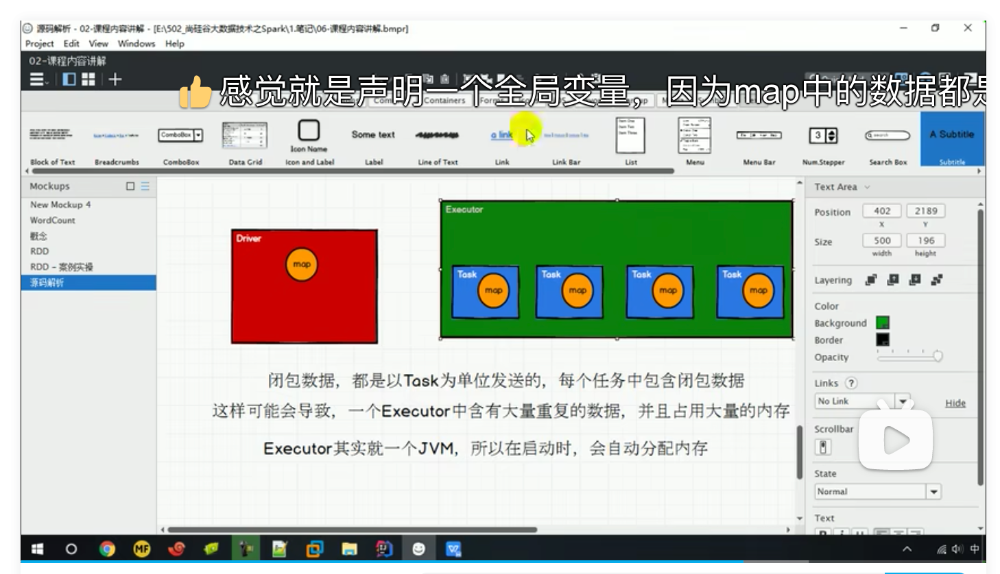
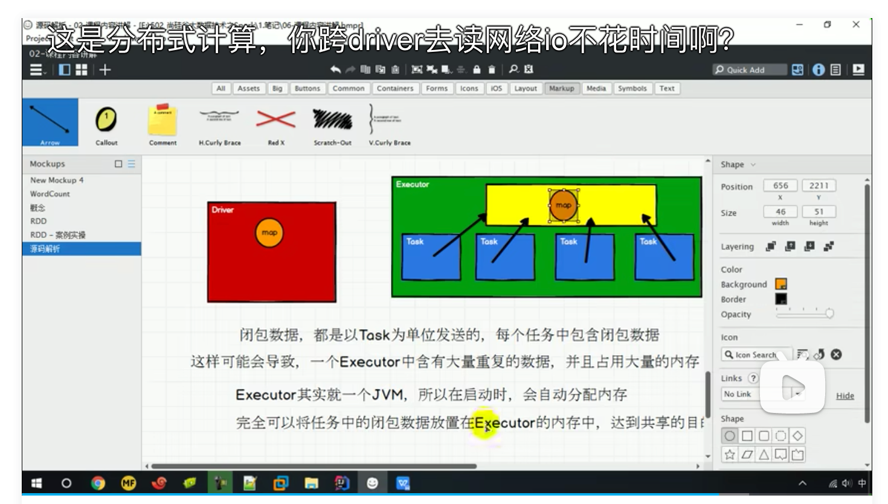

### 介绍

广播变量用来高效分发较大的对象。向所有工作节点发送一个较大的只读值，以供一个 或多个 Spark 操作使用。比如，如果你的应用需要向所有节点发送一个较大的只读查询表， 广播变量用起来都很顺手。在多个并行操作中使用同一个变量，但是 Spark 会为每个任务 分别发送。

### 需求

对两个List[Map]中Map按key实现分组操作

* 实现方式1：join

  ```scala
  def main(args: Array[String]): Unit = {
    val conf = new SparkConf()
      .setMaster("local")
      .setAppName("broadcast1")
    val sc: SparkContext = new SparkContext(conf)
    val rdd = sc.makeRDD(List(("a", 1), ("b", 2), ("c", 3)))
    val rdd1 = sc.makeRDD(List(("a", 4), ("b", 5), ("c", 6)))
    val joinRDD: RDD[(String, (Int, Int))] = rdd.join(rdd1)
    joinRDD.collect().foreach(println)
    sc.stop()
  }
  ```

  结论：虽然join方法能实现功能，但是join存在shuffle，效率不高

* 实现方式2: map

  ```scala
  def main(args: Array[String]): Unit = {
    val conf = new SparkConf()
      .setMaster("local")
      .setAppName("broadcast2")
    val sc: SparkContext = new SparkContext(conf)
    val rdd = sc.makeRDD(List(("a", 1), ("b", 2), ("c", 3)))
    val map = mutable.Map(("a", 4), ("b", 5), ("c", 6))
    val rddMap: RDD[(String, (Int, Int))] = rdd.map {
      case (k, v) => {
        val n = map.getOrElse(k, 0)
        (k, (n, v))
      }
    }
    rddMap.collect().foreach(println)
    sc.stop()
  }
  ```

  结论：map操作不需要shuffle，但是存在需要将map发到所有task的问题，在map数据量非常大的情况下，内存中会冗余大量数据

### 画图分析



同一份数据需要在多个任务中使用，Driver需要把数据发送给每一个task，数据存在冗余

### 改进，使用广播变量



注意：广播变量无法修改（分布式共享的只读变量）

### 使用

```scala
def main(args: Array[String]): Unit = {
  val conf = new SparkConf()
    .setMaster("local")
    .setAppName("broadcast")
  val sc: SparkContext = new SparkContext(conf)
  val rdd = sc.makeRDD(List(("a", 1), ("b", 2), ("c", 3)))
  val map = mutable.Map(("a", 4), ("b", 5), ("c", 6))
  val mapBroadcast: Broadcast[mutable.Map[String, Int]] = sc.broadcast(map)
  val rddMap: RDD[(String, (Int, Int))] = rdd.map {
    case (k, v) => {
      val n = mapBroadcast.value.getOrElse(k, 0)
      (k, (v, n))
    }
  }
  rddMap.collect().foreach(println)
  sc.stop()

}
```