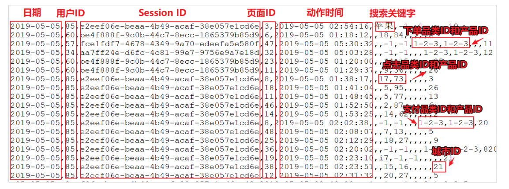
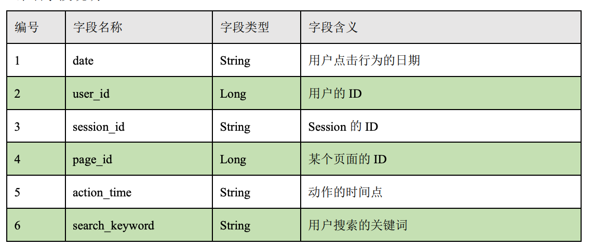
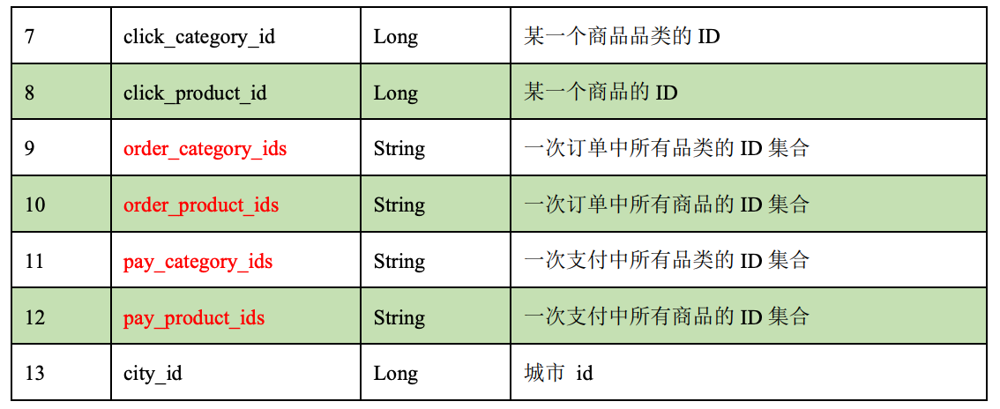
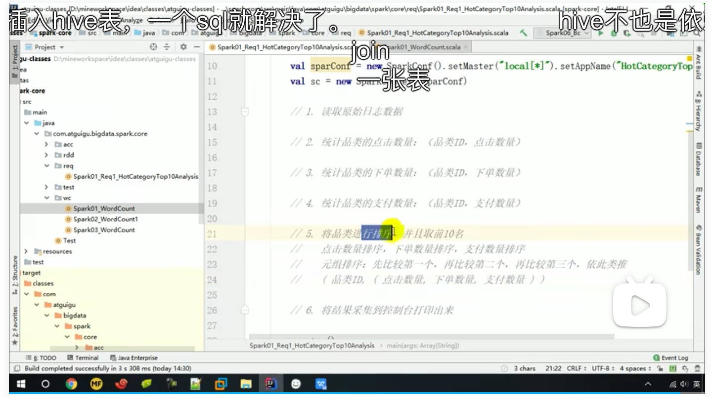
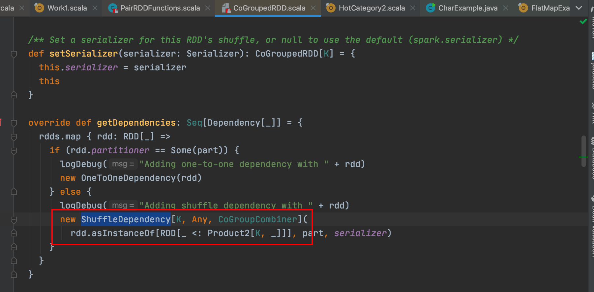
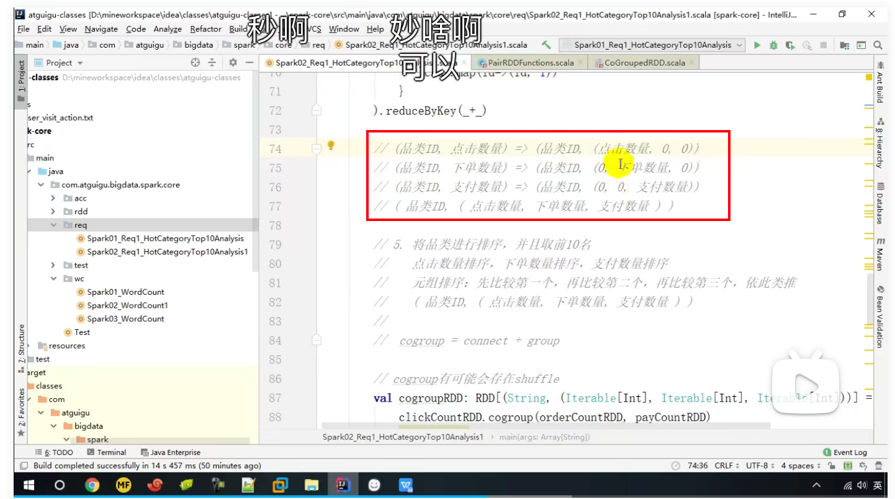
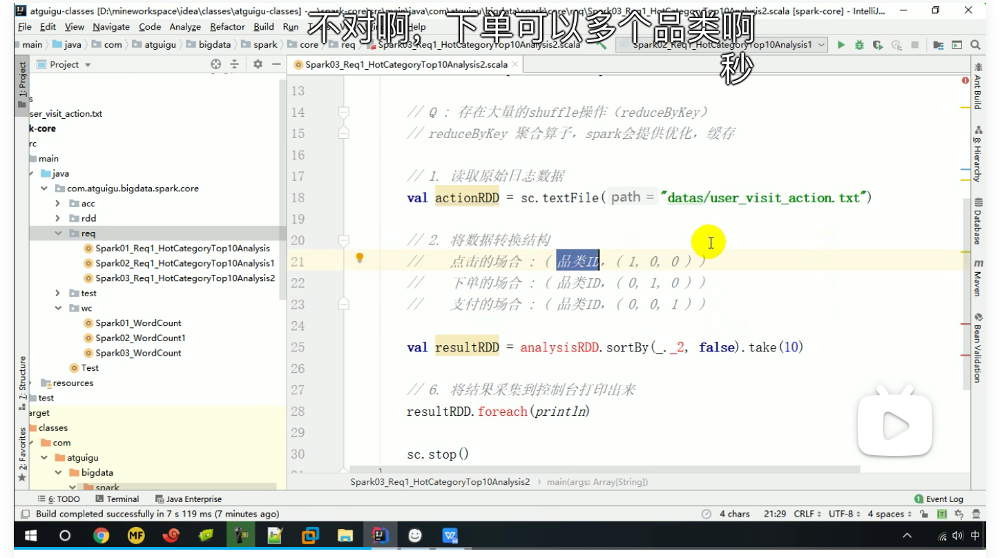

### 案例分析



上面的数据图是从数据文件中截取的一部分内容，表示为电商网站的用户行为数据，主 要包含用户的 4 种行为：搜索，点击，下单，支付。数据规则如下：

* 数据文件中每行数据采用下划线分隔数据
* 每一行数据表示用户的一次行为，这个行为只能是 4 种行为的一种 
* 如果搜索关键字为 null,表示数据不是搜索数据 
* 如果点击的品类 ID 和产品 ID 为-1，表示数据不是点击数据 
*  针对于下单行为，一次可以下单多个商品，所以品类 ID 和产品 ID 可以是多个，id 之 间采用逗号分隔，如果本次不是下单行为，则数据采用 null 表示 
* 支付行为和下单行为类似

详细字段说明：





### 需求说明

品类是指产品的分类，大型电商网站品类分多级，咱们的项目中品类只有一级，不同的 公司可能对热门的定义不一样。我们按照每个品类的点击、下单、支付的量来统计热门品类。

鞋 点击数 下单数 支付数 

衣服 点击数 下单数 支付数

电脑 点击数 下单数 支付数

例如，综合排名 = 点击数*20%+下单数*30%+支付数*50%

本项目需求优化为：先按照点击数排名，靠前的就排名高；如果点击数相同，再比较下 单数；下单数再相同，就比较支付数。

### 方案1

分别统计每个品类点击的次数，下单的次数和支付的次数：

（品类，点击总数）（品类，下单总数）（品类，支付总数）



### 代码

```scala
def main(args: Array[String]): Unit = {
  val conf = new SparkConf()
    .setMaster("local")
    .setAppName("homework1")
  val sc: SparkContext = new SparkContext(conf)
  //1.从文件读取数据
  val rdd = sc.textFile("datas/user_visit_action.txt")
  //2.统计品类的点击数量
  val rddClickCount = rdd.filter(r => {
    val split: Array[String] = r.split("_")
    split(6) != "-1"
  }).map(
    r => {
      val split = r.split("_")
      (split(6), 1)
    }
  ).reduceByKey(_ + _)
  //3.统计品类的下单数量
  val rddOrderCount = rdd.filter(r => {
    val split = r.split("_")
    split(8) != "null"
  }).flatMap(r => {
    val split = r.split("_")
    split(8).split(",").map(n => {
      (n, 1)
    })
  }).reduceByKey(_ + _)
  //4.统计品类的支付数量
  val rddPayCount = rdd.filter(r => {
    val split = r.split("_")
    split(10) != "null"
  }).flatMap(r => {
    val split = r.split("_")
    split(10).split(",").map(n => {
      (n, 1)
    })
  }).reduceByKey(_ + _)
  //5.将品类进行排序，并且取前10名
  //join,不能使用join,join需要两个rdd都存在相同的key才能连接，类似sql中的innerJoin
  //zip,不能zip,zip需要位置匹配
  //leftOuterJoin,不能leftOuterJoin，以左为主，万一左边没有则数据丢失
  //cogroup,可以cogroup，类似sql中的fullJoin
  val rddCogroup: RDD[(String, (Iterable[Int], Iterable[Int], Iterable[Int]))] = rddClickCount.cogroup(rddOrderCount, rddPayCount)
  val rddMap = rddCogroup.mapValues {
    case (clickIt, orderIt, payIt) => {
      var clickCount = 0
      var orderCount = 0
      var payCount = 0
      if (clickIt.iterator.hasNext) //这里只需要用if而不需要while,是因为ClickIt是通过reduceByKey获得,rddClickCount中不可能存在两key相同的kv对
        clickCount = clickIt.iterator.next()
      if (orderIt.iterator.hasNext)
        orderCount = orderIt.iterator.next()
      if (payIt.iterator.hasNext)
        payCount = payIt.iterator.next()
      (clickCount, orderCount, payCount)
    }
  }
  val rddResult = rddMap.sortBy(_._2, false).take(10) //take是行动算子
  //6.打印
  rddResult.foreach(println)

  sc.stop()
}
```

### 方案2

两个方面优化：

1. 从文件读取的rdd被使用多次可以用cache

2. cogroup可能造成多个数据源之间的shuffle操作

   

思路：改变数据结构如下图，然后使用union，最后reduceByKey



```scala
def main(args: Array[String]): Unit = {
  val conf = new SparkConf()
    .setMaster("local[*]")
    .setAppName("hotCategory2")
  val sc: SparkContext = new SparkContext(conf)
  val rdd = sc.textFile("datas/user_visit_action.txt")
  rdd.cache()
  //2.统计品类的点击数量
  val rddClickCount = rdd.filter(r => {
    val split: Array[String] = r.split("_")
    split(6) != "-1"
  }).map(
    r => {
      val split = r.split("_")
      (split(6), 1)
    }
  ).reduceByKey(_ + _)
  //3.统计品类的下单数量
  val rddOrderCount = rdd.filter(r => {
    val split = r.split("_")
    split(8) != "null"
  }).flatMap(r => {
    val split = r.split("_")
    split(8).split(",").map(n => {
      (n, 1)
    })
  }).reduceByKey(_ + _)
  //4.统计品类的支付数量
  val rddPayCount = rdd.filter(r => {
    val split = r.split("_")
    split(10) != "null"
  }).flatMap(r => {
    val split = r.split("_")
    split(10).split(",").map(n => {
      (n, 1)
    })
  }).reduceByKey(_ + _)
  //5.转换数据结构
  val rddClickMap: RDD[(String, (Int, Int, Int))] = rddClickCount.mapValues((_, 0, 0))
  val rddOrderMap: RDD[(String, (Int, Int, Int))] = rddOrderCount.mapValues((0, _, 0))
  val rddBuyMap: RDD[(String, (Int, Int, Int))] = rddClickCount.mapValues((0, 0, _))
	//6.union
  val rddUnion = rddClickMap.union(rddOrderMap).union(rddBuyMap)
	//7.reduceByKey
  val rddReduce: RDD[(String, (Int, Int, Int))] = rddUnion.reduceByKey(
    (x, y) => {
      (x._1 + y._1, x._2 + y._2, x._3 + y._3)
    }
  )
  val rddResult = rddReduce.sortBy(_._2, false).take(10)
  //8.打印
  rddResult.foreach(println)
  sc.stop()
}
```

### 方案3

Q：方案2中存在多次reduceByKey影响性能。

Ps:对于单个数据源reduceByKey多次，Spark默认存在隐式cache优化



思路：将文件中的每一行都转换上图中的数据结构，直接做一次reduceByKey即可

```scala
def main(args: Array[String]): Unit = {
  val conf = new SparkConf()
    .setMaster("local[*]")
    .setAppName("hotCategory3")
  val sc: SparkContext = new SparkContext(conf)
  //1.读取文件
  val rdd = sc.textFile("datas/user_visit_action.txt")
  //2.flatMap
  val rddFlatMap = rdd.flatMap(
    r => {
      val splits = r.split("_")
      if (splits(6) != "-1") {
        List((splits(6), (1, 0, 0)))
      } else if (splits(8) != "null") {
        val cids = splits(8).split(",")
        cids.map((_, (0, 1, 0)))
      } else if (splits(10) != "null") {
        val cids = splits(10).split(",")
        cids.map((_, (0, 0, 1)))
      } else {
        Nil
      }
    }
  )
  //3.reduceByKey
  val rddReduce: RDD[(String, (Int, Int, Int))] = rddFlatMap.reduceByKey(
    (x, y) => {
      (x._1 + y._1, x._2 + y._2, x._3 + y._3)
    }
  )
  val rddResult = rddReduce.sortBy(_._2, false).take(10)
  //4.打印
  rddResult.foreach(println)

  sc.stop()
}
```

### 方案4

Q:方案3中仍然存在reduceByKey

优化思路：使用累加器，避免使用reduceByKey

```scala
object HotCategory4 {
  def main(args: Array[String]): Unit = {
    val conf = new SparkConf()
      .setMaster("local[*]")
      .setAppName("hotCategory3")
    val sc: SparkContext = new SparkContext(conf)
    //1.读取文件
    val rdd = sc.textFile("datas/user_visit_action.txt")
		//2.创建累加器
    val acc = new MyAcc
    sc.register(acc,"HotCategoryAcc")
		//3.foreach
    rdd.foreach(
      r=>{
        val splits = r.split("_")
        if (splits(6) != "-1") {
          acc.add(splits(6),"click")
        } else if (splits(8) != "null") {
          val cids = splits(8).split(",")
          cids.foreach(
            cid=>acc.add(cid,"order")
          )
        } else if (splits(10) != "null") {
          val cids = splits(10).split(",")
          cids.foreach(
            cid=>acc.add(cid,"pay")
          )
        }
      }
    )
		//4.map,ActionCount已经包含品类id,所以可以精简数据结构
    val counts: mutable.Iterable[ActionCount] = acc.value.map(_._2)
		//5.sortWith,根据clickCount，orderCount，payCount依次排序
    val sortCount = counts.toList.sortWith(
      (l, r) => {
        if (l.clickCount > r.clickCount) {
          true
        } else if (l.clickCount == r.clickCount) {
          if (l.orderCount > r.orderCount)
            true
          else if (l.orderCount == r.orderCount) {
            l.payCount > l.payCount
          } else
            false
        } else {
          false
        }
      }
    )
    //6.打印
    sortCount.take(10).foreach(println)
    sc.stop()
  }
	//case class默认成员变量为val,需要指定var
  case class ActionCount(cid:String,var clickCount:Int,var orderCount:Int,var payCount:Int)

  //INT:(品类id,行为类型)
  //OUT:Map(品类id,ActionCount)
  class MyAcc extends AccumulatorV2[(String,String),mutable.Map[String,ActionCount]]{
    private val acMap =  mutable.Map[String,ActionCount]()

    override def isZero: Boolean = acMap.isEmpty

    override def copy(): AccumulatorV2[(String, String), mutable.Map[String, ActionCount]] = new MyAcc

    override def reset(): Unit = acMap.clear()

    override def add(v: (String, String)): Unit = {
      if(v._2=="click"){
        val ac: ActionCount = acMap.getOrElse(v._1, ActionCount(v._1,0, 0, 0))
        ac.clickCount+=1
        acMap.update(v._1,ac)
      }else if(v._2=="order"){
        val ac: ActionCount = acMap.getOrElse(v._1, ActionCount(v._1,0, 0, 0))
        ac.orderCount+=1
        acMap.update(v._1,ac)
      }else if(v._2=="pay"){
        val ac: ActionCount = acMap.getOrElse(v._1, ActionCount(v._1,0, 0, 0))
        ac.payCount+=1
        acMap.update(v._1,ac)
      }
    }

    override def merge(other: AccumulatorV2[(String, String), mutable.Map[String, ActionCount]]): Unit = {
      val map1 = this.acMap
      val map2 = other.value
      map2.foreach{
        case (key, count) => {
          val ac: ActionCount = map1.getOrElse(key, ActionCount(key,0, 0, 0))
          ac.clickCount += count.clickCount
          ac.orderCount += count.orderCount
          ac.payCount += count.payCount
          acMap.update(key,ac)
        }
      }
    }

    override def value: mutable.Map[String, ActionCount] = acMap
  }
}
```