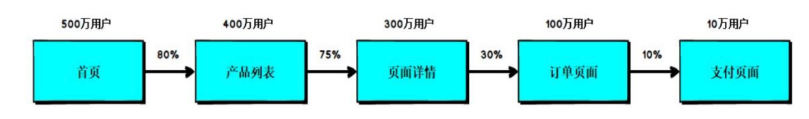
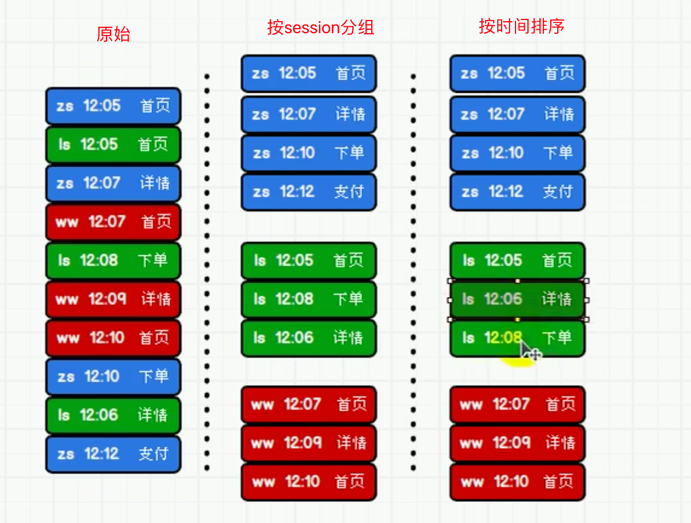
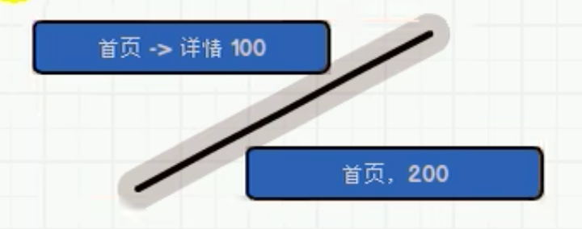
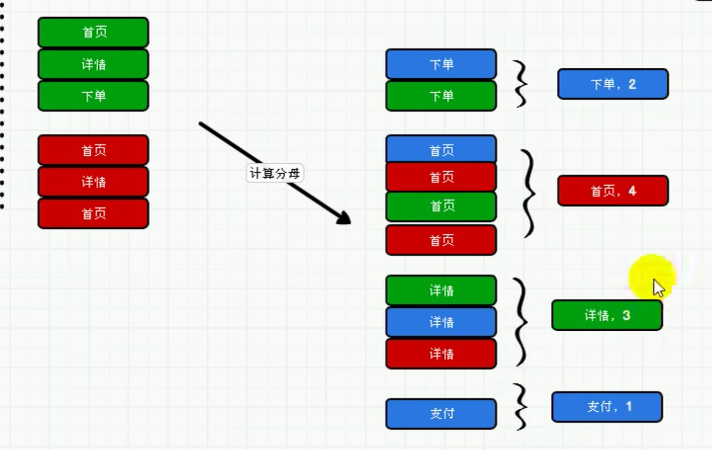
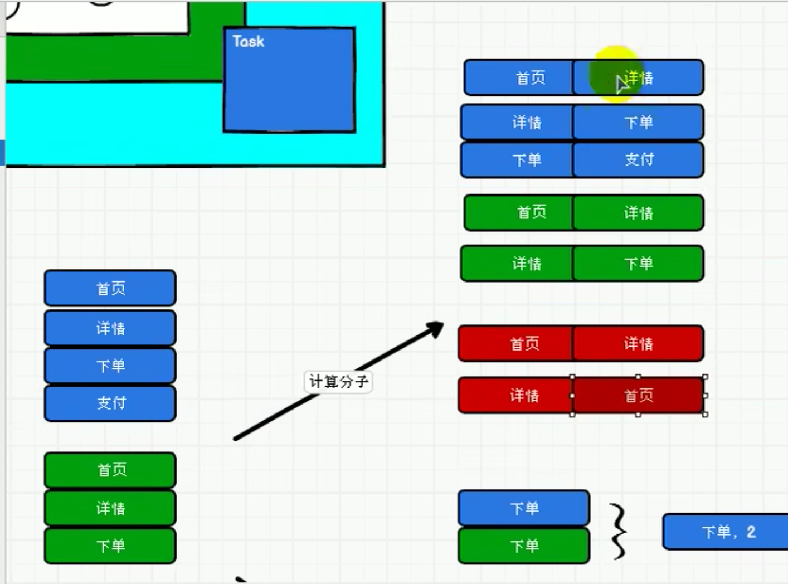
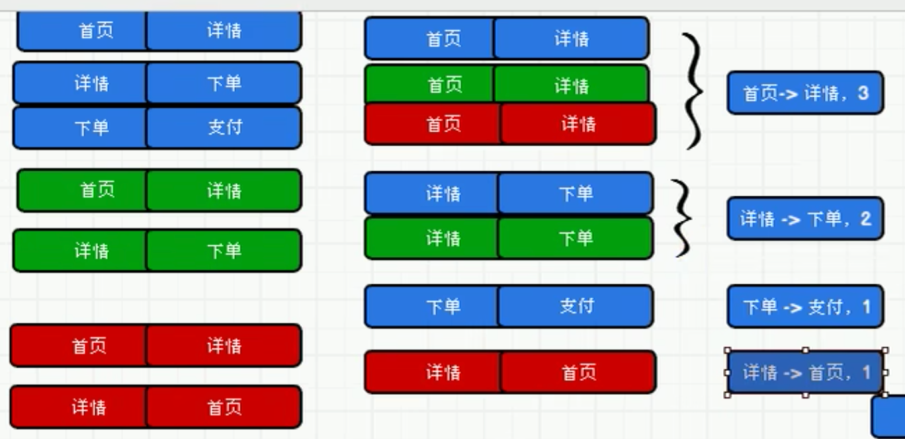

### 页面单跳转换率统计

### 需求说明

计算页面单跳转化率，什么是页面单跳转换率，比如一个用户在一次 Session 过程中 访问的页面路径 3,5,7,9,10,21，那么页面 3 跳到页面 5 叫一次单跳，7-9 也叫一次单跳， 那么单跳转化率就是要统计页面点击的概率。 比如：计算 3-5 的单跳转化率，先获取符合条件的 Session 对于页面 3 的访问次数（PV） 为 A，然后获取符合条件的 Session 中访问了页面 3 又紧接着访问了页面 5 的次数为 B， 那么 B/A 就是 3-5 的页面单跳转化率。



### 需求分析

 

1. 按照session分组
2. session分组的结果按照时间排序



3. 分析最终结果，缺什么补什么，多什么去掉什么。session和时间在结果中都是不需要的，可以舍弃

4. 计算分母。对页面进行分组、聚合操作

   

5. 计算分子。将独立的页面转换为跳转组合页面

   

6. 跳转组合页面分组

   

7. 分子除以分母即可获得单跳转换率。

### 代码实现

```scala
object PageFlowAnalysis {


  def main(args: Array[String]): Unit = {
    // TODO : Top10热门品类
    val sparConf = new SparkConf().setMaster("local[*]").setAppName("HotCategoryTop10Analysis")
    val sc = new SparkContext(sparConf)
    val actionRDD = sc.textFile("datas/user_visit_action.txt")
    val rddMap = actionRDD.map(
      action => {
        val data = action.split("_")
        UserVisitAction(
          data(0),
          data(1).toLong,
          data(2),
          data(3).toLong,
          data(4),
          data(5),
          data(6).toLong,
          data(7).toLong,
          data(8),
          data(9),
          data(10),
          data(11),
          data(12).toLong
        )
      }
    )
    rddMap.cache()
    //需要统计的页面
    val okPageIdList: List[Long] = List[Long](1, 2, 3, 4, 5, 6, 7)
    //需要统计的页面跳转
    val oKPageIdZip: List[(Long, Long)] = okPageIdList.zip(okPageIdList.tail)
    //TODO:计算分母
    val pageIdMap: Map[Long, Int] = rddMap.map(
      r => {
        (r.page_id, 1)
      }
    ).filter{
      case (pageId, i) => okPageIdList.init.contains(pageId) //okPageIdList.init代表除了最后一个元素的list
    }.reduceByKey(_ + _).collect().toMap //toMap方便通过key获得数据
    //TODO:计算分子
    val rddGroup: RDD[(String, Iterable[UserVisitAction])] = rddMap.groupBy(_.session_id)
    val rddMv: RDD[(String, List[((Long, Long), Int)])] = rddGroup.mapValues(
      it => {
        val actions: List[UserVisitAction] = it.toList.sortBy(_.action_time)
        //只关心页面，所以只保留页面
        val pageIdList = actions.map(_.page_id)
        //将排序过后的数据进行拉链操作，生成若干有序的页面跳转对，并过滤关注的页面跳转对
        val zipList: List[(Long, Long)] = pageIdList.zip(pageIdList.tail).filter{
          case t => oKPageIdZip.contains(t)
        }
        //转换方便统计的（key,count）的数据结构
        val pageIdCountList: List[((Long, Long), Int)] = zipList.map((_, 1))
        pageIdCountList
      }
    )
    //rddMv的value中数据结构是List,需要扁平化
    val rddFlat: RDD[((Long, Long), Int)] = rddMv.map(_._2).flatMap(list => list)
    rddFlat.reduceByKey(_+_).foreach{
      case ((p1,p2), i) => {
        val count: Int = pageIdMap.getOrElse(p1, 0) //获得分母
        printf(s"${p1}跳转到${p2}的转换率是${i.toDouble/count}\n") 
      }
    }
    sc.stop()
  }

  //用户访问动作表
  case class UserVisitAction(
    date: String,//用户点击行为的日期
    user_id: Long,//用户的ID
    session_id: String,//Session的ID
    page_id: Long,//某个页面的ID
    action_time: String,//动作的时间点
    search_keyword: String,//用户搜索的关键词
    click_category_id: Long,//某一个商品品类的ID
    click_product_id: Long,//某一个商品的ID
    order_category_ids: String,//一次订单中所有品类的ID集合
    order_product_ids: String,//一次订单中所有商品的ID集合
    pay_category_ids: String,//一次支付中所有品类的ID集合
    pay_product_ids: String,//一次支付中所有商品的ID集合
    city_id: Long
  )//城市 id
}
//结果
4跳转到5的转换率是0.018323153803442533
3跳转到4的转换率是0.016884531590413945
6跳转到7的转换率是0.0192040077929307
2跳转到3的转换率是0.019949423995504357
1跳转到2的转换率是0.01510989010989011
5跳转到6的转换率是0.014594442885209093
```

