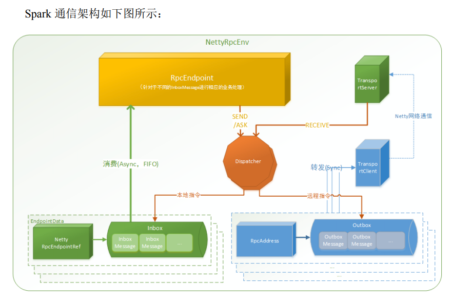

* RpcEndpoint：RPC 通信终端。Spark 针对每个节点（Client/Master/Worker）都称之为一 个 RPC 终端，且都实现 RpcEndpoint 接口，内部根据不同端点的需求，设计不同的消 息和不同的业务处理，如果需要发送（询问）则调用 Dispatcher。在 Spark 中，所有的 终端都存在生命周期：
  *  Constructor 
  *  onStart 
  *  receive* 
  *  onStop 
*  RpcEnv：RPC 上下文环境，每个 RPC 终端运行时依赖的上下文环境称为 RpcEnv；在 把当前 Spark 版本中使用的 NettyRpcEnv 
* Dispatcher：消息调度（分发）器，针对于 RPC 终端需要发送远程消息或者从远程 RPC 接收到的消息，分发至对应的指令收件箱（发件箱）。如果指令接收方是自己则存入收 件箱，如果指令接收方不是自己，则放入发件箱；
* Inbox：指令消息收件箱。一个本地 RpcEndpoint 对应一个收件箱，Dispatcher 在每次向 Inbox 存入消息时，都将对应 EndpointData 加入内部 ReceiverQueue 中，另外 Dispatcher 创建时会启动一个单独线程进行轮询 ReceiverQueue，进行收件箱消息消费； 
* RpcEndpointRef：RpcEndpointRef 是对远程 RpcEndpoint 的一个引用。当我们需要向一 个具体的 RpcEndpoint 发送消息时，一般我们需要获取到该 RpcEndpoint 的引用，然后 通过该应用发送消息。 
*  OutBox：指令消息发件箱。对于当前 RpcEndpoint 来说，一个目标 RpcEndpoint 对应一 个发件箱，如果向多个目标RpcEndpoint发送信息，则有多个OutBox。当消息放入Outbox 后，紧接着通过 TransportClient 将消息发送出去。消息放入发件箱以及发送过程是在同 一个线程中进行； 
*  RpcAddress：表示远程的 RpcEndpointRef 的地址，Host + Port。 
* TransportClient：Netty 通信客户端，一个 OutBox 对应一个 TransportClient，TransportClient 不断轮询 OutBox，根据 OutBox 消息的 receiver 信息，请求对应的远程 TransportServer； 
* TransportServer：Netty 通信服务端，一个 RpcEndpoint 对应一个 TransportServer，接受 远程消息后调用 Dispatcher 分发消息至对应收发件箱；