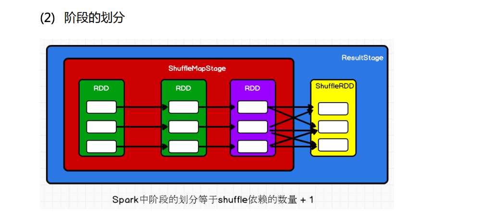

### RDD依赖

### 阶段划分

### 任务切分

### 任务调度

#### Spark Task 级调度

Spark Task 的调度是由 TaskScheduler 来完成，由前文可知，DAGScheduler 将 Stage 打 包到交给 TaskScheTaskSetduler，TaskScheduler 会将 TaskSet 封装为 TaskSetManager 加入到 调度队列中，TaskSetManager 结构如下图所示。

TaskSetManager 负 责监控 管理 同一 个 Stage 中的 Tasks， TaskScheduler 就是以 TaskSetManager 为单元来调度任务。 

前面也提到，TaskScheduler 初始化后会启动 SchedulerBackend，它负责跟外界打交道， 接收 Executor 的注册信息，并维护 Executor 的状态，所以说 SchedulerBackend 是管“粮食” 的，同时它在启动后会定期地去“询问”TaskScheduler 有没有任务要运行，也就是说，它会定 期地“问”TaskScheduler“我有这么余粮，你要不要啊”，TaskScheduler 在 SchedulerBackend“问” 它的时候，会从调度队列中按照指定的调度策略选择 TaskSetManager 去调度运行，大致方 法调用流程如下图所示：

上图中，将 TaskSetManager 加入 rootPool 调度池中之后，调用 SchedulerBackend 的 riviveOffers 方法给 driverEndpoint 发送 ReviveOffer 消息；driverEndpoint 收到 ReviveOffer 消息后调用 makeOffers 方法，过滤出活跃状态的 Executor（这些 Executor 都是任务启动时反 向注册到 Driver 的 Executor），然后将 Executor 封装成 WorkerOffer 对象；准备好计算资源 （WorkerOffer）后，taskScheduler 基于这些资源调用 resourceOffer 在 Executor 上分配 task。

#### 调度策略

TaskScheduler 支持两种调度策略，一种是 FIFO，也是默认的调度策略，另一种是 FAIR。 在 TaskScheduler 初始化过程中会实例化 rootPool，表示树的根节点，是 Pool 类型。 

1. FIFO 调度策略 如果是采用 FIFO 调度策略，则直接简单地将 TaskSetManager 按照先来先到的方式入 队，出队时直接拿出最先进队的 TaskSetManager，其树结构如下图所示，TaskSetManager 保 存在一个 FIFO 队列中。

2. FAIR 调度策略 FAIR 调度策略的树结构如下图所示：

   

   ​	FAIR 模式中有一个 rootPool 和多个子 Pool，各个子 Pool 中存储着所有待分配的 TaskSetMagager。 

   ​	在 FAIR 模式中，需要先对子 Pool 进行排序，再对子 Pool 里面的 TaskSetMagager 进行排序，因为 Pool 和 TaskSetMagager 都继承了 Schedulable 特质，因此使用相同的排序算法。

   ​	排序过程的比较是基于 Fair-share 来比较的，每个要排序的对象包含三个属性: runningTasks值（正在运行的Task数）、minShare值、weight值，比较时会综合考量runningTasks 值，minShare 值以及 weight 值。 注意，minShare、weight 的值均在公平调度配置文件 fairscheduler.xml 中被指定，调度 池在构建阶段会读取此文件的相关配置。

   1.  如果A对象的runningTasks大于它的minShare，B对象的runningTasks小于它的minShare， 那么 B 排在 A 前面；（runningTasks 比 minShare 小的先执行）
   2.  如果 A、B 对象的 runningTasks 都小于它们的 minShare，那么就比较 runningTasks 与 minShare 的比值（minShare 使用率），谁小谁排前面；（minShare 使用率低的先执行） 
   3.  如果 A、B 对象的 runningTasks 都大于它们的 minShare，那么就比较 runningTasks 与 weight 的比值（权重使用率），谁小谁排前面。（权重使用率低的先执行）
   4.  如果上述比较均相等，则比较名字。 

   ​    整体上来说就是通过minShare和weight这两个参数控制比较过程，可以做到让minShare 使用率和权重重使用率少（实际运行 task 比例较少）的先运行。 FAIR 模式排序完成后，所有的 TaskSetManager 被放入一个 ArrayBuffer 里，之后依次 被取出并发送给 Executor 执行。 

   ​	从调度队列中拿到 TaskSetManager 后，由于 TaskSetManager 封装了一个 Stage 的所有 Task，并负责管理调度这些 Task，那么接下来的工作就是 TaskSetManager 按照一定的规则 一个个取出 Task 给 TaskScheduler，TaskScheduler 再交给 SchedulerBackend 去发到 Executor 上执行。

#### 本地化调度

​	DAGScheduler 切割 Job，划分 Stage, 通过调用 submitStage 来提交一个 Stage 对应的 tasks，submitStage 会调用 submitMissingTasks，submitMissingTasks 确定每个需要计算的 task 的 preferredLocations，通过调用 getPreferrdeLocations()得到 partition 的优先位置，由于一个 partition 对应一个 Task，此 partition 的优先位置就是 task 的优先位置，对于要提交到 TaskScheduler 的 TaskSet 中的每一个 Task，该 task 优先位置与其对应的 partition 对应的优先 位置一致。 

​	从调度队列中拿到 TaskSetManager 后，那么接下来的工作就是 TaskSetManager 按照一定的规则一个个取出 task 给 TaskScheduler，TaskScheduler 再交给 SchedulerBackend 去发到 Executor 上执行。前面也提到，TaskSetManager 封装了一个 Stage 的所有 Task，并负责管理 调度这些 Task。 根据每个 Task 的优先位置，确定 Task 的 Locality 级别，Locality 一共有五种，优先级 由高到低顺序：

​	在调度执行时，Spark 调度总是会尽量让每个 task 以最高的本地性级别来启动，当一个 task 以 X 本地性级别启动，但是该本地性级别对应的所有节点都没有空闲资源而启动失败， 此时并不会马上降低本地性级别启动而是在某个时间长度内再次以 X 本地性级别来启动该 task，若超过限时时间则降级启动，去尝试下一个本地性级别，依次类推。 

​	可以通过调大每个类别的最大容忍延迟时间，在等待阶段对应的 Executor 可能就会有 相应的资源去执行此 task，这就在在一定程度上提到了运行性能。