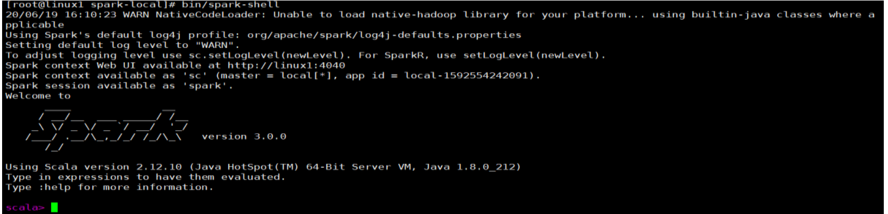

1. 进入解压缩后的路径，执行如下指令

   ```sh
   bin/spark-shell
   ```

   

2. 准备数据文件，注意：数据结构是一个以换行符分割的数据，并是常规理解json数组

   ```json
   {"username":"yknife","age":10}
   {"username":"leo","age":30}
   ```

3. 读取文件并展示

   ```sh
   val df = spark.read.json("data/json/user.json")
   df.show
   ```

   


4. sql操作数据

   ```sh
   # 创建视图
   df.createTempView("user")
   # sql操作，注意：需要加上show
   spark.sql("select age from user").show
   +---+
   |age|
   +---+
   | 10|
   | 30|
   +---+
   # 求平均值
   spark.sql("select avg(age) from user").show
   +--------+
   |avg(age)|
   +--------+
   |    20.0|
   +--------+
   ```

   