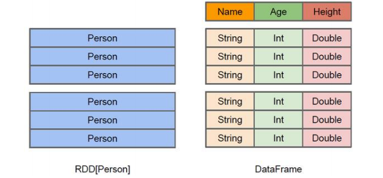
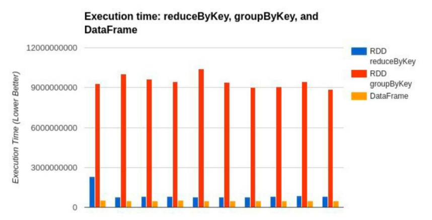

​		

### DataFrame		

​		在 Spark 中，DataFrame 是一种以 RDD 为基础的分布式数据集，类似于传统数据库中 的二维表格。DataFrame 与 RDD 的主要区别在于，前者带有 schema 元信息，即 DataFrame 所表示的二维表数据集的每一列都带有名称和类型。这使得 Spark SQL 得以洞察更多的结构 信息，从而对藏于 DataFrame 背后的数据源以及作用于 DataFrame 之上的变换进行了针对性 的优化，最终达到大幅提升运行时效率的目标。反观 RDD，由于无从得知所存数据元素的 具体内部结构，Spark Core 只能在 stage 层面进行简单、通用的流水线优化。 

​		同时，与 Hive 类似，DataFrame 也支持嵌套数据类型（struct、array 和 map）。从 API 易用性的角度上看，DataFrame API 提供的是一套高层的关系操作，比函数式的 RDD API 要 更加友好，门槛更低。

​		上图直观地体现了 DataFrame 和 RDD 的区别。 左侧的 RDD[Person]虽然以 Person 为类型参数，但 Spark 框架本身不了解 Person 类的内 部结构。而右侧的 DataFrame 却提供了详细的结构信息，使得 Spark SQL 可以清楚地知道 该数据集中包含哪些列，每列的名称和类型各是什么。 

​		DataFrame 是为数据提供了 Schema 的视图。可以把它当做数据库中的一张表来对待 DataFrame 也是懒执行的，但性能上比 RDD 要高，主要原因：优化的执行计划，即查询计 划通过 Spark catalyst optimiser 进行优化。比如下面一个例子:

​		为了说明查询优化，我们来看上图展示的人口数据分析的示例。图中构造了两个 DataFrame，将它们 join 之后又做了一次 filter 操作。如果原封不动地执行这个执行计划，最 终的执行效率是不高的。因为 join 是一个代价较大的操作，也可能会产生一个较大的数据 集。如果我们能将 filter 下推到 join 下方，先对 DataFrame 进行过滤，再 join 过滤后的较小 的结果集，便可以有效缩短执行时间。而 Spark SQL 的查询优化器正是这样做的。简而言之， 逻辑查询计划优化就是一个利用基于关系代数的等价变换，将高成本的操作替换为低成本操 作的过程。

### DataSet

​		DataSet 是分布式数据集合。DataSet 是 Spark 1.6 中添加的一个新抽象，是 DataFrame 的一个扩展。它提供了 RDD 的优势（强类型，使用强大的 lambda 函数的能力）以及 Spark SQL 优化执行引擎的优点。DataSet 也可以使用功能性的转换（操作 map，flatMap，filter 等等）。

* DataSet 是 DataFrame API 的一个扩展，是 SparkSQL 最新的数据抽象 
*  用户友好的 API 风格，既具有类型安全检查也具有 DataFrame 的查询优化特性； 
*  用样例类来对 DataSet 中定义数据的结构信息，样例类中每个属性的名称直接映射到 DataSet 中的字段名称； 
*  DataSet 是强类型的。比如可以有 DataSet[Car]，DataSet[Person]。 
*  DataFrame 是 DataSet 的特列，DataFrame=DataSet[Row] ，所以可以通过 as 方法将 DataFrame 转换为 DataSet。Row 是一个类型，跟 Car、Person 这些的类型一样，所有的 表结构信息都用 Row 来表示。获取数据时需要指定顺序

