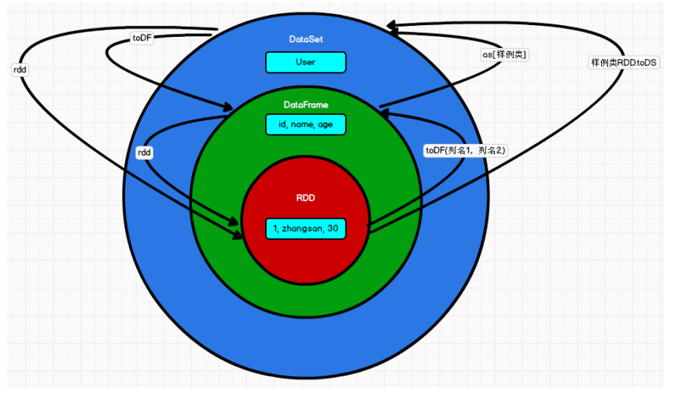

## RDD、DataFrame、DataSet 三者的关系

​		在 SparkSQL 中 Spark 为我们提供了两个新的抽象，分别是 DataFrame 和 DataSet。他们 和 RDD 有什么区别呢？首先从版本的产生上来看： 

*  Spark1.0 => RDD 
*  Spark1.3 => DataFrame 
*  Spark1.6 => Dataset 

​		如果同样的数据都给到这三个数据结构，他们分别计算之后，都会给出相同的结果。不 同是的他们的执行效率和执行方式。在后期的 Spark 版本中，DataSet 有可能会逐步取代 RDD 和 DataFrame 成为唯一的 API 接口。

### 三者的共性

* RDD、DataFrame、DataSet 全都是 spark 平台下的分布式弹性数据集，为处理超大型数 据提供便利; 
* 三者都有惰性机制，在进行创建、转换，如 map 方法时，不会立即执行，只有在遇到 Action 如 foreach 时，三者才会开始遍历运算; 
*  三者有许多共同的函数，如 filter，排序等; 
*  在对 DataFrame 和 Dataset 进行操作许多操作都需要这个包:import spark.implicits._（在 创建好 SparkSession 对象后尽量直接导入） 
*  三者都会根据 Spark 的内存情况自动缓存运算，这样即使数据量很大，也不用担心会 内存溢出 
*  三者都有 partition 的概念 
*  DataFrame 和 DataSet 均可使用模式匹配获取各个字段的值和类型

### 三者的区别

1. RDD 
   *  RDD 一般和 spark mllib 同时使用 
   *  RDD 不支持 sparksql 操作 
2. DataFrame 
   *  与 RDD 和 Dataset 不同，DataFrame 每一行的类型固定为 Row，每一列的值没法直 接访问，只有通过解析才能获取各个字段的值 
   *  DataFrame 与 DataSet 一般不与 spark mllib 同时使用
   * DataFrame 与 DataSet 均支持 SparkSQL 的操作，比如 select，groupby 之类，还能 注册临时表/视窗，进行 sql 语句操作 
   *  DataFrame 与 DataSet 支持一些特别方便的保存方式，比如保存成 csv，可以带上表 头，这样每一列的字段名一目了然(后面专门讲解)
3. DataSet
   *  Dataset 和 DataFrame 拥有完全相同的成员函数，区别只是每一行的数据类型不同。 DataFrame 其实就是 DataSet 的一个特例 type DataFrame = Dataset[Row] 
   *  DataFrame 也可以叫 Dataset[Row],每一行的类型是 Row，不解析，每一行究竟有哪 些字段，各个字段又是什么类型都无从得知，只能用上面提到的 getAS 方法或者共 性中的第七条提到的模式匹配拿出特定字段。而 Dataset 中，每一行是什么类型是 不一定的，在自定义了 case class 之后可以很自由的获得每一行的信息

### 三者的互相转换

