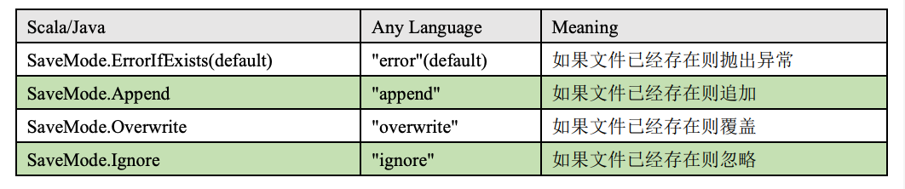
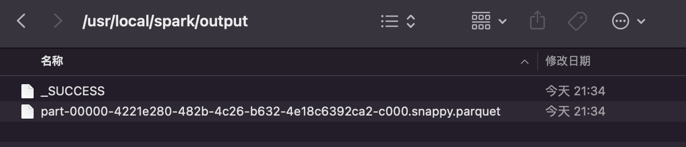
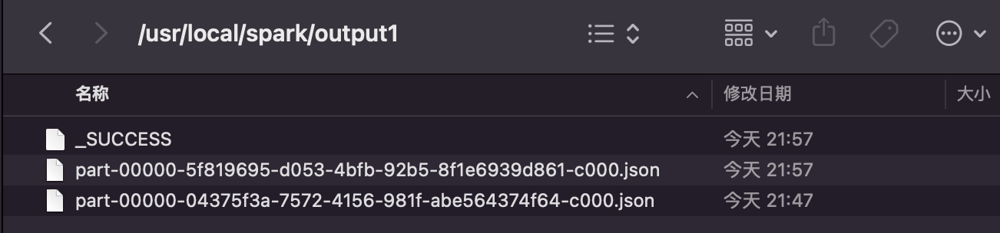

## 通用的加载和保存方式

​	SparkSQL 提供了通用的保存数据和数据加载的方式。这里的通用指的是使用相同的 API，根据不同的参数读取和保存不同格式的数据，SparkSQL 默认读取和保存的文件格式 为 parquet

### 加载数据

spark.read.load 是加载数据的通用方法

```sh
spark.read.
csv format jdbc json load option options orc parquet schema
table text textFile
```

如果读取不同格式的数据，可以对不同的数据格式进行设定

```sh
spark.read.format("…")[.option("…")].load("…")
```

* format("…")：指定加载的数据类型，包括"csv"、"jdbc"、"json"、"orc"、"parquet"和 "textFile"。 
* load("…")：在"csv"、"jdbc"、"json"、"orc"、"parquet"和"textFile"格式下需要传入加载 数据的路径。 
* option("…")：在"jdbc"格式下需要传入 JDBC 相应参数，url、user、password 和 dbtable

我们前面都是使用 read API 先把文件加载到 DataFrame 然后再查询，其实，我们也可以直 接在文件上进行查询: 

```sh
文件格式.`文件路径`
```

```sh
spark.sql("select * from json.`/opt/module/data/user.json`").show
```

### 保存数据

df.write.save 是保存数据的通用方法

```sh
df.write.
csv jdbc json orc parquet textFile… …
```

如果保存不同格式的数据，可以对不同的数据格式进行设定

```sh
df.write.format("…")[.option("…")].save("…")
```

*  format("…")：指定保存的数据类型，包括"csv"、"jdbc"、"json"、"orc"、"parquet"和 "textFile"。 
*  save ("…")：在"csv"、"orc"、"parquet"和"textFile"格式下需要传入保存数据的路径。 
*  option("…")：在"jdbc"格式下需要传入 JDBC 相应参数，url、user、password 和 dbtable

保存操作可以使用 SaveMode, 用来指明如何处理数据，使用 mode()方法来设置。 有一点很重要: 这些 SaveMode 都是没有加锁的, 也不是原子操作。 SaveMode 是一个枚举类，其中的常量包括：



```sh
df.write.mode("append").json("/opt/module/data/output")
```

### 实操

```sh
spark.read.load("data/json/user.json")
# 默认读取文件格式为parquet，强行读取json文件会报错
# Caused by: java.lang.RuntimeException: file:/usr/local/spark/data/json/user.json is not a Parquet file. expected magic number at tail [80, 65, 82, 49] but found [58, 51, 48, 125]
# 读取一个parquet文件
val df = spark.read.load("examples/src/main/resources/users.parquet")
df.show
+------+--------------+----------------+                                        
|  name|favorite_color|favorite_numbers|
+------+--------------+----------------+
|Alyssa|          null|  [3, 9, 15, 20]|
|   Ben|           red|              []|
+------+--------------+----------------+
# 写入数据output路径
df.write.save("output")
```



```sh
# 读一个json文件
# 等效于spark.read.json
val df = spark.read.format("json").load("data/json/user.json")
df.show
# 写一个json文件
df.write.format("json").save("output1")
# 重复执行报错org.apache.spark.sql.AnalysisException: path file:/usr/local/spark/output1 already exists.;
df.write.format("json").save("output1")
# 不会报错，保存模式append,注意：会新增一个新文件，而不是追加行到相同文件
df.write.mode("append").format("json").save("output1")
```



```sh
# 保存模式overwrite，清空所有重复的，追加一个最新的
df.write.mode("overwrite").format("json").save("output1")
# 保存模式ignore，如果文件存在则忽略
df.write.mode("ignore").format("json").save("output1")
# 不创建临时表的情况下，使用漂号`路径，直接sql查询数据，
spark.sql("select * from json.`data/json/user.json`").show
```

##  Parquet

​	Spark SQL 的默认数据源为 Parquet 格式。Parquet 是一种能够有效存储嵌套数据的列式 存储格式。

​	数据源为 Parquet 文件时，Spark SQL 可以方便的执行所有的操作，不需要使用 format。 修改配置项 spark.sql.sources.default，可修改默认数据源格式。

## JSON

​	Spark SQL 能够自动推测 JSON 数据集的结构，并将它加载为一个 Dataset[Row]. 可以 通过 SparkSession.read.json()去加载 JSON 文件。 

​	注意：Spark 读取的 JSON 文件不是传统的 JSON 文件，每一行都应该是一个 JSON 串。格 式如下：

```json
{"name":"Michael"}
{"name":"Andy"， "age":30}
[{"name":"Justin"， "age":19},{"name":"Justin"， "age":19}]
```

## CSV

Spark SQL 可以配置 CSV 文件的列表信息，读取 CSV 文件,CSV 文件的第一行设置为 数据列

```sh
spark.read.format("csv").option("sep", ";").option("inferSchema",
"true").option("header", "true").load("examples/src/main/resources/people.csv")
```

